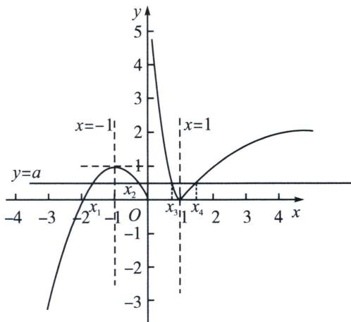

> [!faq]- 《导数专题(上册)》例题解析
>
> > [!success]- **【答案】** D
>
> > [!note]- **【分析】**
> > 本题未单列分析。
>
> > [!note]- **【解析】**
> > 解析 $f(x) = \left\{ \begin{array}{ll} - x^2 -2x, & x\leqslant 0\\ |\log_2x|, & x > 0 \end{array} \right.$ $= \left\{ \begin{array}{ll} - x^{2} - 2x, & x\leqslant 0\\ -\log_{2}x, & 0 <   x <   1,\\ \log_{2}x, & x\geqslant 1 \end{array} \right.$ 函数 $f(x)$ 的图象，如图：
> > 
> > 函数 $g(x)=f(x)-a$ 有4个不同的零点，故 $f(x)=a$ 有4个不同的解，根据对称性得到 $x_{1}+x_{2}=-2$ ， $x_{3}x_{4}=1$ ，（更多等高线问题，可参考同步系列函数篇）
> > 所以 $x_{3}(x_{1}+x_{2})+\frac{1}{x_{3}^{2}x_{4}}=-2x_{3}+\frac{1}{x_{3}}$ ，因为 $\frac{1}{2}<x_{3}<1$ ，所以 $y=-2x_{3}+\frac{1}{x_{3}}$ 是减函数，所以 $-1<-2x_{3}+\frac{1}{x_{3}}<1$ ，
> >
> > 故选 **D**.
