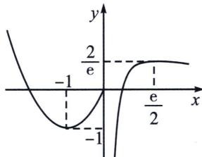

> [!faq]- 《导数专题(上册)》例题解析
>
> > [!success]- **【答案】** B
>
> > [!note]- **【分析】**
> > 本题未单列分析。
>
> > [!note]- **【解析】**
> > 解析 函数 $f(x) = \begin{cases} x^2 + 2x, & x \leqslant 0 \\ \frac{\ln(2x)}{x}, & x > 0 \end{cases}$ ，函数 $g(x) = f(x) - m$ 有 3 个零点，当 $x \leqslant 0$ 时， $f(x) = x^2 + 2x$ ，当 $x \in (-\infty, -1)$ 时， $f(x)$ 单调递减；当 $x \in (-1, 0)$ 时， $f(x)$ 单调递增，所以当 $x \leqslant 0$ 时， $f(x)_{\min} = f(-1) = -1$ ， $f(0) = 0$ ，当 $x \to -\infty$ ， $f(x) \to +\infty$ ，当 $x > 0$ 时， $f(x) = \frac{\ln(2x)}{x} = 2\frac{\ln(2x)}{2x}$ ，由同构函数，当 $2x \in (0, e)$ 时，函数 $f(x)$ 单调递增；当 $2x \in (e, +\infty)$ 时，函数 $f(x)$ 单调递减。当 $x > 0$ 时， $f(x)_{\max} = f\left(\frac{e}{2}\right) = \frac{2\ln e}{e} = \frac{2}{e}$ ， $f(x)$ 的图象如图所示。
> > 
> > 所以 y=m 与 $f(x)$ 的图象有 3 个交点，由图知 $-1<m<\frac{2}{e}$ .
> >
> > 故选 **B**.
