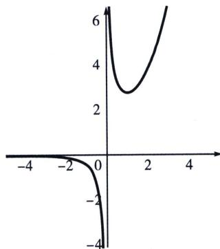

> [!faq]- 《导数专题(上册)》例题解析
>
> > [!success]- **【答案】** A
>
> > [!note]- **【解析】**
> > 解析 $f(x) = \frac{e^{x - 1}}{x} +\frac{x}{e^{x - 1} + x} +a = 0\Leftrightarrow \frac{e^{x - 1}}{x} +\frac{1}{\frac{e^{x - 1}}{x} + 1} +a = 0\Leftrightarrow \frac{e^{x - 1}}{x}\left(\frac{e^{x - 1}}{x} +1\right) + 1 + a\left(\frac{e^{x - 1}}{x} +1\right) = 0$ 令 $h(t) = \frac{t^2}{e^2} +(a + 1)\frac{t}{e} +a + 1$ ，设两根分别为 $t_1,t_2,t_1 + t_2 = -(a + 1)e,t_1t_2 = (a + 1)e^2$ ，令 $g(x) =$ $\frac{e^{x}}{x}$ ，如图，结合 $g(x)=\frac{e^{x}}{x}$ 图像易知 $\frac{e^{x_{1}}}{x_{1}}=t_{1}<0,\quad\frac{e^{x_{2}}}{x_{2}}=\frac{e^{x_{3}}}{x_{3}}=t_{2}>e,$
> >
> > 
> >
> > 由二次函数性质 $a<-\frac{3}{2}$ ，所以 $\frac{2e^{x_{1}}}{x_{1}}+\frac{e^{x_{2}}}{x_{2}}+\frac{e^{x_{3}}}{x_{3}}=2(t_{1}+t_{2})>e$ ，
> >
> > 故选 **A**.
