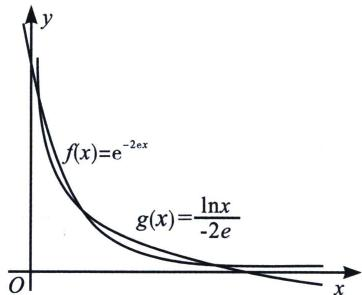

<!-- question-source:start -->
例24 (2023·东昌府区开学 T12)已知函数 $f(x)=e^{kx}$ ， $g(x)=\frac{\ln x}{k}$ ，其中 $k\neq0$ ，则（）A. 若点 $P(a,b)$ 在 $f(x)$ 的图象上，则点 $Q(b,a)$ 在 $g(x)$ 的图象上B. 当k=e时，设点A，B分别在 $f(x)$ ， $g(x)$ 的图象上，则 $|AB|$ 的最小值为 $\frac{\sqrt{2}}{e}$ C. 当k=1时，函数 $F(x)=f(x)-g(x)$ 的最小值小于 $\frac{5}{2}$ D. 当k=-2e时，函数 $G(x)=f(x)-g(x)$ 有3个零点

(1)=e-1>0$ ，所以 $F'(x)$ 在 $\left(\frac{1}{2},1\right)$ ，即在 $(0,+\infty)$ 上存在唯一零点 $x_{0}$ ，且 $F'(x_{0})=e^{x_{0}}-\frac{1}{x_{0}}=0$ ， $x_{0}=\ln\frac{1}{x_{0}}=-\ln x_{0}$ ，当 $0<x<x_{0}$ 时， $F'(x)<0$ ，当 $x>x_{0}$ 时， $F'(x)>0$ ，所以 $F(x)$ 在 $(0,x_{0})$ 上递减，在 $(x_{0},+\infty)$ 上递增，所以 $F(x)_{\min}=F(x_{0})=e^{x_{0}}$ $-\ln x_0 = \frac{1}{x_0} + x_0$ ，由双勾函数知 $y = \frac{1}{x} + x$ 在 $\left(\frac{1}{2}, 1\right)$ 上是减函数， $x_0 \in \left(\frac{1}{2}, 1\right)$ ，所以 $F(x)_{\min} = \frac{1}{x_0} + x_0 < 2 + \frac{1}{2} = \frac{5}{2}$ ，C 正确；

对于 D，法一：当 k = -2e 时， $f(x) = e^{-2ex}$ 是减函数， $g(x) = \frac{\ln x}{-2e}$ 也是减函数，它们互为反函数，作出它们的图象如下图所示，易知它们有一个交点在直线 y = x 上，在右侧， $f(x)$ 的图象在 x 轴上方，而 $g(x)$ 的图象在 (1, 0) 处穿过 x 轴过渡到 x 轴下方，之间它们有一个交点，根据对称性，在左上方，靠近 (0, 1) 处也有一个交点，因此函数 $y = f(x)$ 与 $y = g(x)$ 的图象有 3 个交点，即 $G(x) = f(x) = g(x)$ 有 3 个零点，D 正确.

法二： $e^{-2ex} = \frac{\ln x}{-2e} \Rightarrow -2exe^{-2ex} = x\ln x \Rightarrow h(-2ex) = h(\ln x)$ ，故 $\left\{ \begin{array}{l} -2ex_{1} = \ln x_{1}\\ -2ex_{2} <   - 1, - 1 <   \ln x_{2} <   0,\\ -1 <   - 2ex_{3} <   0,\ln x_{3} <   - 1 \end{array} \right.$ 三种情况各有一解故选ACD.

<!-- question-source:end -->

![[高中/总复习/专题/2026版高中《mst老唐说题》导数专题（数学）/上册/第05章_小题篇_数形结合/第二节_数形结合与零点问题/考点_2_原函数与反函数交点个数问题/例题/answers/Q00047276A1.md]]
