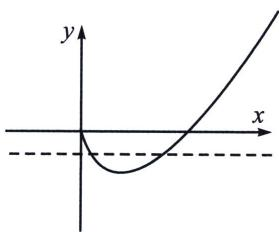

> [!faq]- 《导数专题(上册)》例题解析
>
> > [!success]- **【答案】** 详见解析
>
> > [!note]- **【解析】**
> > 解析 构造 $x \ln x = \frac{a}{x} \ln \frac{a}{x}$ ，根据定义域可知 $a > 0$ ，如图，当 $x > 1$ 时， $y = x \ln x > 0$ ，此时，仅存在 $x = \frac{a}{x}$ ，使 $x_{1} \ln x_{1} = \frac{a}{x_{1}} \ln \frac{a}{x_{1}}$ ，此时只存在一个实根，不合题意；当 $0 < x < 1$ 时，则会出现一个根与三个根的情况，其临界点就 $x_{1} = \frac{a}{x_{2}} = \frac{1}{e}$ ，此时 $a = \frac{1}{e^{2}}$ ，此时两函数在 $x = \frac{1}{e}$ 处相切，若需要有三个零点，则一定要满足 $\left\{ \begin{array}{l} x_{1} = \frac{a}{x_{1}} \\ 0 < x_{2} < \frac{1}{e}, \frac{1}{e} < \frac{a}{x_{2}} < 1, \\ \frac{1}{e} < x_{3} < 1, 0 < \frac{a}{x_{3}} < \frac{1}{e} \end{array} \right.$ （本质也是极值点偏移 $x_{2} x_{3} < \frac{1}{e^{2}} \Rightarrow a < \frac{1}{e^{2}}$ ）
> >
> > 
