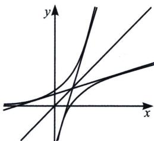
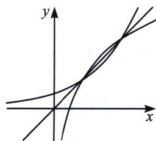
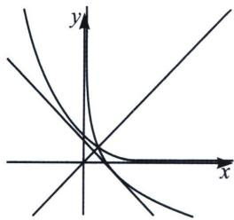
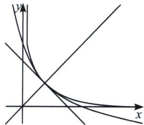
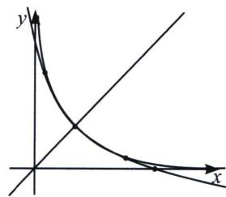

## 考点 2：原函数与反函数交点个数问题

关于为 $y = a^{x}$ 与 $y = \log_a x$ 的交点个数

先分析 a>1，
(1) 若 $a^{x}>x>\log_{a}x$ ，如图，此时 $a^{x}>x$ ，则 $e^{x\ln a}>x\Rightarrow x\ln a>\ln x\Rightarrow\ln a>\frac{\ln x}{x}_{\max}=\frac{1}{e}$ ，所以 $a>e^{\frac{1}{e}}$ 时，两函数没有交点；

(2) $1 < a < e^{\frac{1}{e}}$ 时， $y = a^{x}$ 与 $y = \log_{a} x$ 有两个交点，如右图；

(1) $a>e^{\frac{1}{e}}$ ，无交点

(2) $1 < a < e^{\frac{1}{e}}$ ，两个交点

我们再来分析 $0 < a < 1$ ，在这里就会出现一个或者三个交点的情况，我们做以下分析：

(3) $1 > a > e^{-e}$ 一个交点

(4) $a=e^{-e}$ 一个交点(相切)

(5) $0 < a < e^{-1}$ 三个交点

我们发现 a 越小，根据 $(a^{x})' = a^{x} \ln a$ ，函数递减越慢，临界条件就是 $a^{x}$ 与 $\log_{a} x$ 相切于 y = x，且切线斜率为 -1，所以 $\frac{1}{x_{0} \ln a} = -1 \Rightarrow \frac{1}{x_{0}} = -\ln a$ ，且 $a^{x_{0}} = x_{0} \Rightarrow e^{x_{0} \ln a} = x_{0} \Rightarrow \ln a = \frac{\ln x_{0}}{x_{0}} = -\ln a \ln x_{0} \Rightarrow x_{0} = \frac{1}{e}$ ，所以 $a = e^{-e}$ ，

(3) 当 $1 > a > e^{-e}$ 时，如左图所示，两个函数仅有一个交点；

(4) 当 $a = e^{-e}$ 时，两个函数拟合，就是在交点处相切，如中图；

(5) 当 $0 < a < e^{-1}$ 时，两函数会出现三个零点，如右图；

![[高中/总复习/专题/2026版高中《mst老唐说题》导数专题（数学）/上册/第05章_小题篇_数形结合/第二节_数形结合与零点问题/考点_2_原函数与反函数交点个数问题/例题/Q00047276.md]]
![[高中/总复习/专题/2026版高中《mst老唐说题》导数专题（数学）/上册/第05章_小题篇_数形结合/第二节_数形结合与零点问题/考点_2_原函数与反函数交点个数问题/例题/Q00047277.md]]
