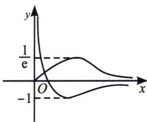

<!-- question-source:start -->
例 8 (河南省南阳市 2023 高三期中 T16) 若方程 $x^{2}e^{-x}=ax-\ln x-1$ 存在唯一实根，则实数 a 的取值范围是 \_\_\_\_.

<!-- question-source:end -->

![[高中/总复习/专题/2026版高中《mst老唐说题》导数专题（数学）/上册/第05章_小题篇_数形结合/第二节_数形结合与零点问题/考点_2_参变半分离与模块函数分析/例题/answers/Q00052697A1.md]]
