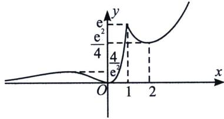

> [!faq]- 《导数专题(上册)》例题解析
>
> > [!success]- **【答案】** D
>
> > [!note]- **【分析】**
> > 本题未单列分析。
>
> > [!note]- **【解析】**
> > 解析 本题考查六大基础函数的变化功底， $x^{2}e^{x}=4\left(\frac{x}{2}e^{\frac{x}{2}}\right)^{2}\leqslant\frac{4}{e^{2}}$ ，当且仅当 $\frac{x}{2}=-1$ 时取等，由于 $g(x)=xe^{x}$ 在区间 $(-∞,-1)$ 单调递减，在 $(-1,+∞)$ 单调递增，故 $f(x)=x^{2}e^{x}$ 在区间 $(-∞,-1)$ 单调递减。
> > 2) 单调递增，在 $(-2, 0)$ 单调递减，且 $x \in (-\infty, 0)$ 时， $f(x) > 0$ ；当 $x \in (0, 1)$ 时， $f(x)$ 单调递增，当 x = 1 时， $x^{2} e^{x} = e$ ; $\frac{e^{x}}{x^{2}} = \frac{1}{4} \cdot \left( \frac{e^{\frac{x}{2}}}{\frac{x}{2}} \right)^{2} \geqslant \frac{e^{2}}{4}$ ，当且仅当 $\frac{x}{2} = 1$ 时取等，由于 $h(x) = \frac{e^{x}}{x}$ 在 $(0, 1)$ 单调递减，在 $(1, +\infty)$ 单调递增，所以 $f(x) = \frac{e^{x}}{x^{2}}$ 在 $(1, 2)$ 单调递减，在 $(2, +\infty)$ 单调递增，故我们可以快速作出 $f(x)$ 草图，如图所示：
> > 
> > 对于 A: $f(0)=0$ ，点 0 是函数 $f(x)$ 的零点，故 A 错，（书写规范尤其注意）
> > 对于 B: $\left[f(x)\right]^{2}-2af(x)=0$ ，不妨令 $g(x)=x^{2}-2ax,\left[f(x)\right]^{2}-2af(x)=0\Leftrightarrow f(x)=0$ 或 $f(x)=2a$ 有两个不等实根， $f(x)=0$ 有唯一解 x=0，故 $f(x)=2a$ 有一个根， $2a\in\left(\frac{4}{e^{2}},\frac{e^{2}}{4}\right)\cup(e,+\infty)$ ， $a\in\left(\frac{2}{e^{2}},\frac{e^{2}}{8}\right)\cup\left(\frac{e}{2},+\infty\right)$ 故 B 错误，对于 C：极大值点为 x=-2，故 C 错误，对于 D：由图像 $\exists x_{1}\in(0,1)$ ， $x_{2}\in(1,3)$ ，使 $f(x_{1})>f(x_{2})$ ，故 D 正确。
> >
> > 故选 **D**.
