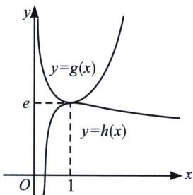

> [!faq]- 《导数专题(上册)》例题解析
>
> > [!success]- **【答案】** 详见解析
>
> > [!note]- **【分析】**
> > 本题未单列分析。
>
> > [!note]- **【解析】**
> > (1) = e$ ;
> > 再令 $h(x)=\frac{\ln x+1}{x}$ ，则 $h'(x)=\frac{-\ln x}{x^{2}}=0$ 时，x=1，x<1时 $h'(x)>0$ ，x>1时 $h'(x)<0$ ，故 $h(x)_{\max}=h
> > (1)=1$ ;
> > 故当 $a \geqslant \frac{1}{e}$ 时， $\frac{ae^x}{x} \geqslant \frac{1}{e} g(x)_{\min} = 1 \geqslant h(x)_{\max}$ ，当且仅当 $x = 1$ 时等号成立，如图11-2-2所示.
> > 总结：亲密接触模型，上函数和下函数选取很重要，我们必须熟悉六大基础函数模型.
> > 
> > 我们继续用分而治之解答例题 3:
> > (2)法二：（分而治之）要证 $f(x)\geqslant 2a + a\ln \frac{2}{a}$ ，即证 $e^{2x} - a\ln x\geqslant 2a + a\ln \frac{2}{a}$ ，只需 $e^{2x}\geqslant a$ $\left(\ln x + 2 + \ln \frac{2}{a}\right) = a\ln \frac{2e^2x}{a}$
> > 只需 $\frac{e^{2x}}{2x} \geqslant e^2 \frac{a}{2e^2x} \ln \frac{2e^2x}{a}$ ，由同构式可令 $g(x) = \frac{e^x}{x}$ ，求导后可以得 $g(x)_{\min} = g
> > (1) = e$ ， $h(x) = \frac{\ln x}{x}$ ，易知 $h(x)_{\max} = h(e) = \frac{1}{e}$ ，故 $\frac{e^{2x}}{2x} = g(2x) \geqslant e$ ，当仅当 $x = \frac{1}{2}$ 时等号成立；
> > $e^2\frac{a}{2e^2x}\ln \frac{2e^2x}{a} = e^2h\left(\frac{2e^2x}{a}\right)\leqslant e^2\cdot \frac{1}{e} = e$ 恒成立，所以 $e^{2x} > a\left(\ln x + 2 + \ln \frac{2}{a}\right)$ 恒成立，当且仅当 $\frac{2e^2x}{a} = e\Leftrightarrow \left\{ \begin{array}{ll}x = \frac{1}{2}\\ a = e \end{array} \right.$ 时， $e^{2x}\geqslant a\left(\ln x + 2 + \ln \frac{2}{a}\right)$ 取得等号；故当 $a > 0$ 时， $f(x)\geqslant 2a + a\ln \frac{2}{a}$
> > 同理，我们继续用分而治之解答例题 4:
> > (2)法二: (分而治之)由 $f(x)\geqslant1$ 得: $ae^{x-1}\geqslant\ln x-\ln a+1=\ln\frac{ex}{a}$ , 两边同时除以 $\frac{ex}{a}$ 得: $\frac{a^2}{e^2}\frac{e^x}{x}\geqslant\frac{\ln\frac{ex}{a}}{\frac{ex}{a}}$ , 由六大乘除同构函数可得: 令 $g(x)=\frac{e^x}{x}$ , 求导后可以得 $g(x)_{\min}=g
> > (1)=e$ , $h(x)=\frac{\ln x}{x}$ , 易知 $h(x)_{\max}=h(e)=\frac{1}{e}$ , 故 $\frac{a^2}{e^2}\frac{e^x}{x}=\frac{a^2}{e^2}g(x)\geqslant\frac{a^2}{e}$ , 当且仅当 $x=1$ 时等号成立; $\frac{\ln\frac{ex}{a}}{\frac{ex}{a}}=h\left(\frac{ex}{a}\right)\leqslant\frac{1}{e}$ 恒成立, 所以 $\frac{a^2}{e^2}\frac{e^x}{x}\geqslant\frac{\ln\frac{ex}{a}}{\frac{ex}{a}}$ 恒成立, 必须满足 $\frac{a^2}{e}\geqslant\frac{1}{e}\Rightarrow a\geqslant1$ , 当且仅当 $\frac{a^2}{e}=\frac{1}{e}\Leftrightarrow\begin{cases}x=1\\a=1\end{cases}$ 时, $ae^{x-1}\geqslant\ln x-\ln a+1$ 取得等号; 当 $a<1$ 时, $f (1)=a+\ln a<1$ , 与题意不符合, 综上, $a\geqslant1$ .
> > ## 例1 (2024·贵阳模拟 T21)已知函数 $f(x) = e^{x - 1} - \ln (x + a) + 1$ .
> > (1)设 x=1 是 $f(x)$ 的极值点，求 a，并求 $f(x)$ 的单调区间；
> > (2) 当 $a \leqslant 3$ 时，证明 $f(x) > -1$ .
> > 解析
> > (1) $f'(x)=e^{x-1}-\frac{1}{x+a}$ ，因为 x=1 是 $f(x)$ 的极值点，即 $f' (1)=0$ ，即 $1-\frac{1}{1+a}=0$ ，所以 a=0。于是 $f(x)=e^{x-1}-\ln x+1$ ，定义域为 $(0,+\infty)$ ，且 $f'(x)=e^{x-1}-\frac{1}{x}$ ，函数 $f'(x)=e^{x-1}-\frac{1}{x}$ 在 $(0,+\infty)$ 上单调递增，且 $f' (1)=0$ ，因此当 $x\in(0,1)$ 时， $f'(x)<0$ ；当 $x\in(1,+\infty)$ 时， $f'(x)>0$ ，所以 $f(x)$ 的单调递减区间为 $(0,1)$ ，增区间为 $(1,+\infty)$ 。
> > (2) 当 $a \leqslant 3, x > -a$ 时， $0 < x + a \leqslant x + 3$ ，从而 $\ln (x + a) \leqslant \ln (x + 3)$ ，则证： $e^{x - 1} \geqslant \ln \frac{x + 3}{e^2} \Rightarrow \frac{1}{e^4}$ $\frac{e^{x + 3}}{x + 3} \geqslant \frac{\ln \frac{x + 3}{e^2}}{e^2 \frac{x + 3}{e^2}}$ ， $\frac{1}{e^4} \frac{e^{x + 3}}{x + 3} \geqslant e^3 \geqslant \frac{\ln \frac{x + 3}{e^2}}{e^2 \frac{x + 3}{e^2}}$ ，左边不等式在 $x = -2$ 取等，右边不等式在 $x = e^3 - 3$ 取等，取等不一致，故 $f(x) > -1$ .
