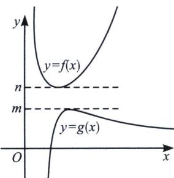
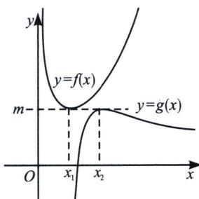

<!-- question-source:start -->
1. 若 $F(x) > 0$ 对 $x \in D$ 恒成立，且 $F(x) = f(x) - g(x)$ ，我们可以转化为 $f(x) > g(x)$ ，通过分别求出两个函数的最值，当 $f(x)_{\min} > g(x)_{\max}$ 时一定成立，我们称之为高人一等，如图7所示；或者 $f(x)_{\min} = f(x_1) \geqslant g(x)_{\max} = g(x_2)$ ， $x_1 \neq x_2$ 时一定成立，我们称之为错位PS，如图8所示。通常我们将 $f(x)$ 叫做上函数， $g(x)$ 叫做下函数。

  
图 7

  
图8
<!-- question-source:end -->
