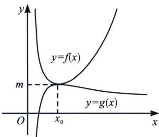
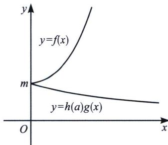

<!-- question-source:start -->
2. 若 $F(x) \geqslant 0$ 对 $x \in D$ 恒成立，且 $F(x) = f(x) - g(x)$ ，我们可以转化为 $f(x) \geqslant g(x)$ ，通过分别求出两个函数的最值，当 $f(x)_{\min} \geqslant g(x)_{\max}$ ，且 $f(x)_{\min} = f(x_0) = g(x)_{\max} = g(x_0)$ 时一定成立，我们称之为亲密接触，如图9所示.

  
图9

  
图10

3. 若含参数 $a$ 的函数 $F(x) \geqslant 0$ 对 $x \in [x_0, +\infty)$ 恒成立，且 $F(x_0) = 0$ ，构造 $F(x) = f(x) - h(a)g(x)$ ，在这种情况下 $f(x) \geqslant h(a)g(x)$ 恒成立，且 $f(x)_{\min} = f(x_0) = m$ ，只需 $h(a)g(x)$ 单调递减；或者 $y = f(x)$ 单调递增，且 $f'(x_0) = 0$ ，只需 $h(a)g(x)$ 单调递减，这也是我们通常讲到的端点效应（洛必达法则）；此法叫做天各一方，如图10所示，在端点效应中推导矛盾区间时往往需要切线放缩.

我们来用分而治之解答例题 2:

法二(分而治之): 因为函数 $f(x) = ae^{x} - \ln x - 1 \geqslant 0$ , 所以有 $ae^{x} \geqslant \ln x + 1$ , 即 $\frac{ae^{x}}{x} \geqslant \frac{\ln x + 1}{x}$ 对 $x \in (0, +\infty)$ 恒成立, 令 $g(x) = \frac{e^{x}}{x}$ , $g'(x) = \frac{e^{x}x - e^{x}}{x^{2}} = 0$ 时, $x = 1$ , $x < 1$ 时 $g'(x) < 0$ , $x > 1$ 时 $g'(x) > 0$ , 故 $g(x)_{\min} = g
<!-- question-source:end -->

![[高中/总复习/专题/2026版高中《mst老唐说题》导数专题（数学）/上册/第06章_综合篇_新三板斧/第三节_分而治之的上下函数选取/对点训练/answers/Q00046658A1.md]]
