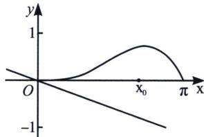

<!-- question-source:start -->
例13 (2019·新课标 [T20)已知函数 $f(x)=2\sin x-x\cos x-x$ ， $f'(x)$ 为 $f(x)$ 的导数.

(1)证明： $f'(x)$ 在区间 $(0, \pi)$ 存在唯一零点；

(2) 若 $x \in [0, \pi]$ 时， $f(x) \geqslant ax$ ，求 a 的取值范围.

(1) 因为函数 $f(x) = 2\sin x - x\cos x - x$ ，求导得 $f'(x) = 2\cos x - \cos x + x\sin x - 1 = \cos x + x\sin x - 1$ ，令 $g(x) = \cos x + x\sin x - 1$ ，则 $g'(x) = -\sin x + \sin x + x\cos x = x\cos x$ ，当 $x \in \left(0, \frac{\pi}{2}\right)$ 时， $x\cos x > 0$ ，当 $x \in \left(\frac{\pi}{2}, \pi\right)$ 时， $x\cos x < 0$ ，当 $x = \frac{\pi}{2}$ 时，极大值为 $g\left(\frac{\pi}{2}\right) = \frac{\pi}{2} - 1 > 0$ ，又 $g(0) = 0$ ， $g(\pi) = -2$ ， $g(x)$ 在 $(0, \pi)$ 上有唯一零点，即 $f'(x)$ 在 $(0, \pi)$ 上有唯一零点；

(2)由
(1)知， $f'(x)$ 在 $(0, \pi)$ 上有唯一零点 $x_{0}$ ，使得 $f'(x_{0}) = 0$ ，且 $f'(x)$ 在 $(0, x_{0})$ 为正，在 $(x_{0}, \pi)$ 为负，所以 $f(x)$ 在 $[0, x_{0}]$ 单调递增，在 $[x_{0}, \pi]$ 单调递减，结合 $f(0) = 0$ ， $f(\pi) = 0$ ，可知 $f(x)$ 在 $[0, \pi]$ 上非负，令 $h(x) = ax$ ，则 $f(x) \geqslant h(x)$ ，如图 11-2-1 所示，根据 $f(x)$ 和 $h(x)$ 的图象可知， $a \leqslant 0$ ，故 a 的取值范围是 $(-\infty, 0]$ .

总结：天各一方类型，左端点大小相等， $f(x)\geqslant h(x)=ax$ ，则 $h(x)$ 必为减函数.
<!-- question-source:end -->

![[高中/总复习/专题/2026版高中《mst老唐说题》导数专题（数学）/上册/第06章_综合篇_新三板斧/第三节_分而治之的上下函数选取/考点_1_构造单调三角函数进行或者最值界定/例题/answers/Q00047319A1.md]]
