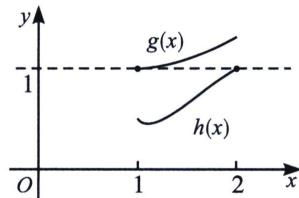

> [!faq]- 《导数专题(上册)》例题解析
>
> > [!success]- **【答案】** 详见解析
>
> > [!note]- **【解析】**
> > 解析 (1) 因为函数 $f(x) = a(x - \ln x) + \frac{2x - 1}{x^2}$ ，所以 $f'(x) = a\left(1 - \frac{1}{x}\right) + \frac{2x^2 - (2x - 1) \cdot 2x}{x^4} = \frac{ax - a}{x} + \frac{2 - 2x}{x^3} = \frac{ax^3 - ax^2 + 2 - 2x}{x^3} = \frac{(x - 1)(ax^2 - 2)}{x^3} (x > 0)$ ，若 $a \leqslant 0$ ，则 $ax^2 - 2 < 0$ 恒成立，当 $x \in (0, 1)$ 时， $f'(x) > 0$ ， $f(x)$ 为增函数，当 $x \in (1, +\infty)$ 时， $f'(x) < 0$ ， $f(x)$ 为减函数；当 $a > 0$ ，若 $0 < a < 2$ ，当 $x \in (0, 1)$ 和 $\left(\frac{\sqrt{2a}}{a}, +\infty\right)$ 时， $f'(x) > 0$ ， $f(x)$ 为增函数，当 $x \in \left(1, \frac{\sqrt{2a}}{a}\right)$ 时， $f'(x) < 0$ ， $f(x)$ 为减函数；若 $a = 2$ ， $f'(x) \geqslant 0$ 恒成立， $f(x)$ 在 $(0, +\infty)$ 上为增函数；若 $a > 2$ ，当 $x \in \left(0, \frac{\sqrt{2a}}{a}\right)$ 和 $(1, +\infty)$ 时， $f'(x) > 0$ ，所以 $f(x)$ 为增函数，当 $x \in \left(\frac{\sqrt{2a}}{a}, 1\right)$ 时， $f'(x) < 0$ ，所以 $f(x)$ 为减函数；
> >
> > 
> >
> > (2)当 $a = 1$ 时，令 $F(x) = f(x) - f'(x) - \frac{3}{2} = x - \ln x + \frac{2}{x} - \frac{1}{x^2} - 1 + \frac{2}{x^2} + \frac{1}{x} - \frac{2}{x^3} = x - \ln x + \frac{3}{x} + \frac{1}{x^2} - \frac{2}{x^3} - \frac{5}{2}$ . 令 $g(x) = x - \ln x$ ，由 $g'(x) = \frac{x - 1}{x} \geqslant 0$ ，可得 $g(x) \geqslant g(1) = 1$ ，当且仅当 $x = 1$ 时取等号； $h(x) = \frac{2}{x^3} - \frac{1}{x^2} - \frac{3}{x} + \frac{5}{2}$ ，令 $t = \frac{1}{x} \in \left[\frac{1}{2}, 1\right]$ ， $h(t) = 2t^3 - t^2 - 3t + 1$ ， $h'(t) = 6t^2 - 2t - 3$ ，又 $h'\left(\frac{1}{2}\right) = -\frac{5}{2}$ ， $h'(1) = 1$ ，故存在 $t_0 \in \left[\frac{1}{2}, 1\right]$ ，使得 $h(t) = 0$ ， $h(t)_{\max} = \max \{h\left(\frac{1}{2}\right), h(1)\} = h\left(\frac{1}{2}\right) = 1$ ，如图，即当且仅当 $x = 2$ 取等号， $f(x) - f'(x) > g(1) - h(2) = 0$ ， $F(x) > 0$ 恒成立，即 $f(x) > f'(x) + \frac{3}{2}$ 对于任意的 $x \in [1, 2]$ 成立.
> >
> > 总结: 分而治之+错位 $PS$ 模型. 一大堆数据摆在眼前, 能让我们识别的就是 $g(x) = x - \ln x$ 这个有最小值的函数, 加上本题没有等号, 所以分而治之是一个很好的选择.
