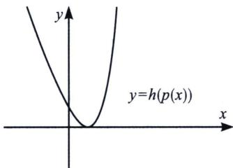
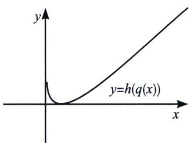
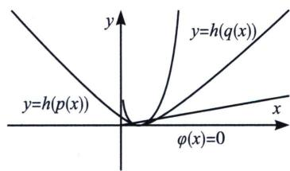
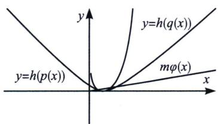
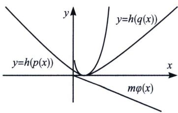
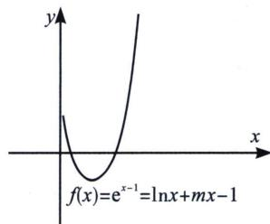

## 一、保值性原理

所谓的保值性，就是初一学的非负数原理，例如： $a^{2}+|b|+\sqrt{c}+d\geqslant0$ 恒成立 $a, b\in R, c\geqslant0$ ，必有 $d\geqslant0$ 。此时，a=b=c=0 且 d=0 时取“=”，此时同时取“=”显然格外重要。

下面我们就来看看保值性定理：

保值性定理1：若 $h(p(x)) + h(q(x)) \geqslant 0$ 恒成立，若满足 $f(x) = h(p(x)) + h(q(x)) + m\varphi(x)$ ，此时， $m\varphi(x)$ 我们称其为余量函数.

## 问题一：证不等式恒成立

若 $f(x) \geqslant 0$ 恒成立，且 $h(p(x)) + h(q(x)) \geqslant 0$ ，当 $x = x_0$ 时 $h(p(x_0)) = h(q(x_0)) = 0$ ，则余量函数一定满足 $m\varphi(x) \geqslant 0$ 恒成立；例如： $h(x) = e^x - x - 1$ ，我们易知 $h(x) \geqslant 0$ ， $h(p(x)) = h(x - 1) = e^{x - 1} - x$ ， $h(q(x)) = h(\ln x)$

$= x - \ln x - 1$ ，如图1和图2，两个函数都是单峰函数，且在 $x = 1$ 时同时取得最小值，故$h(p(x))+h(q(x))\geqslant0$ 恒成立，当 $\varphi(x)=x$ 时，我们发现当 $m\geqslant0$ 时， $f(x)=e^{x-1}+mx-\ln x-1=(e^{x-1}-x)+(x-\ln x-1)+mx\geqslant0$ 恒成立，如图3图4；此时我们只知道 $m\geqslant0$ 是恒成立的，但这只是必要条件，我们需要说明m<0时不成立，此时我们只需要使用找点探路法，代入 $f(1)=m<0$ ，如图5，矛盾，故 $m\geqslant0$ .

  
图 1

  
图2

  
图3

  
图4

  
图5

  
图6

接下来我们分析一下零点个数问题：

$f(x)=0$ 零点个数问题，则一定要满足：①当 $m\varphi(x)>0$ 时，则 $f(x)>0(f(x)$ 有0个零点）如图4；②当 $m\varphi(x)\geqslant0$ 时，且 $h(p(x_{0}))=h(q(x_{0}))=\varphi(x_{0})=0$ ，则 $f(x)\geqslant0(f(x)$ 有1个零点）如图3；③当 $m\varphi(x)<0$ 时， $f(x)$ 有2个零点，如图6.

![[高中/总复习/专题/2026版高中《mst老唐说题》导数专题（数学）/上册/第06章_综合篇_新三板斧/第二节_保值性原理/一_保值性原理/例题/Q00052711.md]]
