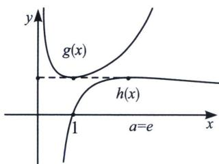
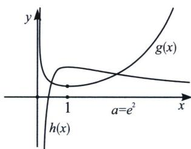

<!-- question-source:start -->
例8 (2023·浙江精诚联盟高二月考T8)已知 $a, x$ 均为正实数，不等式 $e^{x-1}-a \ln(ax)+a \geqslant 0$ 恒成立，则 $a$ 的最大值为
( )
A. 1 B. $\sqrt{e}$ C. $e$ D. $e^2$

(1)=1-e^{2}<0$ , 矛盾;

法二(分而治之): 原不等式转化为: $e^{x - 1} \geqslant a \ln \frac{ax}{e}$ , 即 $g(x) = \frac{e^{x - 1}}{\frac{ax}{e}} \geqslant h(x) = a \frac{\ln \frac{ax}{e}}{\frac{ax}{e}}$ , 当 $g(x)_{\min} \geqslant h(x)_{\max}$ , 根据六大同构函数最值可知 $g(x) = \frac{1}{a} \cdot \frac{e^x}{x} \geqslant \frac{e}{a}$ , 当且仅当 $x = 1$ 时等号成立, $h(x) = a \frac{\ln \frac{ax}{e}}{\frac{ax}{e}} \leqslant \frac{a}{e}$ , 当且仅当 $x = \frac{e^2}{a}$ 时等号成立, 所以当 $\frac{e}{a} \geqslant \frac{a}{e}$ , 即 $a \leqslant e$ 时成立, 由于取等条件 $x = \frac{e^2}{a} = e$ 不能同时满足, 故属于分而治之的错位 PS 模型, 如左图, 当 $a = e^2$ 时, $g(x)_{\min} = g
(1) = \frac{1}{e}$ , $h(x)_{\max} = h (1) = e$ , 显然矛盾, 如右图; 故选 C.

<!-- question-source:end -->

![[高中/总复习/专题/2026版高中《mst老唐说题》导数专题（数学）/上册/第06章_综合篇_新三板斧/第二节_保值性原理/三_数据特点与方法选取/例题/answers/Q00047300A1.md]]
