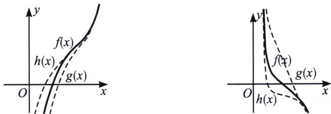
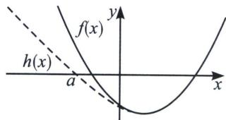
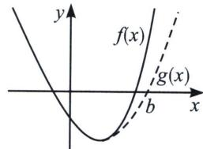
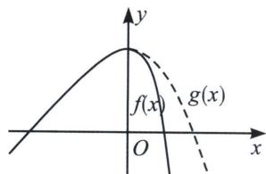
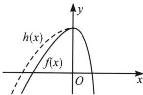

## 二、找点原理

物理学电磁感应有一个重要的定理叫做“楞次定理”，其中最重要的一句口诀叫做“增反减同”，这个原理也能应用在找点上，就是单调递增的函数 $f(x)$ ，需要找到 $x_{1}\in(m,n)$ ，使 $f(x_{1})=0$ ，我们在找大点的时候需要一个更小的函数 $g(x)$ ，使 $g(n)=0$ ；取小点则需要构造一个更大的函数 $h(x)$ ，使 $h(m)=0$ ，我们将此叫做“增反”，即增函数找大点构造小函数，找小点构造大函数，当然 $g(x)$ 以及 $h(x)$ 都是我们上面介绍的那五个可求出零点的函数；

减函数则满足“减同”，即减函数找大点构造大函数，取小点构造小函数(图右)，这类“增反减同”的找点法原理我们叫做楞次找点原理.

同理, 我们来研究有极值点的函数取点原理, 当函数极大值大于零或者极小值小于零, 通常会有两个零点, 高考中一旦需要我们去找这两个零点时, 我们也可以根据楞次取点法进行分析, 两边都构造放缩函数, 得到可解方程。我们通常将零点当中的较小零点用 $x_{1}$ 表示, 较大零点用 $x_{2}$ 表示。若 $f(x_{0})$ 为函数唯一极小值点, 那么我们需要找到 $x_{1} \in (a, x_{0})$ , $x_{2} \in (x_{0}, b)$ , 我们可以利用不同的范围来进行放缩, 当 $x < x_{0}$ 时, 构造 $f(x) > h(x)$ , 当 $h(a) = 0$ 时, 一定有 $f(a) > 0$ (如下图左); 同理当 $x > x_{0}$ 时, 构造 $f(x) > g(x)$ , 当 $g(b) = 0$ 时, 一定有 $f(b) > 0$ (如下图右); 当然 $h(x)$ 和 $g(x)$ 通

## 第6章 综合篇——新三板斧(放缩、找点、分而治之)

常都是零点易求的函数。由于 $h(x)$ 和 $g(x)$ 不是唯一的，我们有多种构造方法和构造选择，故我们把这类型极小值小于零的两个零点问题的放缩找点类型称为“众星捧月”。

同样，在极大值大于零的两个零点问题时，则需要构造“仙女散花”的模型(如下图)

