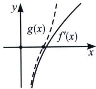

<!-- question-source:start -->
例3 (2015·新课标Ⅰ)设函数 $f(x)=e^{2x}-a\ln x$ .

(1) 讨论 $f(x)$ 的导函数 $f'(x)$ 零点的个数；

(2)证明：当 $a > 0$ 时， $f(x) \geqslant 2a + a\ln \frac{2}{a}$ .

(1) $f'(x)=2e^{2x}-\frac{a}{x}$ ，①当 $a\leqslant0$ 时， $f'(x)>0$ 恒成立，没有零点；

②当 $a > 0$ 时, $f''(x) > 0$ , 故 $f'(x)$ 单调递增, 我们对 $f'(x) = 2e^{2x} - \frac{a}{x}$ 进行主客体变量分析, 当 $x > 0$ 时， $2e^{2x}\in(2,+\infty)$ ，且当 $x\to+\infty$ ， $2e^{2x}\to+\infty$ ， $-\frac{a}{x}<0$ ，当 $x\to0$ 时， $-\frac{a}{x}\to-\infty$ ，找大点时，
我们需要构造一个小函数，即 $f'(x)=2\left(e^{2x}-\frac{a}{2x}\right)>2\left(1-\frac{a}{2x}\right)=0$ ，取 $x=\frac{a}{2}$ ， $f'\left(\frac{a}{2}\right)>0$ ，我们需要
找一个小点 m，使得 $f'(m)<0$ ，一定要找一个比 $f'(x)$ 更大的函数（如图），

从 $2e^{2x}$ 参考小点的设界下手，要找一个小点 m，使得 $f'(m)<0$ ，其主体变量是负数部分 $-\frac{a}{x}$ ，正数部分 $2e^{2x}$ 我们给它进行设界，由于 $x\in\left(0,\frac{a}{2}\right)$ ，且 $2e^{2x}$ 为单调增函数，故 $f'(x)=2e^{2x}-\frac{a}{x}<2e^{a}-\frac{a}{x}=0$ ，取 $x=\frac{a}{2e^{a}}$ ，故 $\exists x_{1}\in\left(\frac{a}{2e^{a}},\frac{a}{2}\right)$ ，使得 $f'(x_{1})=0$ ；

(2)(同构保值性)构造函数 $h(x)=e^{x}-x-1$ ，易证得 $h(x)\geqslant0$ ，当且仅当x=0时等号成立(请读者自证)， $f(x)-2a-a\ln\frac{2}{a}=a\left(\frac{e^{2x}}{a}-\ln x-2-\ln\frac{2}{a}\right)=a\left[(e^{2x-\ln a}-2x+\ln a-1)+(2x-\ln 2x-1)\right]=ah(2x-\ln a)+ah(\ln 2x)\geqslant0$ ，当且仅当 $2x-\ln a=0,\ln 2x=0$ ，即 $x=\frac{1}{2},a=e$ 时等号成立.

## 三、等效零点方程与界限锁定

在前面的零点问题分析当中，我们发现无论是指数还是对数，一定要有主体变量和客体变量，如果出现 $xe^{x}=a$ 或者 $x\ln x=a$ ，我们就需要进行等效零点转化，即转化为含有主体和客体变量的形式，比如 $x\left(e^{x}-\frac{a}{x}\right)=0$ 或者 $e^{x}\left(x-\frac{a}{e^{x}}\right)=0$ 这样的等效零点方程.
<!-- question-source:end -->

![[高中/总复习/专题/2026版高中《mst老唐说题》导数专题（数学）/上册/第06章_综合篇_新三板斧/第四节_找点体系与原理解析/例题/answers/Q00046677A1.md]]
