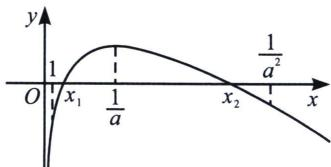

<!-- question-source:start -->
例7 当 $0 < a < \frac{1}{e}$ 时，讨论函数 $f(x) = \ln x - ax$ 的零点个数.

(1) = -a < 0$ ， $f\left(\frac{1}{a}\right) > 0$ ，故 $\exists x_1 \in \left(1, \frac{1}{a}\right)$ ，使得 $f(x_1) = 0$ ；

我们需要取一个点 $m > \frac{1}{a}$ ，使得 $f(m) < 0$ ，如图，此时导致 $f(x) \to -\infty$ 主体变量是 $-ax$ （等效零点）： $f(x) = \ln x - ax = \sqrt{x} \left( \frac{\ln x}{\sqrt{x}} - a\sqrt{x} \right) < \sqrt{x} \left( \frac{2}{e} - a\sqrt{x} \right) = 0$ ，取 $m = \frac{4}{a^2 e^2}$ ，再进行取整后取 $m = \frac{1}{a^2}$ ，故 $\exists x_2 \in \left( \frac{1}{a}, \frac{1}{a^2} \right)$ ，使得 $f(x_2) = 0$ ；
<!-- question-source:end -->

![[高中/总复习/专题/2026版高中《mst老唐说题》导数专题（数学）/上册/第06章_综合篇_新三板斧/第四节_找点体系与原理解析/例题/answers/Q00046682A1.md]]
