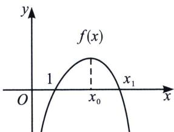
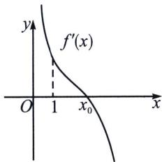
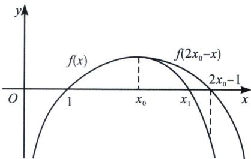

<!-- question-source:start -->
例26 (2019·天津)设函数 $f(x)=\ln x-a(x-1)e^{x}$ ，其中 $a\in R$ .

(1) 若 $a \leqslant 0$ ，讨论 $f(x)$ 的单调性；

(2) 若 $0 < a < \frac{1}{e}$ , (i) 证明 $f(x)$ 恰有两个零点;

(ii) 设 $x_{0}$ 为 $f(x)$ 的极值点， $x_{1}$ 为 $f(x)$ 的零点，且 $x_{1} > x_{0}$ ，证明： $3x_{0} - x_{1} > 2$ .

(1) $f'(x)=\frac{1}{x}-[ae^{x}+a(x-1)e^{x}]=\frac{1-ax^{2}e^{x}}{x}, x\in(0,+\infty), a\leqslant0$ 时， $f'(x)>0$ ，所以函数 $f(x)$ 在 $x\in(0,+\infty)$ 上单调递增.

(2)本题有一个特殊条件, 就是显点 $f
(1)=0$ , 且 $f' (1)=1-ae>0$ , $f''(x)=-\frac{1}{x^2}-a(x+1)e^x<0$ , 故 $f'(x)$ 单调递减, 所以在 $x\in(1,+\infty)$ , 会以此出现两个隐点, 分别是极值点 $x_0$ 和零点 $x_1$ , 这里涉及双变量处理的方法, 极值点构造隐零点方程代换, 零点则需要进行放缩取点, 从而证明最后一问的不等式, 我们将这种由显点效应构造的极值点零点不等式称为“极隐零放”.

证明: (i)由
(1)可知: $f'(x)=\frac{1-ax^2e^x}{x}, x \in (0, +\infty)$ . 令 $g(x)=1-ax^2e^x$ , $g'(x)=-a(x^2+2x)e^x$ , 因为 $0<a<\frac{1}{e}$ , 可知: $g(x)$ 在 $x \in (0, +\infty)$ 上单调递减, 又 $g (1)=1-ae>0$ . 导函数的零点不可求, 我们就需要先对导函数放缩取点, 对此需要采用等效零点分析, 具体操作如下:

由于 $g(x)=x^{2}\left(\frac{1}{x^{2}}-ae^{x}\right)$ ，我们发现 $\frac{1}{x^{2}}\in(0,1)$ ，属于客体部分， $-ae^{x}\in(-\infty,-ae)$ ，属于导致 $g(x)<0$ 的主体部分，所以 $g(x)=x^{2}\left(\frac{1}{x^{2}}-ae^{x}\right)<x^{2}(1-ae^{x})=0$ ，取 $x=\ln\frac{1}{a}$ ， $g\left(\ln\frac{1}{a}\right)=1-\left(\ln\frac{1}{a}\right)^{2}<0$ ，所以 $g(x)$ 存在唯一零点 $x_{0}\in\left(1,\ln\frac{1}{a}\right)$ 。即函数 $f(x)$ 在 $(0,x_{0})$ 上单调递增，在 $(x_{0},+\infty)$ 单调递减， $x_{0}$ 是函数 $f(x)$ 的唯一极值点。

## 第6章 综合篇——新三板斧(放缩、找点、分而治之)

(1)=0,\ f(x_{0})>f (1)=0,\ f(x)=\ln x-a(x-1)e^{x}$ ，由于 $\ln x\in(0,+\infty)$ ，为客体部分， $-a(x-1)e^{x}\in(-\infty,0)$ ，为导致 $f(x)<0$ 主体部分，但是出现了两个无穷大，所以这种情况下我们需要进行等效零点转化， $f(x)=(x-1)\left(\frac{\ln x}{x-1}-ae^{x}\right)<(x-1)(1-ae^{x})=0$ ，取 $x=\ln\frac{1}{a}$ ， $f\left(\ln\frac{1}{a}\right)<0$ ，所以 $\exists x_{1}\in\left(1,\ln\frac{1}{a}\right)$ ，使得 $f(x_{1})=0.$ (ii)方案一：由题意可得： $f'(x_0)=0,\ f(x_1)=0$ ，即 $ax_{0}^{2}e^{x_{0}}=1\Rightarrow a=\frac{1}{x_{0}^{2}e^{x_{0}}}①,\ \ln x_{1}=a(x_{1}-1)e^{x_{1}}\Rightarrow a=\frac{\ln x_{1}}{(x_{1}-1)e^{x_{1}}}②$ ，我们通过(i)的找点操作发现虽然 $x_{0}\in\left(1,\ln\frac{1}{a}\right),x_{1}\in\left(1,\ln\frac{1}{a}\right)$ ，但是 $x_{1}>x_{0}$ ，要证明 $3x_{0}-x_{1}>2$ ，只需证 $3x_{0}>2+\ln\frac{1}{a}>2+x_{1}$ ，根据①得：只需 $3x_{0}>2+\ln x_{0}^{2}e^{x_{0}}$ ，即证 $3x_{0}>2+\ln x_{0}^{2}e^{x_{0}}=2+2\ln x_{0}+x_{0}$ ，只需证 $x_{0}>\ln x_{0}+1$ ，由于 $x_{0}\in\left(1,\ln\frac{1}{a}\right)$ ，故命题得证.

方案二(极值点偏移取点): 如图, $g(x)$ 存在唯一零点 $x_0 \in \left(1, \ln \frac{1}{a}\right)$ . 即函数 $f(x)$ 在 $(0, x_0)$ 上单调递增, 在 $(x_0, +\infty)$ 单调递减, $x_0$ 是函数 $f(x)$ 的唯一极值点. 易知 $f'''(x) < 0$ , 故极大值右偏 (三阶导大于零, 极小值右偏, 极大值则相反), 构造 $F(x) = f(x) - f(2x_0 - x) = \ln x - a(x - 1)e^x + \ln \frac{1}{2x_0 - x} + a(2x_0 - x - 1)e^{2x_0 - x}$ , 易证 $F'(x) = \frac{1}{x} - axe^x + \frac{1}{2x_0 - x} - a(2x_0 - x)e^{2x_0 - x} < 0$ (考试无需证明, 这仅仅是一个探路的思路), 要证明 $3x_0 - x_1 > 2$ , 只需证 $3x_0 > x_1 + 2$ , 根据极值点偏移可知 $x_1 < 2x_0 - 1$ , 故只需证 $3x_0 > 2x_0 - 1 + 2 = 2x_0 + 1$ , 显然成立, 所以本题的关键就是取点证 $f(2x_0 - 1) < 0$ , 由于 $ax_0^2 e^{x_0} = 1 \Rightarrow a = \frac{1}{x_0^2 e^{x_0}}$ , $f(2x_0 - 1) = \ln (2x_0 - 1) - a(2x_0 - 1)e^{2x_0 - 1} = \ln (2x_0 - 1) - \frac{2x_0 - 1}{x_0^2} e^{x_0 - 1}$ , 令 $t = 2x_0 - 1 > 1$ , $f(t) = \ln t - \frac{4t}{(t + 1)^2} e^{\frac{t-1}{2}} = t\left[\frac{\ln t}{t} - \frac{4e^{\frac{t-1}{2}}}{(t + 1)^2}\right] = t\left[\frac{\ln t}{t} - \frac{1}{4e} \cdot \frac{(e^{\frac{t+1}{4}})^2}{\left(\frac{t+1}{4}\right)^2}\right] < t\left(\frac{1}{e} - \frac{e}{4}\right) < 0$ , 所以存在 $x_1 \in (x_0, 2x_0 - 1)$ , 符合题意.

注意：搞定了极值点偏移取点，很多问题的放缩和构造，本质就是偏移问题和偏移精度构造的问题.

## 九、放缩取点二分法升级精度
<!-- question-source:end -->

![[高中/总复习/专题/2026版高中《mst老唐说题》导数专题（数学）/上册/第06章_综合篇_新三板斧/第四节_找点体系与原理解析/例题/answers/Q00046700A1.md]]
