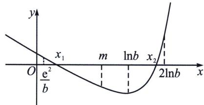
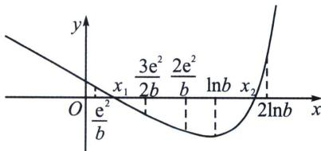

<!-- question-source:start -->
例27 (2021·浙江)设 a, b 为实数，且 a > 1，函数 $f(x) = a^{x} - bx + e^{2} (x \in \mathbb{R})$ .

(1)求函数 $f(x)$ 的单调区间；

(2)若对任意 $b > 2e^{2}$ , 函数 $f(x)$ 有两个不同的零点, 求 $a$ 的取值范围;

(3)当a=e时，证明：对任意 $b>e^{4}$ ，函数 $f(x)$ 有两个不同的零点 $x_{1}$ ， $x_{2}$ 满足 $x_{2}>\frac{b\ln b}{2e^{2}}x_{1}+\frac{e^{2}}{b}$ (注： $e=2.71828\cdots$ 是自然对数的底数)

## 解析
(1)由题意得 $f'(x)=a^{x}\ln a-b$ ;

(1) 当 $b \leqslant 0$ 时，由于 a > 1，则 $a^{x} \ln a > 0$ ，故 $f'(x) > 0$ ，此时 $f(x)$ 在 R 上单调递增；

(2)当 $b > 0$ 时，令 $f^{\prime}(x) > 0$ ，解得 $x > \frac{\ln\frac{b}{\ln a}}{\ln a}$ ，令 $f^{\prime}(x) < 0$ ，解得 $x < \frac{\ln\frac{b}{\ln a}}{\ln a}$ ，所以此时 $f(x)$ 在 $\left[-\infty ,\frac{\ln\frac{b}{\ln a}}{\ln a}\right]$ 单调递减，在 $\left[\frac{\ln\frac{b}{\ln a}}{\ln a}, + \infty\right]$ 单调递增：

综上，当 $b \leqslant 0$ 时， $f(x)$ 的单调递增区间为 $(- \infty, + \infty)$ ：当 $b > 0$ 时， $f(x)$ 的单调递减区间为 $\left(-\infty, \frac{\ln \frac{b}{\ln a}}{\ln a}\right)$ ，单调递增区间为 $\left(\frac{\ln \frac{b}{\ln a}}{\ln a}, + \infty\right)$ :

(2)由 $f'(x)=a^{x}\ln a-b$ ，由a>1， $b>2e^{2}$ 有 $\frac{b}{\ln a}>0$ ， $f'(x)=0\Rightarrow x_{0}=\log_{a}\frac{b}{\ln a}$ ，易知 $f(x)$ 在 $(-∞,x_{0})$ 单调递减， $(x_{0},+∞)$ 单调递增； $f(x)_{\min}=f(x_{0})=\frac{b}{\ln a}-b\log_{a}\frac{b}{\ln a}+e^{2}=\frac{b}{\ln a}-\frac{b}{\ln a}\ln\frac{b}{\ln a}+e^{2}$ ，(同构换元变形令 $\frac{b}{\ln a}=t$ )，若 $f(x)$ 有两个零点，则一定有 $f(x_{0})<0$ ， $f(x_{0})=h(t)=t-\mathrm{ln}t+e^{2}$ ，易知 $t>e^{2}$ 时 $h(t)<0$ ，有 $\frac{b}{\ln a}>e^{2}$ ，又 $b>2e^{2}\Rightarrow\ln a\leqslant2$ ，所以 $1<a\leqslant e^{2}$ ；

接下来进入放缩取点程序，当 $x < x_0$ 时，主体是 $-bx$ ，故 $f(x) > -bx + e^2 = 0$ ，取 $x = \frac{e^2}{b}$ ， $f\left(\frac{e^2}{b}\right) = a^{\frac{e^2}{b}} > 0$ ，存在唯一 $x_1 \in \left(\frac{e^2}{b}, x_0\right)$ ，使 $f(x_1) = 0$ ，在分析右边，主体是 $a^x$ ， $f(x) = e^{x\ln a} - bx + e^2 > e^{x\ln a} - bx = e^{\frac{x}{2}}\left(e^{\frac{x}{2}\ln a} - \frac{bx}{e^{\frac{x}{2}}}\right) > e^{\frac{x}{2}}\left(e^{\frac{x}{2}\ln a} - \frac{2b}{e}\right) = 0$ ，解得： $x = 2\log_a\frac{2b}{e}$ ，取整得： $x = 2\log_ab$ 存在唯一 $x_2 \in (x_0, 2\log_ab)$ ，使 $f(x_2) = 0$ ，综合可得： $1 < a \leqslant e^2$ ；

(3) 当 a = e 时，由
(2)知极值点 $x_{0} = \ln b$ ， $f(x)$ 有两个零点 $x_{1}$ ， $x_{2}$ 且 $0 < x_{1} < \ln b < x_{2}$ ，

法一：(零点二分法提高取点精度)由
(2)知 $f(x)$ 有两个零点 $x_{1}$ ， $x_{2}$ ，代入a=e，得 $\frac{e^{2}}{b}<x_{1}<\ln b<x_{2}<2\ln b$ ，如图，根据题意，只需找到同时满足 $\left\{\begin{aligned} &x_{2}>\ln b>m>x_{1}\\ &\ln b>\frac{b\ln b}{2e^{2}}m+\frac{e^{2}}{b}>\frac{b\ln b}{2e^{2}}x_{1}+\frac{e^{2}}{b}\end{aligned}\right.$ 的点m，在探索 $\ln b>$

## 第6章 综合篇——新三板斧(放缩、找点、分而治之)

$\frac{b \ln b}{2 e^2} m + \frac{e^2}{b} > \frac{b \ln b}{2 e^2} x_1 + \frac{e^2}{b}$ 取点过程中，先进行必要性探路，由于 $b > e^4$ ，故 $\frac{e^2}{b} < \frac{1}{e^2}$ ，是一个相对较小的变量，先将其拿掉，即构造一个可约分取点的式子 $\ln b = \frac{b \ln b}{2 e^2} m_0$ ，取 $m_0 = \frac{2 e^2}{b}$ ，此时的 $m_0$ 不是本题的结果，仅仅是一个为了简化而选择的过度数据，本题命题者就在这里故意设置了 $\frac{e^2}{b}$ 这个干扰因素， $f\left(\frac{2 e^2}{b}\right) = e^{\frac{2 e^2}{b}} - e^2 < 0$ ，且 $\ln b > 4 > \frac{2 e^2}{b}$ ，这个 $m_0 = \frac{2 e^2}{b}$ 探路方向都是正确的，仅仅是必要性探路出来一个更大的值，我们进行二次放缩， $\frac{e^2}{b} < m < \frac{2 e^2}{b}$ ，那么考虑零点二分法，取 $m = \frac{3 e^2}{2 b}$ ，

结果 $\frac{b\ln b}{2e^{2}}m+\frac{e^{2}}{b}=\frac{3}{4}\ln b+\frac{e^{2}}{b}<\ln b$ ，且 $f(m)=e^{\frac{3e^{2}}{2b}}-b\cdot\frac{3e^{2}}{2b}+e^{2}<e^{\frac{3}{2e^{2}}}-e^{2-\ln2}<0$ （根据 $\frac{3}{2e^{2}}<1<2-\ln2$ ）
成立，如图，故符合 $x_{2}>\ln b>\frac{b\ln b}{2e^{2}}\cdot\frac{3e^{2}}{2b}+\frac{e^{2}}{b}>\frac{b\ln b}{2e^{2}}x_{1}+\frac{e^{2}}{b}$ ，命题得证.

注意：本题不妨令 $m = \lambda \frac{e^2}{b} (1 < \lambda < 2)$ ，且符合 $\left\{ \begin{array}{l} x_2 > \ln b > \frac{b \ln b}{2 e^2} \cdot \frac{\lambda e^2}{b} + \frac{e^2}{b} \\ f\left(\frac{\lambda e^2}{b}\right) < 0 \end{array} \Rightarrow \left\{ \begin{array}{l} b \ln b\left(1 - \frac{\lambda}{2}\right) > 4e^4\left(1 - \frac{\lambda}{2}\right) > e^2 \\ 2 + \ln (\lambda - 1) > \frac{\lambda e^2}{b} > \frac{\lambda}{e^2} \end{array} \right. \right.$
<!-- question-source:end -->

![[高中/总复习/专题/2026版高中《mst老唐说题》导数专题（数学）/上册/第06章_综合篇_新三板斧/第四节_找点体系与原理解析/例题/answers/Q00046701A1.md]]
