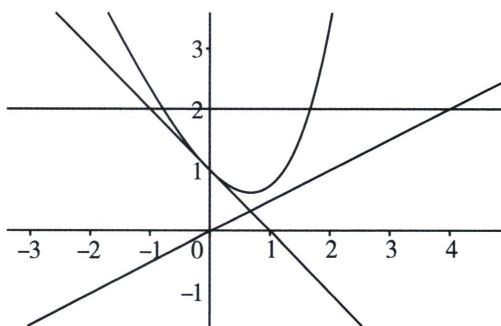

> [!faq]- 《导数专题(上)》例题解析
>
> > [!success]- **【答案】** 详见解析
>
> > [!note]- **【分析】**
> > 本题未单列分析。
>
> > [!note]- **【解析】**
> > 解析 法一：因为 $f(x)=e^{x}-2x,\quad f'(x)=e^{x}-2=0,\quad x=\ln2$ ，当 $\left\{\begin{aligned}x<\ln2,&f'(x)<0,f(x)\downarrow\\ x>\ln2,&f'(x)>0,f(x)\uparrow\end{aligned}\right.$
> > ## 第6章 综合篇——新三板斧(放缩、找点、分而治之)
> > $f(x)_{\min}=f(\ln2)=2-2\ln2$ ，关于 $f(x)=t$ 的方程有两个实数根，所以 $f(x)=t>2-2\ln2$
> > 故左边找显点切线， $y - f(0) = x f'(0) \Rightarrow y = 1 - x$ ，自证 $y = 1 - x \leqslant e^x - 2x$ ，令 $t = 1 - x \Rightarrow x'_1 = 1 - t$ ，即证 $x_2 < 2t$ ，即证明 $f(2t) = e^{2t} - 4t > t \Rightarrow e^{2t} > 2et > 5t$ 得证！
> > 法二：找点：（单调性自行补充）令 $g(x)=e^{x}-2x-t>1-x-t=0\Rightarrow x'_{1}=1-t$ ，右边探路得即证 $x_{2}<2t$ ，令 $y=kx+b=t\Rightarrow x=\frac{t-b}{k}=2t\Rightarrow\left\{\begin{aligned}k&=\frac{1}{2}\\ &b&=0\end{aligned}\right.\Rightarrow y=\frac{x}{2}$ ，右边即证 $e^{x}-2x>\frac{1}{2}x$ ，由 $e^{x}>ex>\frac{5x}{2}$ ，得证！
> > 
> > 本题在切割线夹中属于流氓题，在不给任何提示得情况下，可以出无数道切割线得题，考试除了凭借经验，很难处理.
> > ## 八、偏移取点
