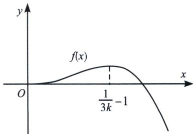
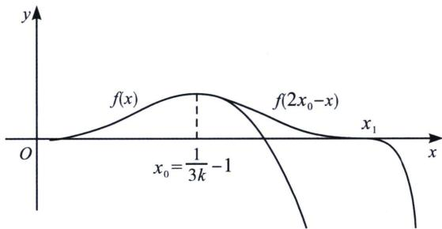
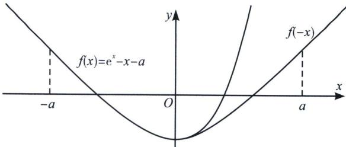

<!-- question-source:start -->
例21 (2025 新课标Ⅱ卷第 18 题) 已知 $f(x) = \ln (1 + x) - x + \frac{1}{2} x^2 - kx^3, 0 < k < \frac{1}{3}$ .

(1)证明： $f(x)$ 在 $(0,+\infty)$ 存在唯一极值点和唯一零点；

(2)设 $x_{1}$ ， $x_{2}$ 为 $f(x)$ 在 $(0,+\infty)$ 的极值点和零点；

(i) 设 $g(t)=f(x_{1}+t)-f(x_{1}-t)$ ，证明： $g(t)$ 在 $(0, x_{1})$ 单调递增；

(ii) 比较 $2x_{1}$ 与 $x_{2}$ 的大小，并证明.

（1）由题意可知 $f^{\prime}(x) = \frac{1}{1 + x} - 1 + x - 3kx^{2} = \frac{1 - 1 - x + x + x^{2} - 3kx^{2} - 3kx^{3}}{1 + x} =$ $\frac{x^2[1 - 3k(x + 1)]}{1 + x}, x > 0$ 时， $\frac{x^2}{1 + x} >0, k\in \left(0,\frac{1}{3}\right)$ ，故 $g(x) = 1 - 3k(x + 1)$ 单调递减，且当 $x\in$ $(0,\frac{1}{3k} -1)$ 时 $g(x) > 0$ ，即 $f^{\prime}(x) > 0$ ，故 $f(x)$ 单调递增； $x\in \left(\frac{1}{3k} -1, + \infty\right)$ 时 $g(x) <   0$ ，即 $f^{\prime}$ $(x) <   0,f(x)$ 单调递减，故 $f(x)$ 有唯一极值点 $\frac{1}{3k} -1$

又 $f(0) = 0$ ，故 $x\in \left(0,\frac{1}{3k} -1\right)$ 时， $f(x) > f(0) = 0$ ， $x\in \left(\frac{1}{3k} -1, + \infty\right)$ 时， $f\left(\frac{1}{2k}\right) = \ln \left(1 + \frac{1}{2k}\right) -$ $\frac{1}{2k} < 0$ ，故存在唯一 $x_0 \in \left(\frac{1}{3k} - 1, \frac{1}{2k}\right)$ 满足 $f(x_0) = 0$ ，故 $f(x)$ 在 $(0, +\infty)$ 存在唯一极值点和唯一零点；注意：放缩取点，由于 $\ln(1+x) - x < 0$ ，利用 $f(x) = \ln(1+x) - x + \frac{1}{2}x^2 - kx^3 < \frac{1}{2}x^2 - kx^3 = x^2 \left(\frac{1}{2} - kx\right) = 0$ ，取 $x = \frac{1}{2k}$ ；利用 $f(x) = \ln(1+x) - x + \frac{1}{2}x^2 - kx^3 < \ln(1+x) + \frac{1}{2}x^2 - kx^3 = x^2 \left[\frac{\ln(1+x)}{x^2} + \left(\frac{1}{2} - kx\right)\right] < x^2\left(\frac{3}{2} - kx\right) = 0$ ，取 $x = \frac{3}{2k}$ ，取点放缩方法很多种，但你需要养成放缩取点的习惯。

(2)（i）由题意可知 $x_{1} = \frac{1}{3k} - 1$ 、 $x_{2} = x_{0}$ ；则 $g^{\prime}(t) = f^{\prime}(x_{1} + t) + f^{\prime}(x_{1} - t)$ ， $g^{\prime}(t) = \frac{(x_{1} + t)^{2}[1 - 3k(x_{1} + t + 1)]}{1 + x_{1} + t} + \frac{(x_{1} - t)^{2}[1 - 3k(x_{1} - t + 1)]}{1 + x_{1} - t} = 3kt\left[\frac{(x_{1} - t)^{2}}{1 + x_{1} + t} + \frac{(x_{1} + t)^{2}}{1 + x_{1} - t}\right]$ $g^{\prime}(t) = \frac{6kt^{2}(t^{2} - x_{1}^{2} - 2x_{1})}{(1 + x_{1})^{2} - t^{2}}$ ，又 $t \in (0, x_{1})$ ，故 $t^{2} - x_{1}^{2} - 2x_{1} < 0$ ，又 $(1 + x_{1})^{2} - t^{2} > 0$ ，故 $g^{\prime}(t) < 0$ ， $g(t)$ 在 $(0, x_{1})$ 单调递减；
(ii）由(i）知 $g(t)$ 在 $(0, x_{1})$ 单调递减，故 $g(x_{1}) < g(0)$ 。则有 $f(2x_{1}) - f(0) < f(x_{1}) - f(x_{1}) = 0 \Rightarrow f(2x_{1}) < 0$ ，又有 $x_{2}$ 是 $f(x)$ 的零点，则 $f(x_{2}) = 0$ ，继而得到 $f(2x_{1}) < f(x_{2})$ ，又有 $x_{2} > x_{1}$ ， $2x_{1} > x_{1}$ ，且 $f(x)$ 在 $(x_{1}, +\infty)$ 上单调递减，得到， $2x_{1} > x_{2}$ 。

注意：本题就在第二问简单的极值点偏移提示下，给了第三问一个不用计算便能拿到的结果，总体而言，今年的二卷难度偏简单，一道三问的考题，似乎还不如以前两问的考题难度大。明年高考命题组估计又要换人，没有达到选拔人才的目的。如果说2024年的新定义走的有点激进，咱们很多地方的教学环境很难支撑新定义的学习，那么一道这样的18题，没有任何设计的坑，没有任何可能走偏的方向，目的何在？意欲何为？如果非要我来理解，那便是利用极值点偏移进行放缩取点，高考早就有了要求，对极值点和零点的关系，高考早就有这些多元化的考查，我们不妨看看那些曾经高考中出现过的考题。

知识点：极值点偏移与放缩取点

如果函数 $y = f(x)$ 的满足 $f'(x_0) = 0$ ，且在 $x = x_0$ 处左右两侧 $f'(x)$ 异号，则 $f(x)$ 在 $x = x_0$ 取得极值点，所有的函数，除了二次函数（和型对称）和对勾函数（积型对称），都会产生极值点偏移，所以我们可以利用极值点偏移，进行放缩取点。

比如最简单的 $f(x)=e^{x}-x-a$ 有两个零点，求a取值范围，并进行放缩取点。

如图， $f'(x)=e^{x}-1=0$ ， $x=0$ ，易知 $x<0$ ， $f'(x)<0$ ， $f(x)$ 单调递减； $x>0$ ， $f'(x)>0$ ， $f(x)$ 单调递增； $f(x)_{\text{极小}}=f(0)=1-a<0$ ，则 $a>1$ 时，会有两个零点，接下来进行放缩取点，先对函数再作分析： $f''(x)=e^{x}>0$ ，函数为凹函数， $f'''(x)=e^{x}>0$ ，故极小值出现右偏，即 $x>0$ 时， $f(x)>f(-x)$ ，很容易证明，构造 $F(x)=f(x)-f(-x)=e^{x}-e^{-x}-2x$ ，典型的双曲正弦函数， $F'(x)=e^{x}+e^{-x}-2>0$ ，所以 $F(x)$ 单调递增， $F(x)>F(0)=0$ ，所以 $f(x)>f(-x)$ ；

在这个极值点偏移的 buff 加成下，取点则简单很多，x<0 时， $f(x)=e^{x}-x-a>-x-a=0$ ，取 x=-a，则 $f(-a)>0$ ，由于 x>0 时， $f(x)>f(-x)$ ，故一定有取 x=a， $f(a)=e^{a}-2a=e^{a}\left(1-\frac{2a}{e^{a}}\right)>e^{a}\left(1-\frac{2}{e}\right)>0$ ;

所以，合理利用极值点偏移进行放缩取点，很多题根本无需计算即可得出.

## 例22 (2020·新课标 I 文科第二问)已知函数 $f(x)=e^{x}-a(x+2)$ 。若 $f(x)$ 有两个零点，求 a 的取值范围。
<!-- question-source:end -->

![[高中/总复习/专题/2026版高中《mst老唐说题》导数专题（数学）/上册/第06章_综合篇_新三板斧/第四节_找点体系与原理解析/八_偏移取点/例题/answers/Q00047347A1.md]]
