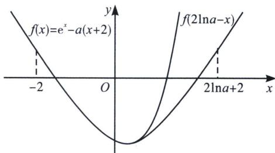

> [!faq]- 《导数专题(上册)》例题解析
>
> > [!success]- **【答案】** 详见解析
>
> > [!note]- **【分析】**
> > $f''(x)=e^{x}>0$ ，函数为凹函数， $f'''(x)=e^{x}>0$ ，故极小值出现右偏，即 $x>0$ 时， $f(x)>f(-x)$ ，很容易证明，构造 $F(x)=f(x)-f(-x)=e^{x}-e^{-x}-2x$ ，典型的双曲正弦函数， $F'(x)=e^{x}+e^{-x}-2>0$ ，所以 $F(x)$ 单调递增， $F(x)>F(0)=0$ ，所以 $f(x)>f(-x)$ ；
> >
> > 在这个极值点偏移的 buff 加成下，取点则简单很多，x<0 时， $f(x)=e^{x}-x-a>-x-a=0$ ，取 x=-a，则 $f(-a)>0$ ，由于 x>0 时， $f(x)>f(-x)$ ，故一定有取 x=a， $f(a)=e^{a}-2a=e^{a}\left(1-\frac{2a}{e^{a}}\right)>e^{a}\left(1-\frac{2}{e}\right)>0$ ;
> >
> > 所以，合理利用极值点偏移进行放缩取点，很多题根本无需计算即可得出.
> >
> > ## 例22 (2020·新课标 I 文科第二问)已知函数 $f(x)=e^{x}-a(x+2)$ 。若 $f(x)$ 有两个零点，求 a 的取值范围。
>
> > [!note]- **【解析】**
> > 解析 ①当 $a \leqslant 0$ 时, $f'(x) = e^x - a > 0$ 恒成立, $f(x)$ 在 $(- \infty, + \infty)$ 上单调递增, 不合题意;
> > - **②**：当 $a > 0$ 时, 令 $f'(x) = 0$ , 解得 $x = \ln a$ , 当 $x \in (-\infty, \ln a)$ 时, $f'(x) < 0$ , $f(x)$ 单调递减, 当 $x \in (\ln a, + \infty)$ 时, $f'(x) > 0$ , $f(x)$ 单调递增. 所以 $f(x)_{\min} = f(\ln a) = a - a(\ln a + 2) = -a(1 + \ln a)$ . 要使 $f(x)$ 有两个零点, 则一定要满足 $f(\ln a) < 0$ , 则 $a > \frac{1}{e}$ , 由于 $f(-2) = e^{-2} > 0 \exists x_1 \in (-2, \ln a)$ , 使 $f(x_1) = 0$ ,
> >
> > 
> >
> > (极值点偏移取点): 由于 $f'''(x) = e^x > 0$ , 故会出现极值点右偏的情况, 即 $x > \ln a$ 时, $f(x) > f(2\ln a - x)$ , 则利用对称性, 当左边出现 $f(-2) > 0$ 时, 右边一定存在 $f(2\ln a + 2) > 0$ , 即 $f(2\ln a + 2) = (ea)^2 - 2a(\ln a + 2) = e^2 a^2 \left(1 - 2\frac{\ln e^2 a}{e^2 a}\right) > 0$ , 故 $\exists x_2 \in (\ln a, 2\ln a + 2)$ , 使 $f(x_2) = 0$ , 综上, 若 $f(x)$ 有两个零点, 则 $a$ 的取值范围是 $\left(\frac{1}{e}, +\infty\right)$ .
> >
> > 注意：极值点偏移利用三阶导和图像综合判断，放缩取点直接取出来代入函数，即可得到，非常好操作.
