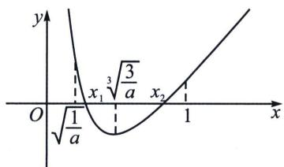

> [!faq]- 《导数专题(上册)》例题解析
>
> > [!success]- **【答案】** 详见解析
>
> > [!note]- **【解析】**
> > 解析 (1) 证明：令 $g(x) = 1 + x \ln x$ ，函数定义域 $x \in (0, +\infty)$ ，则求导可得 $g'(x) = 1 + \ln x$ .
> >
> > 令 $g^{\prime}(x) > 0$ ，得 $x > \frac{1}{e}$ ；令 $g^{\prime}(x) < 0$ ，得 $0 < x < \frac{1}{e}$ 所以 $g(x)$ 在 $\left(0, \frac{1}{e}\right)$ 上单调递减，在 $\left(\frac{1}{e}, +\infty\right)$ 上单调递增．所以 $g(x)_{\min} = g\left(\frac{1}{e}\right) = 1 - \frac{1}{e} > 0$ ，所以 $1 + x\ln x > 0$ 得证；
> >
> > (2)证明：易知函数 $f(x)=a(\ln x+1)+\frac{1}{x^{3}}$ 的定义域是 $(0,+\infty)$ 。 $f'(x)=\frac{a}{x}-\frac{3}{x^{4}}=\frac{ax^{3}-3}{x^{4}}$
> >
> > 令 $f'(x)>0$ 。得 $x>\sqrt[3]{\frac{3}{a}}$ ；令 $f'(x)<0$ ，得 $0<x<\sqrt[3]{\frac{3}{a}}$ 。所以 $f'(x)>0$ 在 $x>\sqrt[3]{\frac{3}{a}}$ 上单调递减，在 $\left(\sqrt[3]{\frac{3}{a}},+\infty\right)$ 上单调递增，所以 $f(x)_{\min}=f\left(\sqrt[3]{\frac{3}{a}}\right)=\frac{a}{3}\left(\ln\frac{3}{a}+3\right)+\frac{a}{3}$ 。
> > - **①**：当 $\frac{a}{3}\left(\ln\frac{3}{a}+3\right)+\frac{a}{3}\geqslant0$ ，即 $0<a\leqslant3e^{4}$ 时， $f(x)$ 至多有1个零点，故不满足题意.
> > - **②**：当 $\frac{a}{3}\left(\ln\frac{3}{a}+3\right)+\frac{a}{3}<0$ ，即 $a>3e^{4}$ 时， $\sqrt[3]{\frac{3}{a}}<\sqrt[3]{\frac{1}{e^{4}}}<1$ 。因为 $f(x)$ 在 $(\sqrt[3]{\frac{3}{a}},+\infty)$ 上单调递增，且 $f(1)=a+1>0$ 。所以 $f(1)\cdot f(\sqrt[3]{\frac{3}{a}})<0$ ，所以 $f(x)$ 在 $(\sqrt[3]{\frac{3}{a}},+\infty)$ 上有且只有1个零点，不妨记为 $x_{2}$ ，且 $\sqrt[3]{\frac{3}{a}}<x_{2}<1$ ，如图。
> >
> > 
> >
> > 左边取点方案一：由(1)知 $x \ln x > -1 \Rightarrow \ln x > -\frac{1}{x} \Rightarrow \ln ex > -\frac{1}{ex}$ ，所以 $f(x) = a \ln ex + \frac{1}{x^3} > \frac{-a}{ex} + \frac{1}{x^3} = 0$ ，取 $x = \sqrt{\frac{e}{a}}$ ，所以 $\sqrt{\frac{1}{a}} < \sqrt{\frac{e}{a}} < x_1 < \sqrt[3]{\frac{3}{a}}$ ；
> >
> > 左边取点方案二： $f(x)=a(\ln x+1)+\frac{1}{x^{3}}=\frac{1}{x}\left(\frac{1}{x^{2}}+\frac{a}{e}\cdot ex\ln ex\right)>\frac{1}{x}\left(\frac{1}{x^{2}}-\frac{a}{e^{2}}\right)=0$ ，解得： $x=\frac{e}{\sqrt{a}}$ 显然 $x_{1} > \frac{e}{\sqrt{a}} > \sqrt{\frac{1}{a}}$ ; 综上所述， $|x_{2}-x_{1}| < 1 - \sqrt{\frac{1}{a}}$ .
> >
> > ## 例19 (陪跑课学生答疑)已知函数 $f(x)=x+\ln x-1$
> >
> > (1) 若 $f(x) \leqslant kx - k$ 对于 $\forall x > 0$ 恒成立，求 $k$ 的值；
> >
> > (2)若 $\exists x_{1} <   x_{2}$ ，使得 $|f(x_1)| = |f(x_2)| = a$ 成立，求证： $x_{2} > e^{\frac{a}{2}}x_{1}$
> >
> > ##
> > 解析 (1)略;
> >
> > (2)由题意 $\left\{ \begin{array}{l} f(x_{1}) = x_{1} + \ln x_{1} - 1 = -a \\ f(x_{2}) = x_{2} + \ln x_{2} - 1 = a \end{array} \right.$ ，且 $x_{1} < 1 < x_{2}$ ， $x_{2} > e^{\frac{a}{2}} x_{1} \Leftrightarrow \ln x_{2} - \ln x_{1} > \frac{a}{2} \Rightarrow x_{2} - x_{1} < \frac{3a}{2}$ ，当 $0 < a < 2$ ， $f(a + 1) = a + \ln (a + 1) > a$ ，故 $x_{2} < a + 1$ ，即证 $x_{1} > a + 1 - \frac{3a}{2} = 1 - \frac{a}{2}$ ，注： $0 < a < 2$ 并非空穴来风，而是探路得出 $x_{1} > 1 - \frac{a}{2}$ ，若 $a > 2$ ， $x_{1} < 0$ ，此时就与题目矛盾了。即证： $f\left(1 - \frac{a}{2}\right) = 1 - \frac{a}{2} + \ln\left(1 - \frac{a}{2}\right) - 1 < -a$ ，由 $\ln\left(1 - \frac{a}{2}\right) < -\frac{a}{2}$ ，代入得成立，故得证！当 $a \geqslant 2$ ， $f\left(\frac{3a}{2}\right) = \frac{3a}{2} + \ln\frac{3a}{2} - 1 > a$ ，则 $x_{2} < \frac{3a}{2}$ ，且 $x_{1} > 0$ ，故 $x_{2} - x_{1} < \frac{3a}{2}$ 得证！
