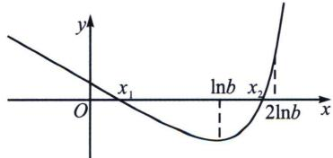

> [!faq]- 《导数专题(上册)》例题解析
>
> > [!success]- **【答案】** A
>
> > [!note]- **【解析】**
> > 解析 因为 $f'(x)=e^{x}-a$ ， $f'(x)=0$ 时， $x=\ln a(a>0)$ ，当 $x\in(-\infty,\ln a)$ 时， $f(x)$ 单调递减，当 $x\in(\ln a,+\infty)$ 时， $f(x)$ 单调递增， $f(x)_{\min}=f(\ln a)=a(1-\ln a)<0$ ，即a>e时，有2个零点，由于 $f(0)=1>0$ ， $\exists x_{1}\in(0,\ln a)$ 使 $f(x_{1})=0$ ；我们需要要取一个比 $\ln a$ 更大的点，
> >
> > 
> >
> > (等效零点法): $f(x) = e^{x} - ax$ 当中, 我们发现客体变量 $-ax$ 是一个负无穷, 我们需要通过等效零点的方式让其转化为有界, 这里我们遵循一句话“主题留一半, 客体被吊打”, 即提出公因式 $e^{\frac{x}{2}}$ .
> >
> > $f(x) = e^{\frac{x}{2}}\left(e^{\frac{x}{2}} - \frac{ax}{e^{\frac{x}{2}}}\right)\geqslant e^{\frac{x}{2}}\left(e^{\frac{x}{2}} - \frac{2a}{e}\right) = 0$ ，取 $x = 2\ln \frac{2a}{e}$ ，故 $\exists x_2\in \left(\ln a,2\ln \frac{2a}{e}\right)$ ，使得 $f(x_{2}) = 0.$
> >
> > 注意：通常放缩取点需要取整，让结构更好看，本题我们可以取 $x = 2\ln a > 2\ln \frac{2a}{e}$ ，如图， $\exists x_2 \in (\ln a, 2\ln a)$ ，使得 $f(x_2) = 0$ 。
