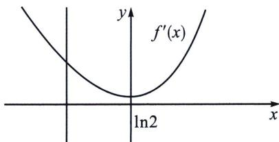
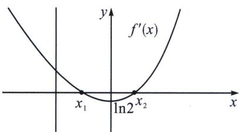
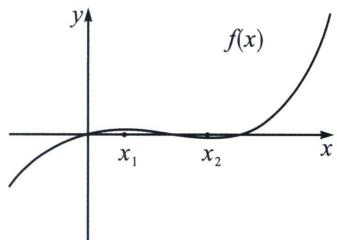
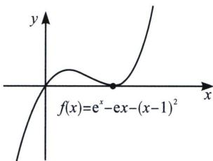

<!-- question-source:start -->
例6 已知函数 $f(x) = x - \frac{a}{\mathrm{e}^x} - \frac{1}{2} (\sin x - \cos x)$ .

(1)当 $a = 0$ 时，判断函数 $f(x)$ 的单调性；

(2)已知 $f(x)\geqslant1$ 对任意 $x\in\mathbb{R}$ 恒成立，求a的取值范围.

(1) 当 $a = 0$ 时, $f(x) = x - \frac{1}{2} (\sin x - \cos x)$ , $f'(x) = 1 - \frac{1}{2} (\cos x + \sin x) = 1 - \frac{\sqrt{2}}{2} \sin (x + \frac{\pi}{4}) > 0$ , 所以 $f(x)$ 在 $\mathbf{R}$ 上单调递增;

(2)由 $f(x)=x-\frac{a}{\mathrm{e}^{x}}-\frac{1}{2}(\sin x-\cos x)\geqslant1$ 对任意 $x\in\mathbb{R}$ 恒成立，则 $\frac{a}{\mathrm{e}^{x}}\leqslant x-1-\frac{1}{2}(\sin x-\cos x)$ 对任意 $x\in\mathbb{R}$ 恒成立，所以 $a\leqslant\left(x-1-\frac{1}{2}\sin x+\frac{1}{2}\cos x\right)\mathrm{e}^{x}$ 对任意 $x\in\mathbb{R}$ 恒成立，令 $g(x)=\left(x-1-\frac{1}{2}\sin x+\frac{1}{2}\cos x\right)\mathrm{e}^{x}$ ，则 $g'(x)=(x-\sin x)\mathrm{e}^{x}$ ，令 $\varphi(x)=x-\sin x$ ，则 $\varphi'(x)=1-\cos x\geqslant0$ ，所以 $\varphi(x)$ 在 $x\in\mathbb{R}$ 上单调递增，又因为 $\varphi(0)=0$ ，所以 $x\in(-\infty,0)$ 时， $\varphi(x)<0$ ，即 $g'(x)<0$ ， $g(x)$ 单调递减； $x\in(0,+\infty)$ 时， $\varphi(x)>0$ ，即 $g'(x)>0$ ， $g(x)$ 单调递增，所以 $g(x)_{\min}=g(0)=-\frac{1}{2}$ ，所以 $a\leqslant-\frac{1}{2}$ ，所以a的取值范围为 $\left(-\infty,-\frac{1}{2}\right]$ .

## 3. 端点效应之参变分离

端点效应失效, 其实就是端点是零点, 但不是极值点, 在整个函数的定义域内会存在极值点比端点值更小(大), 判断这中问题的主要依据, 还是分析数据, 端点处的泰勒展开是否符合, 对于这一类问题, 能参变分离优先参变分离, 另一种解法在后续隐点效应.

我们对 $f(x) = \frac{\mathrm{e}^x}{x}$ 的同构函数，形如 $f(x) = \frac{\mathrm{e}^x}{x^n} (n \in \mathbb{N}^*, x > 0)$ 进行研究 $f'(x) = \frac{\mathrm{e}^x(x - n)}{x^{n+1}}$ ，发现 $f'(n) = 0$ ，且 $x_0 = n$ 为导函数的穿越零点，即 $f(x) = \frac{\mathrm{e}^x}{x^n} (x > 0)$ 的唯一极值点为 $x_0 = n$ ，这就给了我们由数据逻辑而发的破解逻辑，比如函数结构上出现了 $f(x) = \frac{\mathrm{e}^x}{x^2} + g(x)$ ，我们应当第一时间反应 $x = 2$ 为 $h(x) = \frac{\mathrm{e}^x}{x^2}$ 的极值点，而如果命题者设定 $x = 2$ 为 $f(x)$ 的唯一极值点，我们就需要去研究 $g(x)$ 的极值点，此时我们就是在分开处理两部分函数的极值点，如果两函数极值点一致均为 $x_0 = n$ ，则最终必定会形成导中切模式，也就是我们通常说的因式分解形式 $f'(x) = (x - n)\varphi(x)$ .

例如： $f(x)=\mathrm{e}^{x}-x^{2}-ax-1\geqslant0$ 对 $x\geqslant0$ 恒成立，由于 $e^{x}$ 在 x=0 处的泰勒展开为 $\frac{1}{2}x^{2}+x+1$ ，与本题当中的二次项系数不等，故 x=0 是函数的端点，零点，却不是极值点，因为 $f(0)=0$ ， $f'(x)=\mathrm{e}^{x}-2x-a$ ， $f''(x)=\mathrm{e}^{x}-2$ ，所以 $f'(x)$ 在 $(0,\ln2)$ 递减， $(\ln2,+\infty)$ 递增。

$f'(x)$ 的最小值为 $f'(x)_{\min}=f'(\ln2)=2-2\ln2-a$ ，此时 $f'(x)$ 的图象可能出现多种情况：

(1)当如图1所示时， $f'(x)\geqslant0$ ， $f(x)$ 在 $[0,+\infty)$ 单调递增。显然符合题意

(2)当如图2所示时， $f'(x)=0$ 的两个根为 $x_{1}$ ， $x_{2}$ 。所以 $f(x)$ 在 $(0, x_{1})$ 递增， $(x_{1}, x_{2})$ 递减， $(x_{2}, +\infty)$ 递增， $f(x)$ 的正负取决于 $f(x)$ 的极小值。如图3时， $f(x_{2})<0$ ，不符合题意，只有当 $f(x)$ 的图像如图4所示时才满足条件。

  
图2

  
图3

  
图4

$x_{2}$ 满足的条件为 $f(x_{2}) = 0$ 且 $f^{\prime}(x_{2}) = 0$ 。即 $\left\{ \begin{array}{l} f(x_{2}) = \mathrm{e}^{x_{2}} - x_{2}^{2} - ax_{2} - 1 = 0 \\ f^{\prime}(x_{2}) = \mathrm{e}^{x_{2}} - 2x_{2} - a = 0 \end{array} \right.$

整理得 $x_{2}^{2}+(a-2)x_{2}+1-a=0$ ，解得 $x_{2}=1$ 或 $x_{2}=1-a$ ，因为 $f(x)_{\min}=f'(\ln2)$ ，所以另一个极值点应该大于 $\ln2$ ，所以另一个极值点为 1。因为 $f(0)=0$ ，所以只需 $f
(1)=\mathrm{e}-2-a\geqslant0$ 即可。因此 a 的范围为 $a\leqslant e-2$ 。

我们利用参变分离速解， $F(x) = \frac{\mathrm{e}^x - x^2 - 1}{x} \geqslant a$ ，不难发现 $F(x)$ 由两部分组成，即 $g(x) = \frac{\mathrm{e}^x}{x}$ 和 $h(x) = -\left(x + \frac{1}{x}\right)$ ，显然两函数都会在 $x = 1$ 处取得极值，即导函数必定形成导中切， $F'(x) = \frac{(x - 1)(\mathrm{e}^x - x - 1)}{x^2}$ ，切线为 $\mathrm{e}^x \geqslant x + 1$ 。此时 $F
(1) = \mathrm{e} - 2 \geqslant a$ 时，如左图， $f(x) = \mathrm{e}^x - x^2 - ax - 1 \geqslant 0$ 恒成立，当 $a > \mathrm{e} - 2$ 时，如图3， $f (1) < 0$ ，矛盾。参变分离最大的优点就是不需要矛盾区间找点。
<!-- question-source:end -->

![[高中/总复习/专题/2026版高中《mst老唐说题》导数专题（数学）/上册/第07章_综合篇_显点探路/第一节_端点效应探路/例题/answers/Q00047358A1.md]]
