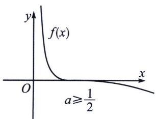
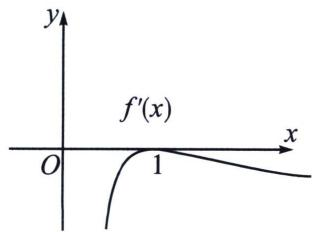
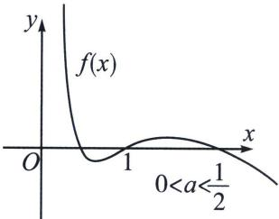
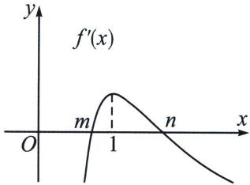

<!-- question-source:start -->
例6 (2020·全国Ⅰ卷)已知函数 $f(x)=\mathrm{e}^{x}+ax^{2}-x$ .

(1) 当 a=1 时，讨论 $f(x)$ 的单调性；

(2) 当 $x \geqslant 0$ 时, $f(x) \geqslant \frac{1}{2} x^3 + 1$ , 求 $a$ 的取值范围.

(1) 当 $a = 1$ 时, $f(x) = \mathrm{e}^{x} + x^{2} - x$ , $f^{\prime}(x) = \mathrm{e}^{x} + 2x - 1$ , 设 $g(x) = f^{\prime}(x)$ , 因为 $g^{\prime}(x) = \mathrm{e}^{x} + 2 > 0$ , 可得 $g(x)$ 在 $\mathbf{R}$ 上递增, 即 $f^{\prime}(x)$ 在 $\mathbf{R}$ 上递增, 因为 $f^{\prime}(0) = 0$ , 所以当 $x > 0$ 时, $f^{\prime}(x) > 0$ ; 当 $x < 0$ 时, $f^{\prime}(x) < 0$ , 所以 $f(x)$ 的增区间为 $(0, +\infty)$ , 减区间为 $(- \infty, 0)$ ;

(2) 分析：令 $g(x)=\mathrm{e}^{x}-\frac{1}{2}x^{3}+ax^{2}-x-1$ ， $g'(x)=\mathrm{e}^{x}-\frac{3}{2}x^{2}+2ax-1$ ， $g''(x)=\mathrm{e}^{x}-3x+2a$ ，则， $g'''(x)=\mathrm{e}^{x}-3$ ，

当 $x \in (0, \ln 3)$ 时， $g''(x)$ 为减函数， $x \in (\ln 3, +\infty)$ 时 $g''(x)$ 为增函数，所以 $g''(x)$ 的最小值为 $3 - 3 \ln 3 + 2a$ ，因为 $g''(x)$ 含参，所以 $g'(x)$ 可能含有零点，端点效应失效.

所以, 本题用 $x = 0$ 失败的原因就是函数在其他地方还有一个极值点, 在这种情况下, 端点效应失效, 我们可以进一步完善极值点也可以分参求解.

(参变分离): 由 $f(x) \geqslant \frac{1}{2} x^{3} + 1$ 得, $\mathrm{e}^{x} - \frac{1}{2} x^{3} + ax^{2} - x - 1 \geqslant 0$ , 其中 $x \geqslant 0$ , 当 $x = 0$ 时, 显然成立, 符合题意；当 $x > 0$ 时，分离参数 $a$ 得， $a \geqslant -\frac{\mathrm{e}^x - \frac{1}{2} x^3 - x - 1}{x^2} = h(x), h'(x) = \frac{(2 - x)\mathrm{e}^x + \left(\frac{1}{2} x^3 - x - 2\right)}{x^3} = \frac{(2 - x)\mathrm{e}^x + \left(\frac{1}{2} x^3 - x - 2\right)}{x^3} = \frac{(2 - x)\mathrm{e}^x + \left(\frac{1}{2} x^3 - x - 2\right)}{x^3} = \frac{(2 - x)\mathrm{e}^x + \left(\frac{x^3}{2} x^3 - x - 2\right)}{x^3} = \frac{(2 - x)\mathrm{e}^x + \left(\frac{x^3}{2} x^3 - x - 2\right)}{x^3} = \frac{(2 - x)\mathrm{e}^x + \left(\frac{x^3}{2} x^3 - x - 2\right)}{x^2} = \frac{(2 - x)\mathrm{e}^x + \left(\frac{x^3}{2} x^3 - x - 2\right)}{x^3} = \frac{(2 - x)\mathrm{e}^x + \left(\frac{x^3}{2} x^3 - x - 2\right)}{x^3} = \frac{(2 - x)\mathrm{e}^x + \cdots + (x - 2)^x}{x^3} = \frac{(2 - x)\mathrm{e}^x + \cdots + (x - 2)^x}{x^3} = \frac{(2 - x)\mathrm{e}^x + \cdots + (x - 2)^x}{x^3} = \frac{(2 - x)\mathrm{e}^x + \cdots + (x - 2)^x}{x^3} = \cdots = \frac{(2 - x)\mathrm{e}^x + \cdots + (x - 2)^x}{x^3} = \frac{(2 - x)\mathrm{e}^x + \cdots + (x - 2)^x}{x^3} = \frac{(2 - x)\mathrm{e}^x + \cdots + (x - 2)^x}{x^3} = \frac{(2 - y)\mathrm{e}^x + \cdots + (y - 2)^x}{y^3} = \frac{(2 - y)\mathrm{e}^x + \cdots + (y - 2)^x}{y^3} = \frac{(2 - y)\mathrm{e}^x + \cdots + (y - 2)^x}{y^3} = \frac{(2 - y)\mathrm{e}^x + \cdots + (y - 2)^x}{y^3} = \frac{x^{2}}{4},$

## 例7 (24-25 高二下·江苏盐城·期中) 函数 $f(x) = x + a\ln x, a \in \mathbb{R}$ .

当 $x \geqslant 1$ 时，不等式 $f(x) \geqslant (1 + \ln x)^2$ 恒成立，求 $a$ 的取值范围。解析 由 $f(x) = x + a \ln x \geqslant (1 + \ln x)^2$ 且 $x \geqslant 1$ ，令 $t = \ln x \geqslant 0$ ，则 $e^t + at \geqslant (1 + t)^2$ ，当 $t = 0$ 时， $e^t + at = 1 = (1 + t)^2$ ，此时 $a \in \mathbb{R}$ ，满足题设；当 $t > 0$ 时， $2 - a \leqslant \frac{e^t}{t} - 1 - \frac{1}{t}$ 恒成立，令 $h(t) = \frac{e^t}{t} - t - \frac{1}{t}$ ，则 $h'(t) = \frac{e^t(t - 1) + 1 - t^2}{t^2}$ ，令 $k(t) = e^t(t - 1) + 1 - t^2$ ，则 $k'(t) = t(e^t - 2)$ ， $0 < x < \ln 2$ 时， $k'(t) < 0$ ， $k
(1)$ 在 $(0, +\infty)$ 上单调递减， $x > \ln 2$ 时， $k'(t) > 0$ ， $k(t)$ 在 $(0, +\infty)$ 上单调递增，且 $k(0) = k (1) = 0$ ，故 $0 < 1 < 1$ 时 $k(t) < 0$ ，即 $h'(t) < 0$ ， $t > 1$ 时 $k(t) > 0$ ，即 $h'(t) > 0$ ，所以 $h(t)$ 在 $(0, 1)$ 上单调递减，在 $(1, +\infty)$ 上单调递增，故 $h(t) \geqslant h (1) = e - 2$ ，所以 $2 - a \leqslant e - 2$ ，即 $a \geqslant 4 - e$ ，综上， $a \geqslant 4 - e$ 。本题也是典型的端点效应失效问题，可以分参，也可以参考后续的隐点探路。

## 4. 双端点效应之中间零点模型

关于飘带函数三零点

若 $f(x)=\ln x-a\left(x-\frac{1}{x}\right)$ ，当 $a\geqslant\frac{1}{2}$ 时，有且仅有一个零点。 $x_{1}=1$ ；当 $0<a<\frac{1}{2}$ 时，有三个零点， $0<x_{1}<1$ ， $x_{2}=1$ ， $x_{3}>1$ 且 $x_{1}x_{3}=1$ ；

我们分析导函数， $f'(x)=\frac{-ax^2+x-a}{x^2}$ ，令 $g(x)=-ax^2+x-a$ ，显然 $g(x)$ 是一个开口向下的单峰函数， $g
(1)=1-2a$ ，中间零点的导数值决定了零点个数，这也是三零点问题的本质，更进一步理解就是，在 $x=1$ 的两边产生两次端点效应，当左右两边都恒单调递减时，一个零点；当左右两边都存在极值点，则会在左右两边各存在零点，那么 $f' (1)>0$ 符合题意。

①当 $g
(1) \leqslant 0$ 时，即 $a \geqslant \frac{1}{2}$ ，此时 $f'(x) \leqslant 0$ 恒成立，如图，此时仅有一个零点；

②当 $g
(1)>0$ 时，即 $0<a<\frac{1}{2}$ ，此时 $f'(x)>0$ 恒成立，如图，此时有三个零点，由于中间零点位于递增区间，而导函数是开口向下的单峰函数，故一定存在 0<m<1<n，使得 $f'(m)=f'(n)=0$ ，如图，则在 $(0,m)$ 和 $(n,+\infty)$ ， $f'(x)<0$ ，所以一定存在 $x_{1}\in(0,1)$ ， $x_{2}\in(1,+\infty)$ ;

如果一个函数有一个中间的零点 $x_0$ 已知，且它的导函数为单峰极值函数，若导函数形成有极小值的开口向上的单峰函数，则 $f'(x_0) < 0$ 时，一定有三个零点，若导函数形成有极大值的开口向下的单峰函数，则 $f'(x_0) > 0$ 时，一定有三个零点.
<!-- question-source:end -->

![[高中/总复习/专题/2026版高中《mst老唐说题》导数专题（数学）/上册/第07章_综合篇_显点探路/第一节_端点效应探路/例题/answers/Q00047359A1.md]]
