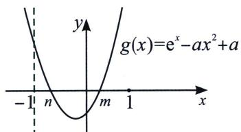
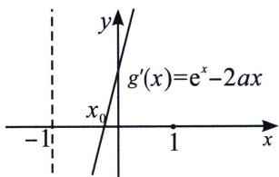
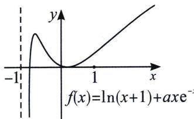

> [!faq]- 《导数专题(上册)》例题解析
>
> > [!success]- **【答案】** A
>
> > [!note]- **【解析】**
> > 解析【分析】 $f'(x)=\frac{1}{1+x}+\frac{a(1-x)}{\mathrm{e}^{x}}=\frac{\mathrm{e}^{x}-ax^{2}+a}{(1+x)\mathrm{e}^{x}}$ ，且 $f(0)=0$ ， $f'(x)$ 为开口向上的单峰函数，故 $f'(0)<0$ ，即a<-1时满足题意，本题就是要将 $a\geqslant-1$ 的情况找出矛盾排除，并在a<-1进行找点确认.
> >
> > 本题也是双端点效应，由于 $f(0)=0$ ，如果在 $x\in(-1,0)$ 和 $x\in(0,+\infty)$ 两个区间 $f(x)$ 单调，则
> >
> > 不会产生零点，当 $a < -1$ 时则需要论证三个单调区间，三个零点分析.
> >
> > (1) 当 $a = 1$ 时, $f(x) = \ln (1 + x) + x\mathrm{e}^{-x}$ , 则 $f'(x) = \frac{1}{1 + x} + \frac{a(1 - x)}{\mathrm{e}^x} = \frac{\mathrm{e}^x - ax^2 + a}{(1 + x)\mathrm{e}^x}$ , $f'(0) = 1 + 1 = 2$ , 又 $f(0) = 0$ , 所求切线方程为 $y = 2x$ ;
> >
> > (2)①若 $a \geqslant 0$ , 当 $-1 < x < 0$ 时, $\frac{1}{1 + x} > 0$ , $\frac{a(1 - x)}{\mathrm{e}^x} > 0$ , 所以 $f'(x) > 0$ , $f(x)$ 单调递增, 则 $f(x) < f(0) = 0$ , 故 $f(x)$ 在区间 $(-1, 0)$ 没有零点, 不合题意;
> >
> > $$
> > - **②**：\text { 若 } a <   0, f ^ {\prime} (x) = \frac {\mathrm{e} ^ {x} - a x ^ {2} + a}{(1 + x) \mathrm{e} ^ {x}}, f ^ {\prime} (0) = 1 + a, \text { 令 } g (x) = \mathrm{e} ^ {x} - a x ^ {2} + a, g ^ {\prime} (x) = \mathrm{e} ^ {x} - 2 a x
> > $$
> >
> > i: $f'(0)=1+a\geqslant0$ ，此时 $0>a\geqslant-1$ ，当 x>0 时， $g'(x)=\mathrm{e}^{x}-2ax>\mathrm{e}^{x}-2x>0$ ，所以 $g(x)$ 单调递增，此时 $g(x)=\mathrm{e}^{x}-ax^{2}+a>g(0)=1+a$ 恒成立，所以 $f(x)>0$ 对 $x\in(0,+\infty)$ 恒成立，与题意不符；
> >
> > ii: $f'(0) = 1 + a < 0$ ，此时 $a < -1$ ， $g'(x) = e^x - 2ax$ 为单调增函数，如图所示， $g'(-1) = \frac{1}{e} + 2a < 0$ ， $g'(0) = 1 > 0$
> >
> > 
> >
> > 
> >
> > 
> >
> > 当 $x \in (-1, 0)$ 时， $\exists x_0 \in (-1, 0)$ ，使 $g'(x_0) = 0$ ，则 $g(x)$ 在区间 $(-1, x_0)$ 单调递减，在区间 $(x_0, 0)$ 单调递增，由于 $g(-1) = \frac{1}{e} > 0$ ， $g(0) = 1 + a < 0$ ，所以 $\exists n \in (-1, 0)$ ，使 $g(n) = 0$ ，即 $f(x)$ 在区间 $(-1, n)$ 单调递增，在区间 $(n, 0)$ 单调递减，因为 $f(0) = 0$ ，所以一定有 $f(n) > 0$ ，又因为 $xe^{-x} \in (-e, 0)$ ，所以 $axe^{-x} \in (0, -ae)$ ， $f(x) = \ln(1+x) + axe^{-x} < \ln(1+x) - ae = 0$ ，取 $x = e^{ae} - 1$ ，所以 $f(e^{ae} - 1) < 0$ ，所以 $\exists x_1 \in (e^{ae} - 1, 0)$ ，使 $f(x_1) = 0$ ；
> >
> > 当 $x \in (0, +\infty)$ 时， $g'(x) = e^{x} - 2ax > 0$ ， $g(x) = e^{x} - ax^{2} + a$ 为单调增函数， $g(0) < 0$ ， $g(1) = e > 0$ ，所以 $\exists m \in (0, 1)$ ，使 $g(m) = 0$ ，即 $f(x)$ 在区间 $(0, m)$ 单调递减，在区间 $(m, +\infty)$ 单调递增，由于 $f(0) = 0$ ，所以一定有 $f(m) < 0$ ，又因为 $xe^{-x} \in \left(0, \frac{1}{e}\right)$ ，所以 $axe^{-x} \in \left(\frac{a}{e}, 0\right)$ ， $f(x) = \ln(1+x) + axe^{-x} > \ln(1+x) + \frac{a}{e} = 0$ ，取 $x = e^{-\frac{a}{e}} - 1$ ，所以 $f(e^{-\frac{a}{e}} - 1) > 0$ ，所以 $\exists x_{2} \in (0, e^{-\frac{a}{e}} - 1)$ ，使 $f(x_{2}) = 0$ ；综上，实数 a 的取值范围为 $(-∞, -1)$ 。
> >
> > 注意: 三个零点问题, 中间零点作显点探路, 永远是问题的最大突破口.
