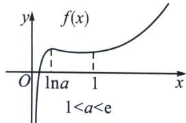
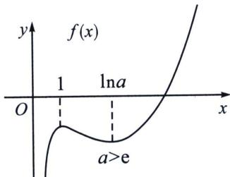

<!-- question-source:start -->
例4 (2024·广州模拟)已知函数 $f(x)=\frac{\mathrm{e}^{x}-a}{x}-a\ln x$ .

(1) 若 $f(x)$ 在 x=1 处取得极小值，求实数 a 的取值范围；

(2) 讨论 $f(x)$ 的零点个数.

(1) 函数 $f(x) = \frac{\mathrm{e}^x - a}{x} - a\ln x$ 的定义域为 $(0, +\infty)$ , $f'(x) = \frac{x\mathrm{e}^x - (\mathrm{e}^x - a)}{x^2} - \frac{a}{x} = \frac{(x-1)(\mathrm{e}^x - a)}{x^2}$ ，①当 $a \leqslant 1$ 时， $\mathrm{e}^x - a > 0$ ，当 $0 < x < 1$ 时， $f'(x) < 0$ ， $f(x)$ 在 $(0, 1)$ 上递减，当 $x > 1$ 时， $f'(x) > 0$ ， $f(x)$ 在 $(1, +\infty)$ 上递增，此时 $f(x)$ 在 $x = 1$ 时取得极小值，符合题意；

②当 a>1 时，由 $f'(x)=0$ 可得 x=1 或 $x=\ln a$ ，若 1<a<e，则由 $f'(x)>0$ 可得 0<x< $\ln a$ 或 x>1；由 $f'(x)<0$ 可得 $\ln a<x<1$ ，即 $f(x)$ 在 $(0,\ \ln a)$ 和 $(1,+\infty)$ 上递增；在 $(\ln a,1)$ 递减，此时函数在 x=1 取得极小值，符合题意；

若 $a = \mathrm{e}$ , $f'(x) = \frac{(x - 1)(\mathrm{e}^x - \mathrm{e})}{x^2}$ , 当 $x > 0$ 时, $f'(x) \geqslant 0$ 恒成立, 即 $f(x)$ 在 $(0, +\infty)$ 上恒为增函数, 不符合题意;

若 $a > \mathrm{e}$ , 由 $f'(x) > 0$ 可得 $0 < x < 1$ 或 $x > \ln a$ ; 由 $f'(x) < 0$ 可得 $1 < x < \ln a$ , 即 $f(x)$ 在 $(0, 1)$ 和 $(\ln a, +\infty)$ 上递增, 在 $(1, \ln a)$ 上递减, 此时函数在 $x = 1$ 时取得极大值, 故不符合题意.

$$
(- \infty , e)
$$

(2)由
(1)知，①当 $a\leqslant1$ 时， $f(x)$ 在(0，1)上递减，在 $(1,+\infty)$ 上递增，则 $f(x)$ 在x=1时取得极小值，也是最小值，为 $f (1)=\mathrm{e}-a>0$ ，此时函数 $f(x)$ 无零点；

②当 1<a<e 时， $f(x)$ 在 $(0, \ln a)$ 和 $(1, +\infty)$ 上递增；在 $(\ln a, 1)$ 递减，故当 x=1 时， $f(x)$ 取得极小值 $f
(1)=\mathrm{e}-a>0$ ，当 $x=\ln a$ 时， $f(x)$ 取得极大值 $f(\ln a)=-a\ln(\ln a)>0$ ，

$f(x) = \frac{\mathrm{e}^x - a}{x} - a\ln x = \frac{1}{\sqrt{x}}\left(\frac{\mathrm{e}^x - a}{\sqrt{x}} -a\sqrt{x}\ln x\right) <   \frac{1}{\sqrt{x}}\left(\frac{\mathrm{e}^x - a}{\sqrt{x}} +\frac{2a}{\mathrm{e}}\right) <   \frac{1}{\sqrt{x}}\left(\frac{\mathrm{e}^x - a}{\sqrt{x}} +a\right),$ 由于 $\mathrm{e}^x <  \frac{a - 1}{\ln a} x+$

1(过(0, 1)和 $(\ln a, a)$ 的割线)，则 $e^{x}<\frac{a-1}{\ln a}x+1<\frac{a-1}{\ln a}\sqrt{x}+1,\quad\frac{e^{x}-a}{\sqrt{x}}+a<\frac{a-1}{\ln a}+\frac{1-a}{\sqrt{x}}+a<2e-1$ $-\frac{a-1}{\sqrt{x}}=0$ ，取 $x=\left(\frac{a-1}{2e-1}\right)^{2}$ ，故函数 $f(x)$ 在 $\left(\left(\frac{a-1}{2e-1}\right)^{2},\ln a\right)$ 上有一个零点；

③当 a=e 时， $f(x)$ 在 $(0, +\infty)$ 上恒为增函数，又 $f
(1)=0$ ，故此时函数 $f(x)$ 在 $(0, +\infty)$ 上有一个零点；

④当 a > e 时， $f(x)$ 在 $(0, 1)$ 和 $(\ln a, +\infty)$ 上递增，在 $(1, \ln a)$ 上递减，故当 x = 1 时 $f(x)$ 有极大值为 $f
(1) = e - a < 0$ ，当 $x = \ln a$ 时， $f(x)$ 有极小值为 $f(\ln a) < f (1) = e - a < 0$ ，

$$
f (x) = \frac {\mathrm{e} ^ {x} - a}{x} - a \ln x = \frac {1}{x} \left(\mathrm{e} ^ {x} - a - a x \ln x\right) > \frac {1}{x} \left(\mathrm{e} ^ {x} - a - a x ^ {2}\right) = \frac {\mathrm{e} ^ {\frac {x}{2}}}{x} \left(\mathrm{e} ^ {\frac {x}{2}} - \frac {a}{\mathrm{e} ^ {\frac {x}{2}}} - \frac {a x ^ {2}}{\mathrm{e} ^ {\frac {x}{2}}}\right) > \frac {\mathrm{e} ^ {\frac {x}{2}}}{x}
$$

$\left(\mathrm{e}^{\frac{x}{2}} - \frac{a}{\sqrt{a}} - \frac{16a}{\mathrm{e}^{2}}\right) > \frac{\mathrm{e}^{\frac{x}{2}}}{x} (\mathrm{e}^{\frac{x}{2}} - 4a)$ ，取 $x = 2\ln 4a$ ，故此时函数 $f(x)$ 在 $(\ln a, 2\ln 4a)$ 上只有一个零点。综上所述，当 $a \leqslant 1$ 时，函数 $f(x)$ 在 $(0, +\infty)$ 上没有零点，当 $a > 1$ 时，函数 $f(x)$ 在 $(0, +\infty)$ 上只有一个零点。
<!-- question-source:end -->

![[高中/总复习/专题/2026版高中《mst老唐说题》导数专题（数学）/上册/第07章_综合篇_显点探路/第三节_极值显点探路与零点个数问题/一_零点探路之显点效应/例题/answers/Q00047374A1.md]]
