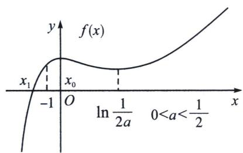
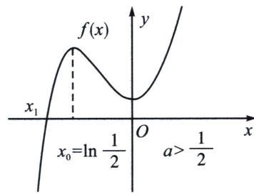

> [!faq]- 《导数专题(上册)》例题解析
>
> > [!success]- **【答案】** 详见解析
>
> > [!note]- **【解析】**
> > 解析 (1) 因为 $f(x) = \frac{x + 1}{\mathrm{e}^x} + ax^2$ ，其中 $a \in \mathbb{R}$ ， $x \in \mathbb{R}$ ，所以 $f'(x) = \frac{-x}{\mathrm{e}^x} + 2ax = \frac{x}{\mathrm{e}^x} (2ae^x - 1)$ ，①当 $a \leqslant 0$ 时，由 $2ae^x - 1 < 0$ ，令 $f'(x) = 0$ ，解得 $x = 0$ ，所以当 $x < 0$ 时，令 $f'(x) > 0$ ，当 $x > 0$ 时，令 $f'(x) < 0$ ，则 $f(x)$ 在 $(-\infty, 0)$ 上单调递增，在 $(0, +\infty)$ 上单调递减；
> > - **②**：当 a>0 时，由 $f'(x)=\frac{x}{\mathrm{e}^{x}}(2a\mathrm{e}^{x}-1)=\frac{2ax}{\mathrm{e}^{x}}\left(\mathrm{e}^{x}-\frac{1}{2a}\right)$ ，（i）当 $a=\frac{1}{2}$ 时，因为 $x(\mathrm{e}^{x}-1)\geqslant0$ ，则 $f'(x)\geqslant0$ ， $f(x)$ 在 R 上单调递增；
> >
> > (ii) 当 $a \in \left(0, \frac{1}{2}\right)$ 时，令 $f'(x) = 0$ ，解得 $x = 0$ 或 $x = \ln \frac{1}{2a} > 0$ ，所以当 $x \in (-\infty, 0) \cup \left(\ln \frac{1}{2a}, +\infty\right)$ 时， $f'(x) > 0$ ，当 $x \in \left(0, \ln \frac{1}{2a}\right)$ 时， $f'(x) < 0$ ，则 $f(x)$ 在 $(- \infty, 0)$ ，$\left(\ln \frac{1}{2a}, +\infty\right)$ 上单调递增，在 $(0, \ln \frac{1}{2a})$ 单调递减；
> >
> > (iii) 当 $a \in \left(\frac{1}{2}, +\infty\right)$ 时，由 $x = \ln \frac{1}{2a} < 0$ ，所以 $x \in \left(-\infty, \ln \frac{1}{2a}\right) \cup (0, +\infty)$ 时， $f'(x) > 0$ ， $x \in \left(\ln \frac{1}{2a}, 0\right)$ 时， $f'(x) < 0$ ，则 $f(x)$ 在 $\left(-\infty, \ln \frac{1}{2a}\right)$ ， $(0, +\infty)$ 上单调递增，在 $\left(\ln \frac{1}{2a}, 0\right)$ 单调递减；
> >
> > 综上：当 $a \leqslant 0$ 时， $f(x)$ 的单调递增区间为 $(-∞, 0)$ ，单调递减区间为 $(0, +∞)$ ;
> >
> > 当 $a \in \left(0, \frac{1}{2}\right)$ 时， $f(x)$ 的单调递增区间为 $(- \infty, 0)$ 和 $\left(\ln \frac{1}{2a}, +\infty\right)$ ，单调递减区间为 $\left(0, \ln \frac{1}{2a}\right)$ ；当 $a = \frac{1}{2}$ 时， $f(x)$ 的单调递增区间为 $R$ ；
> >
> > 当 $a \in \left(\frac{1}{2}, +\infty\right)$ 时， $f(x)$ 的单调递增区间为 $\left(-\infty, \ln \frac{1}{2a}\right), (0, +\infty)$ ，单调递减区间为 $\left(0, \ln \frac{1}{2a}\right)$ ;
> >
> > (2)证明：根据题意结合(1)可知当 $a \in \left(0, \frac{1}{2}\right) \cup \left(\frac{1}{2}, +\infty\right)$ 时， $f(x)$ 存在两个极值点， $f(0) = 1 > 0$ ， $f\left(\ln \frac{1}{2a}\right) = 2a \ln \frac{1}{2a} + 2a + a \ln^2 \frac{1}{2a} = a\left(\ln^2 \frac{1}{2a} + 2 \ln \frac{1}{2a} + 2\right) > 0$ ，由于 $f(-1) = a > 0$ ， $f(x) = \frac{1}{\mathrm{e}^x}(x + 1 + ax^2 \mathrm{e}^x) < \frac{1}{\mathrm{e}^x}\left(x + 1 + \frac{a}{\mathrm{e}}\right) = 0$ ，取 $x = -1 - \frac{a}{\mathrm{e}}$ ，故 $f(x)$ 有仅有一个唯一零点 $x_1 \in \left(-1 - \frac{a}{\mathrm{e}}, -1\right)$ ;
> > - **①**：若 $a \in \left(0, \frac{1}{2}\right)$ ，由(1)可知 $x_0 = 0$ ，则 $x_0 - x_1 > 0 - (-1) = 1 > \ln 2$ ，如左图；
> >
> > 
> >
> > 
> > - **②**：若 $a \in \left(\frac{1}{2}, +\infty\right)$ , 则 $x_0 = \ln \frac{1}{2a}$ , 要证 $x_0 - x_1 \geqslant \ln 2$ , 只需证 $x_1 \leqslant \ln \frac{1}{4a}$ , 只需证 $f\left(\ln \frac{1}{4a}\right) \geqslant 0$ , 如右图,
> >
> > 法一：找点： $f\left(\ln \frac{1}{4a}\right)=a\left(\ln^{2}\frac{1}{4a}+4\ln\frac{1}{4a}+4\right)=a\left(\ln\frac{1}{4a}+2\right)^{2}\geqslant0$ ，当且仅当 $\left\{\begin{aligned}x_{1}&=-2\\ a&=\frac{e^{2}}{4}\end{aligned}\right.$ 时取等号，
> > 综上， $x_{0}-x_{1}\geqslant\ln2$ 恒成立.
> >
> > 法二： $f(-1)=a>0$ ，所以 $x_{1}<-1$ ， $f(x_{1})=\frac{x_{1}+1}{\mathrm{e}^{x_{1}}}+ax_{1}^{2}=0$ ， $2ae^{x_{0}}-1=0$ ，即证 $e^{x_{0}-x_{1}}=$
> >
> > $-\frac{x_{1}^{2}}{2(x_{1}+1)}\geqslant2\Rightarrow x_{1}^{2}\geqslant-4(x_{1}+1)\Rightarrow(x_{1}+2)^{2}\geqslant0$ ，显然成立，得证！
