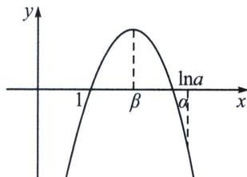

> [!faq]- 《导数专题(上册)》例题解析
>
> > [!success]- **【答案】** 详见解析
>
> > [!note]- **【解析】**
> > 解析 (1) 当 $a = 1, b = 0$ 时， $f(x) = \ln x - x + 1, x \in (0, +\infty)$ ， $f'(x) = \frac{1 - x}{x}$ ，当 $0 < x < 1$ 时， $f'(x) > 0$ ， $f(x)$ 在 $(0, 1)$ 上单增；当 $x > 1$ 时， $f'(x) < 0$ ， $f(x)$ 在 $(1, +\infty)$ 上单减.
> >
> > 所以当 x=1 时， $f(x)$ 有最大值 $f(1)=0$ .
> >
> > (2)证明：当 $a > \mathrm{e}$ ， $b = 1$ 时， $f(x) = a\ln x - (x - 1)\mathrm{e}^x$ ， $f(1) = 0$ ， $x \in (0, +\infty)$ ， $f'(x) = \frac{a}{x} - x\mathrm{e}^x = \frac{a - \mathrm{e}^x \cdot x^2}{x}$ . ①令 $g(x) = a - \mathrm{e}^x \cdot x^2$ ， $g'(x) = -\mathrm{e}^x (x^2 + 2x) < 0$ ，所以 $g(x)$ 在 $(0, +\infty)$ 上单减，
> >
> > 
> >
> > 由 $a > \mathrm{e}$ , $g(1) = a - \mathrm{e} > 0$ , $g(x) = x^{2}\left(\frac{a}{x^{2}} - \mathrm{e}^{x}\right) < x^{2}(a - \mathrm{e}^{x}) = 0$ , 取 $x = \ln a$ , $g(\ln a) < 0$ , 由函数零点存在性定理可知, 存在唯一 $\beta \in (1, \ln a)$ 使 $g(\beta) = 0$ , 即 $a - \mathrm{e}^{\beta} \cdot \beta^{2} = 0$ , 当 $x \in (0, \beta)$ 时, $g(x) > 0$ , $f'(x) > 0$ , $f(x)$ 在 $(0, \beta)$ 上单增, 当 $x \in (\beta, +\infty)$ 时, $g(x) < 0$ , $f'(x) < 0$ , $f(x)$ 在 $(\beta, +\infty)$ 上单减, 所以 $f(x)$ 在 $x = \beta$ 处取得极大值, 即 $f(x)$ 存在唯一的极值点 $\beta$ .
> > - **②**：由①可知， $f(x)=a\ln x-(x-1)e^{x}=(x-1)\left(\frac{a\ln x}{x-1}-e^{x}\right)<(x-1)(a-e^{x})=0$ ，取 $x=\ln a$ ，故 $\exists\beta<\alpha<\ln a$ ，使得 $f(\alpha)=0$ ，要证明 $(\alpha-\beta)(2\beta+1)<3(\beta^{2}-1)$ ，只需证 $(\alpha-\beta)(2\beta+1)<(\ln a-\beta)(2\beta+1)<3(\beta^{2}-1)$ ，由 $a-e^{\beta}\cdot\beta^{2}=0$ ，得 $\ln a=\beta+2\ln\beta$ ，即证 $2\ln\beta(2\beta+1)<3(\beta^{2}-1)$ ，只需证 $3\beta^{2}-2\ln\beta-4\beta\ln\beta-3>0$ ，
> >
> > 法一(构造函数): 令 $h(x) = 3x^{2} - 4x\ln x - 2\ln x - 3, h(1) = 0, h'(x) = 6x - 4\ln x - \frac{2}{x} - 4$ ，当 $x > 1$ 时，易证 $x - \frac{1}{x} > 2\ln x$ ，故 $h'(x) = 2\left(x - \frac{1}{x} - 2\ln x\right) + 4x - 4 > 0$ ，所以 $h(x)$ 在 $(1, +\infty)$ 单调递增， $h(\beta) > h(1) = 0$ .
> >
> > 法二(保值性): $3\beta^{2}-2\ln\beta-4\beta\ln\beta-3=2\beta(\beta-\ln\beta-1)+2\beta-2\ln\beta-2+\beta^{2}-2\beta\ln\beta-1=2\beta(\beta-\ln\beta-1)+2(\beta-\ln\beta-1)+\beta(\beta-\frac{1}{\beta}-2\ln\beta)>0$ (两个不等式都要证明); 故 $(\alpha-\beta)(2\beta+1)<3(\beta^{2}-1)$ 成立.
