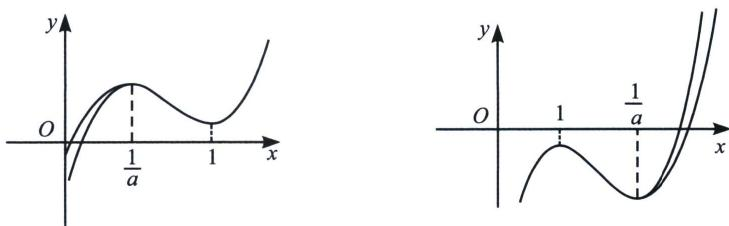
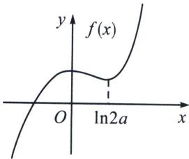
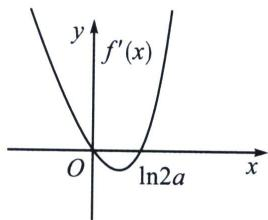
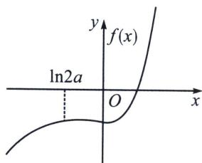
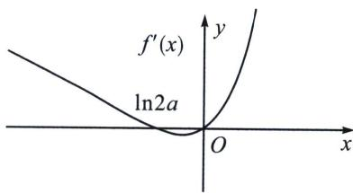
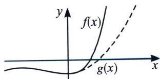
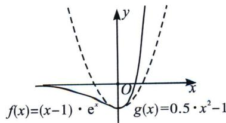

<!-- question-source:start -->
例1 (2022·乙卷文科)已知函数 $f(x)=ax-\frac{1}{x}-(a+1)\ln x$

(1) 当 a=0 时，求 $f(x)$ 的最大值；

(2) 若 $f(x)$ 恰有一个零点，求 a 的取值范围.

## 解析
(1) $f(x)_{\max} = f (1) = -1$

(2) $f'(x)=\frac{(ax-1)(x-1)}{x^{2}}$ ，这里两个零点一个显点x=1，一个隐点 $x=\frac{1}{a}$ ;

① $a\leqslant0,\ f(x)_{\max}=f
(1)=a-1<0$ ，矛盾；②a>0时， $f'(x)=0,\ x=\frac{1}{a}$ 或x=1，

i：当 a=1 时， $f(x)$ 单调递增，所以仅 $\exists f
(1)=0$ ;

ii：当 $a > 1$ 时， $f(x)_{\text{极小值}} = f
(1) = a - 1 > 0$ ， $f(x)_{\text{极大值}} = f\left(\frac{1}{a}\right) > 0$ ，故 $\exists x_1 \in \left(0, \frac{1}{a}\right)$ 使 $f(x_1) = 0$ （如图左），

当 $a > 1$ 时， $f(x)_{\text{极小值}} = f
(1) = a - 1 > 0$ ， $f(x)_{\text{极大值}} = f\left(\frac{1}{a}\right) > 0$ ，接下来进行放缩取点， $f(x) = ax - \frac{1}{x} - (a + 1)\ln x = \frac{1}{\sqrt{x}}\left[ax\sqrt{x} - \frac{1}{\sqrt{x}} - (a + 1)\sqrt{x}\ln x\right] < \frac{1}{\sqrt{x}}\left[1 - \frac{1}{\sqrt{x}} + \frac{2(a + 1)}{\mathrm{e}}\right] < \frac{1}{\sqrt{x}}\left(1 - \frac{1}{\sqrt{x}} + a + 1\right) = 0$ （取整），取 $x = \frac{1}{(a + 2)^2}$ ； $f\left(\frac{1}{(a + 2)^2}\right) < 0$ ， $\exists x_1 \in \left(\frac{1}{(a + 2)^2}, \frac{1}{a}\right)$ ，使 $f(x_1) = 0$ ；

iii： $0 < a < 1$ 时 $f(x)_{\text{极大值}} = f
(1) < 0$ ， $f(x)_{\text{极小值}} = f\left(\frac{1}{a}\right) < 0$ ，同理， $f(x) = ax - \frac{1}{x} - (a + 1)\ln x = \sqrt{x}\left[a\sqrt{x} - \frac{1}{x\sqrt{x}} - \frac{(a + 1)\ln x}{\sqrt{x}}\right] > \sqrt{x}\left[a\sqrt{x} - 1 - \frac{2(a + 1)}{\mathrm{e}}\right] > \sqrt{x}(a\sqrt{x} - 1 - a - 1) = 0$ ，取 $x = \left(\frac{a + 2}{a}\right)^2$ ， $f\left(\left(\frac{a + 2}{a}\right)^2\right) > 0$ ，故 $\exists x_2 \in \left(\frac{1}{a}, \left(\frac{a + 2}{a}\right)^2\right)$ 使 $f(x_2) = 0$ ，综上， $a$ 的取值范围为 $(0, +\infty)$ .

注意：本题显点就是 $f'
(1)=0$ ，故当 $f(x)_{\text{极大}}=f (1)<0$ 时，则一定有 $f(x)_{\text{极小}}=f\left(\frac{1}{a}\right)<0$ ，唯一零点位于 $\left(\frac{1}{a},+\infty\right)$ ；当 $f(x)_{\text{极小}}=f (1)>0$ 时，则一定有 $f(x)_{\text{极大}}=f\left(\frac{1}{a}\right)>0$ ，唯一零点位于 $\left(0,\frac{1}{a}\right)$ .

## 例2 (2021·新高考Ⅱ)已知函数 $f(x)=(x-1)\mathrm{e}^{x}-ax^{2}+b$ .

(1) 讨论 $f(x)$ 的单调性；

(2)从以下
(1)和
(2)中选择一项，
(1) $\frac{1}{2}<a\leqslant\frac{e^{2}}{2}$ ，b>2a；
(2) $0<a<\frac{1}{2}$ ， $b\leqslant2a$ .

证明： $f(x)$ 恰有一个零点.

(1) 因为 $f(x) = (x - 1)e^x - ax^2 + b$ ， $f'(x) = x(e^x - 2a)$ ，①当 $a \leqslant 0$ 时，当 $x > 0$ 时， $f'(x) > 0$ ，当 $x < 0$ 时， $f'(x) < 0$ ，所以 $f(x)$ 在 $(-\infty, 0)$ 上单调递减，在 $(0, +\infty)$ 上单调递增，②当 $a > 0$ 时，令 $f'(x) = 0$ ，可得 $x = 0$ 或 $x = \ln(2a)$ ，（i）当 $0 < a < \frac{1}{2}$ 时，当 $x > 0$ 或 $x < \ln(2a)$ 时， $f'(x) > 0$ ，当 $\ln(2a) < x < 0$ 时， $f'(x) < 0$ ，所以 $f(x)$ 在 $(-\infty, \ln(2a))$ ， $(0, +\infty)$ 上单调递增，在 $(\ln(2a), 0)$ 上单调递减，（ii） $a = \frac{1}{2}$ 时， $f'(x) = x(e^x - 1) \geqslant 0$ 且等号不恒成立，所以 $f(x)$ 在 R 上单调递增，（iii）当 $a > \frac{1}{2}$ 时，当 $x < 0$ 或 $x > \ln(2a)$ 时， $f'(x) > 0$ ，当 $0 < x < \ln(2a)$ 时， $f'(x) < 0$ ， $f(x)$ 在 $(-\infty, 0)$ ， $(\ln(2a), +\infty)$ 上单调递增，在 $(0, \ln(2a))$ 上单调递减.

(2)背景分析：本题属于典型的显点效应，显点为 $f
(1)$ ， $f(x)_{\text{极大}} = f (1) > 0$ 时，只需计算 $f(x)_{\text{极小}} = f(\ln 2a) > 0$ ;

剩下的交给放缩取点.

选
(1). 证明: 由 (1)知, $f(x)$ 在 $(- \infty, 0)$ 上单调递增, $(0, \ln(2a))$ 单调递减, 在 $(\ln(2a), + \infty)$ 上单调递增. $f(\ln(2a)) = (\ln(2a) - 1) \cdot 2a - a \cdot \ln^2 2a + b > 2a \ln(2a) - 2a - a \ln^2 2a + 2a = a \ln(2a)$

$(2-\ln(2a))$ ，由 $\frac{1}{2}<a\leqslant\frac{\mathrm{e}^2}{2}$ 得 $0<\ln(2a)\leqslant 2$ ，所以 $a\ln(2a)(2-\ln(2a))\geqslant 0$ ，所以 $f(x)_{\text{极小}}=f(\ln(2a))>0$ ，当 $x\geqslant 0$ 时， $f(x)\geqslant f(\ln(2a))>0$ ，此时 $f(x)$ 无零点，如下图.

(2)根据
(1)，当 $0 < a < \frac{1}{2}$ 时，所以 $\ln (2a) < 0$ ，当 $x > 0$ 或 $x < \ln (2a)$ 时， $f'(x) > 0$ ，当 $\ln (2a) < x < 0$ 时， $f'(x) < 0$ ，所以 $f(x)$ 在 $(- \infty, \ln (2a))$ ， $(0, + \infty)$ 上单调递增，在 $(\ln (2a), 0)$ 上单调递减， $f(x)_{\text{极大}} = f(\ln (2a)) = (\ln (2a) - 1) \cdot 2a - a \cdot \ln^2 2a + b \leqslant 2a \ln (2a) - 2a - a \ln^2 2a + 2a = a \ln (2a) (2 - \ln (2a)) < 0$ ，所以当 $x \leqslant 0$ 时， $f(x) \leqslant f(\ln (2a)) < 0$ ，此时 $f(x)$ 无零点，唯一零点出现在 $(0, + \infty)$ ，我们进行放缩取点.

方案一(双变量区间与主元锁定): 由于主体 $(x-1)\mathrm{e}^{x}\rightarrow+\infty$ ，客体 $-ax^{2}+b\rightarrow-\infty$ ，且b<1，0<a $<\frac{1}{2}$ ， $f(x)=(x-1)\mathrm{e}^{x}-ax^{2}+b=\mathrm{e}^{x}\left(x-1-a\frac{x^{2}}{\mathrm{e}^{x}}+\frac{b}{\mathrm{e}^{x}}\right)>\mathrm{e}^{x}\left(x-1-\frac{4a}{\mathrm{e}^{2}}+\frac{b}{\mathrm{e}^{x}}\right)>\mathrm{e}^{x}\left(x-2+\frac{b-1}{\mathrm{e}^{x}}\right)>\mathrm{e}^{x}$ $(x-3+b)$ ，取 x=3-b，故 $\exists x_{1}\in(0,3-b)$ ，使 $f(x_{1})=0$ ；

本题的客体变量是 $-ax^{2}+b$ ，那我们不妨求出主体 $(x-1)e^{x}$ 的二次切线方程.

$$
m x ^ {2} - 1
$$

$$
h (x) = (x - 1) \mathrm{e} ^ {x} - m x ^ {2} +
$$

1, $h^{\prime}(x) = x\mathrm{e}^{x} - 2mx$ ， $h''(x) = (x + 1)\mathrm{e}^x -2m$ ， $h''(0) = 0$ ，则 $m = \frac{1}{2}$ ；构 $h(x) = (x - 1)\mathrm{e}^x -\frac{1}{2} x^2+$ 1，易知 $x > 0$ 时， $h(x) > 0$ ，故 $f(x) = [(x - 1)\mathrm{e}^x -\frac{1}{2} x^2 +1] + \frac{1}{2} x^2 -1 - ax^2 +b > \frac{1}{2} x^2 -1 - ax^2 +b$ $= 0$ （如图），取 $x = \sqrt{\frac{1 - b}{\frac{1}{2} - a}}$ ， $f(\sqrt{\frac{1 - b}{\frac{1}{2} - a}}) > 0$ ，所以存在 $x_{1}\in (0,\sqrt{\frac{1 - b}{\frac{1}{2} - a}})$ ，使 $f(x_{1}) = 0$

<!-- question-source:end -->

![[高中/总复习/专题/2026版高中《mst老唐说题》导数专题（数学）/上册/第07章_综合篇_显点探路/第三节_极值显点探路与零点个数问题/例题/answers/Q00046721A1.md]]
