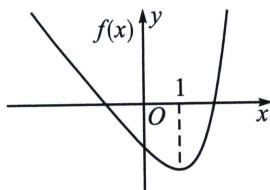
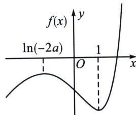
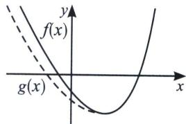

<!-- question-source:start -->
例3 (2016·新课标Ⅰ)已知函数 $f(x)=(x-2)\mathrm{e}^{x}+a(x-1)^{2}$

(1) 讨论 $f(x)$ 的单调性；

(2)若 $f(x)$ 有两个零点，求a的取值范围(文).

(1)由 $f(x)=(x-2)e^{x}+a(x-1)^{2}$ ，可得 $f'(x)=(x-1)e^{x}+2a(x-1)=(x-1)(e^{x}+2a)$ ，①当 $a\geqslant0$ 时，由 $f'(x)>0$ ，可得x>1：由 $f'(x)<0$ ，可得x<1，即有 $f(x)$ 在 $(-∞,1)$ 递减；在 $(1,+∞)$ 递增；

②当 a<0 时，由 $e^{x}+2a=0$ ，可得 $x=\ln(-2a)$ ，由 $\ln(-2a)=1$ ，解得 $a=-\frac{e}{2}$ ，

i：若 $a = -\frac{\mathrm{e}}{2}$ ，则 $f'(x) \geqslant 0$ 恒成立，即有 $f(x)$ 在 $\mathbf{R}$ 上递增；

ii：若 $a < -\frac{\mathrm{e}}{2}$ 时，由 $f'(x) > 0$ ，可得 $x < 1$ 或 $x > \ln (-2a)$

由 $f'(x)<0$ ，可得 $1<x<\ln(-2a)$ ，即有 $f(x)$ 在 $(-∞,1)$ ， $(\ln(-2a),+∞)$ 递增，在 $(1,\ln(-2a))$ 递减；

iii：若 $-\frac{e}{2}<a<0$ ，由 $f'(x)>0$ ，可得 $x<\ln(-2a)$ 或x>1；

由 $f'(x)<0$ ，可得 $\ln(-2a)<x<1$ 。即有 $f(x)$ 在 $(-∞, ∫(-2a))$ ， $(1, +∞)$ 递增，在 $(\ln(-2a))$ ，1)递减；

(2)本题关键在于探显点 $f
(1)=-\mathrm{e}$ ，若a>0，仅有唯一极小值 $f (1)<0$ ，如图，故会有两个零点；

当 a<0 时，会有两个极值点， $f(\ln(-2a))=a[\ln^{2}(-2a)-4\ln(-2a)+5]<0$ ，两个极值都小于零，如图，故不会有两个零点；

(1)可得：当 $a > 0$ 时， $f(x)$ 在 $(- \infty, 1)$ 递减；在 $(1, +\infty)$ 递增，且 $f (1) = -\mathrm{e} < 0$ ， $f
(2) = a > 0$ ，故 $\exists x_2 \in (1, 2)$ 使 $f(x_2) = 0$ ；

当 x<1 时，由于 $(x-2)e^{x}\in(-e,0)$ ，故 $f(x)=(x-2)e^{x}+a(x-1)^{2}>-e+a(x-1)^{2}=0$ ，取 x

$= 1 - \sqrt{\frac{e}{a}}$ ，一定有 $f(1 - \sqrt{\frac{e}{a}}) > 0$ ，故 $\exists x_{1}\in (1 - \sqrt{\frac{e}{a}},1)$ ，使 $f(x_{1}) = 0$ ； $f(x)$ 有两个零点；

②当 a=0 时， $f(x)=(x-2)\mathrm{e}^{x}$ ，所以 $f(x)$ 只有一个零点 x=2；

③当 a<0 时， $f
(1)=-\mathrm{e}<0$ ， $f(\ln(-2a))=-2a(\ln(-2a)-2)+a(\ln(-2a)-1)^{2}=a[\ln^{2}(-2a)-4\ln(-2a)+5]<0$ ，由于极大值和极小值均小于零，故最多只有一个零点，不符合题意。综上可得，a 的取值范围为 $(0,+\infty)$ .
<!-- question-source:end -->

![[高中/总复习/专题/2026版高中《mst老唐说题》导数专题（数学）/上册/第07章_综合篇_显点探路/第三节_极值显点探路与零点个数问题/例题/answers/Q00046722A1.md]]
