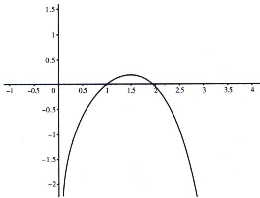

<!-- question-source:start -->
例6 (2024·广州二模)设函数 $f(x)=a\frac{x+1}{e^{x}}+x^{2}$ ，其中 $a\in R$ .

(1) 讨论 $f(x)$ 零点个数；

(2)若 $f(x)$ 存在两个极值点，设极大值点为 $x_{0}$ ， $x_{1}$ 为 $f(x)$ 的零点，求证： $x_{0}-2x_{1}>2$ .

(1) 因为 $f(x) = a \frac{x + 1}{\mathrm{e}^x} + x^2$ ，其中 $a \in \mathbb{R}$ ， $x \in \mathbb{R}$ ，所以 $f'(x) = \frac{-ax}{\mathrm{e}^x} + 2x = \frac{x}{\mathrm{e}^x} (-a + 2\mathrm{e}^x)$ ，①当 $a < 0$ 时，由 $2\mathrm{e}^x - a > 0$ ，令 $f'(x) = 0$ ，解得 $x = 0$ ，所以当 $x < 0$ 时， $f'(x) < 0$ ，当 $x > 0$ 时，令 $f'(x) > 0$ ，则 $f(x)$ 在 $(- \infty, 0)$ 上单调递减，在 $(0, +\infty)$ 上单调递增， $f(0) = a < 0$ ， $f(-1) = 1 > 0$ ，故存在 $x_1 \in (-1, 0)$ ，使得 $f(x_1) = 0$ ，当 $x > 0$ 时， $\frac{x + 1}{\mathrm{e}^x} < 1$ ，则 $f(x) > a + x^2 = 0$ ，取 $x = \sqrt{-a}$ ，故存在 $x_2 \in (0, \sqrt{-a})$ ，使得 $f(x_2) = 0$ ；

②当 a=0，有且仅有唯一零点 x=0；

③当 a > 0 时，由 $f'(x) = \frac{x}{\mathrm{e}^{x}} (2\mathrm{e}^{x} - a)$ ，有两个极值点 x = 0 或 $x = \ln \frac{a}{2}$ ;

(i) 当 $a = 2$ 时， $f'(x) \geqslant 0$ ， $f(x)$ 在 $\mathbf{R}$ 上单调递增， $f(x) = \frac{1}{\mathrm{e}^x} (ax + a + x^2\mathrm{e}^x)$ ，由于 $x^2\mathrm{e}^x \leqslant \frac{4}{\mathrm{e}^2}$ ，故 $f(x) \leqslant \frac{1}{\mathrm{e}^x} (ax + a + \frac{4}{\mathrm{e}^2}) = 0$ ，取 $x = -\frac{a + \frac{4}{\mathrm{e}^2}}{a}$ （取整 $x = -\frac{a + 1}{a}$ ）， $f\left(-\frac{a + 1}{a}\right) < 0$ ， $f(-1) = 1$ ，故存在唯一的零点 $x_1 \in \left(-\frac{a + 1}{a}, -1\right)$ ；

(ii) 当 $a \in (0, 2)$ 时， $\ln \frac{a}{2} < 0$ ，所以当 $x \in \left(-\infty, \ln \frac{a}{2}\right) \cup (0, +\infty)$ 时， $f'(x) > 0$ ，当 $x \in \left(\ln \frac{a}{2}, 0\right)$ 时， $f'(x) < 0$ ，则 $f(x)$ 在 $\left(-\infty, \ln \frac{a}{2}\right), (0, +\infty)$ 上单调递增，在 $\left(\ln \frac{a}{2}, 0\right)$ 单调递减；

(iii) 当 $a \in (2, +\infty)$ 时，由 $\ln \frac{a}{2} > 0$ ，所以 $x \in (-\infty, 0) \cup \left(\ln \frac{a}{2}, +\infty\right)$ 时， $f'(x) > 0$ ， $x \in \left(0, \ln \frac{a}{2}\right)$ 时， $f'(x) < 0$ ，则 $f(x)$ 在 $(- \infty, 0)$ ， $\left(\ln \frac{a}{2}, +\infty\right)$ 上单调递增，在 $\left(0, \ln \frac{a}{2}\right)$ 单调递减；由于 $f\left(\ln \frac{a}{2}\right) = 2\ln \frac{a}{2} + 2 + \ln^2 \frac{a}{2} = \left(\ln \frac{a}{2} + 1\right)^2 + 1 > 0$ ， $f(0) = a > 0$ ，由于 $f\left(-\frac{a+1}{a}\right) < 0$ ， $f(-1) = 1 > 0$ ，综上， $a > 0$ 时， $f(x)$ 有唯一零点.

(2)证明：根据题意结合
(1)可知当 $a \in (0, 2) \cup (2, +\infty)$ 时， $f(x)$ 存在两个极值点，且 $f(x)$ 有唯一零点 $x_1 \in \left(-\frac{a+1}{a}, -1\right)$ ，①若 $a \in (2, +\infty)$ ，则 $x_0 = 0$ ， $x_0 - 2x_1 > -2x_1 > 2$ ，②若 $a \in (0, 2)$ ，由 (1)可知 $x_0 = \ln \frac{a}{2}$ ， $f(x_1) = a(x_1 + 1) \cdot e^{-x_1} + x_1^2 = 0$ ，即 $a(x_1 + 1) + x_1^2 e^{x_1} = 0$ ，将 $a = 2e^{x_0}$ 代入， $2e^{x_0}(x_1 + 1) + x_1^2 e^{x_1} = 0$ ，要证 $x_0 - 2x_1 > 2$ ，即 $x_0 > 2x_1 + 2$ ，即 $e^{x_0} > e^{2x_1 + 2}$ ，而 $x_1 + 1 < 0$ ，即证

$2(x_{1}+1)e^{x_{0}}<2(x_{1}+1)e^{2x_{1}+2}$ ，左右同时加上 $x_{1}^{2}e^{x_{1}}$ ，即证 $2(x_{1}+1)e^{2x_{1}+2}+x_{1}^{2}e^{x_{1}}>0$ ，即证 $x_{1}^{2}+2(x_{1}+1)\cdot e^{x_{1}+2}>0$ ，显然 $e^{x_{1}+2}>x_{1}+3$ ，即 $x_{1}^{2}+2(x_{1}+1)(x_{1}+3)=3x_{1}^{2}+8x_{1}+6=3\left(x_{1}+\frac{4}{3}\right)^{2}+\frac{38}{9}>0$ ，故 $x_{0}-2x_{1}>2$ ，综上所述 $a\in(0,2)\cup(2,+\infty)$ 时， $x_{0}-2x_{1}>2$ 。

## 例7 (2019·天津)设函数 $f(x)=\ln x-a(x-1)\mathrm{e}^{x}$ ，其中 $a\in\mathbb{R}$ .

(1) 若 $a \leqslant 0$ ，讨论 $f(x)$ 的单调性；

(2) 若 $0 < a < \frac{1}{\mathrm{e}}$ ，（i）证明 $f(x)$ 恰有两个零点；

(ii) 设 $x_{0}$ 为 $f(x)$ 的极值点， $x_{1}$ 为 $f(x)$ 的零点，且 $x_{1} > x_{0}$ ，证明： $3x_{0} - x_{1} > 2$ .

(1) $f'(x)=\frac{1}{x}-[ae^{x}+a(x-1)e^{x}]=\frac{1-ax^{2}e^{x}}{x}, x\in(0,+\infty), a\leqslant0$ 时， $f'(x)>0$ ，所以函数 $f(x)$ 在 $x\in(0,+\infty)$ 上单调递增.
(2)证明：(i)由
(1)可知： $f'(x)=\frac{1-ax^{2}e^{x}}{x}, x\in(0,+\infty)$ . 令 $g(x)=1-ax^{2}e^{x}, g'(x)=-a(x^{2}+2x)e^{x}$ ，因为 $0<a<\frac{1}{e}$ ，可知： $g(x)$ 在 $x\in(0,+\infty)$ 上单调递减，又 $g (1)=1-ae>0$ 。导函数的零点不可求，我们就需要先对导函数找点，对此需要采用等效零点分析，具体操作如下：

由于 $g(x)=x^{2}\left(\frac{1}{x^{2}}-ae^{x}\right)$ ，我们发现 $\frac{1}{x^{2}}\in(0,1)$ ，属于客体部分， $-ae^{x}\in(-\infty,-ae)$ ，属于导致 $g(x)<0$ 的主体部分，所以 $g(x)=x^{2}\left(\frac{1}{x^{2}}-ae^{x}\right)<x^{2}(1-ae^{x})=0$ ，取 $x=\ln\frac{1}{a}$ ， $g\left(\ln\frac{1}{a}\right)=1-\left(\ln\frac{1}{a}\right)^{2}<0$ ，所以 $g(x)$ 存在唯一零点 $x_{0}\in\left(1,\ln\frac{1}{a}\right)$ 。即函数 $f(x)$ 在 $(0,x_{0})$ 上单调递增，在 $(x_{0},+\infty)$ 单调递减， $x_{0}$ 是函数 $f(x)$ 的唯一极值点。

(1)=0,\quad f(x_{0})>f (1)=0,\quad f(x)=\ln x-a(x-1)\mathrm{e}^{x}$ ，由于 $\ln x\in(0,+\infty)$ ，为客体部分， $-a(x-1)\mathrm{e}^{x}\in(-\infty,0)$ ，为导致 $f(x)<0$ 主体部分，但是出现了两个无穷大，所以这种情况下我们需要进行等效零点转化， $f(x)=(x-1)\left(\frac{\ln x}{x-1}-ae^{x}\right)<(x-1)(1-ae^{x})=0$ ，取 $x=\ln\frac{1}{a}$ ， $f\left(\ln\frac{1}{a}\right)<0$ ，所以 $\exists x_{1}\in\left(1,\ln\frac{1}{a}\right)$ ，使得 $f(x_{1})=0$ .

(ii) 由题意可得： $f'(x_0) = 0$ ， $f(x_1) = 0$ ，即 $ax_0^2 e^{x_0} = 1 \Rightarrow a = \frac{1}{x_0^2 e^{x_0}}$ ①， $\ln x_1 = a(x_1 - 1)e^{x_1} \Rightarrow a = \frac{\ln x_1}{(x_1 - 1)e^{x_1}}$ ②，我们通过(i)的找点操作发现虽然 $x_0 \in \left(1, \ln \frac{1}{a}\right)$ ， $x_1 \in \left(1, \ln \frac{1}{a}\right)$ ，但是 $x_1 > x_0$ ，要证明 $3x_0 - x_1 > 2$ ，只需证 $3x_0 > 2 + \ln \frac{1}{a} > 2 + x_1$ ，根据①得：只需 $3x_0 > 2 + \ln x_0^2 e^{x_0}$ ，即证 $3x_0 > 2 + \ln x_0^2 e^{x_0} = 2 + 2\ln x_0 + x_0$ ，只需证 $x_0 > \ln x_0 + 1$ ，由于 $x_0 \in \left(1, \ln \frac{1}{a}\right)$ ，故命题得证.

注意: 看似代换的 $3x_{0} - x_{1} > 2$ , 其本质还是进行零点找点, 对每个点的范围进行界限锁定后放

缩，即可证明，这是本题的最优解.

当然：本题我们可以证明极值点右偏，如图：必有 $2x_{0} > x_{1} + 1$ ， $3x_{0} - x_{1} > x_{0} + 1 > 2$ 。同学们可自行看找点篇偏移找点强化。

<!-- question-source:end -->

![[高中/总复习/专题/2026版高中《mst老唐说题》导数专题（数学）/上册/第07章_综合篇_显点探路/第三节_极值显点探路与零点个数问题/例题/answers/Q00046725A1.md]]
