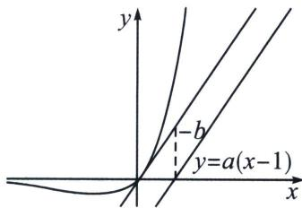

> [!faq]- 《导数专题(上册)》例题解析
>
> > [!success]- **【答案】** 详见解析
>
> > [!note]- **【解析】**
> > 解析 (1) 在 $(0, f(0))$ 处的切线方程为 $y = (a - 1)x$ ;
> >
> > $f'(x)=a-(x+1)e^{x}$ ， $f'(x)=-(x+2)e^{x}$ ，当 $x\leqslant-1$ 时， $f'(x)>0$ ，函数无极值；当x>-1时， $f''(x)<0$ ， $f'(x)$ 单调递减， $f'(-1)>0$ ，当x>-1时，需要找一个大点m， $f'(m)<0$ ，此时需要转化为等效零点方程， $f'(x)=\mathrm{e}^{x}\left(a\frac{1}{\mathrm{e}^{x}}-x-1\right)<\mathrm{e}^{x}\left(a\frac{1}{\mathrm{e}^{-1}}-x-1\right)$ ，取 $x=\mathrm{e}a-1$ ， $f'(\mathrm{e}a-1)=a(1-\mathrm{e}^{\mathrm{e}a})<0$ ，故唯一的 $x_{0}\in(-1,\mathrm{e}a-1)$ 使得 $f'(x_{0})=0$ ；
> >
> > (3)法一(参变分离隐点效应): 令 $h(x)=x\mathrm{e}^{x}-a(x-1)+b \geqslant 0, h'(x)=(x+1)\mathrm{e}^{x}-a$ 根据第(2)问结论可知 $h(x)$ 有唯一极小值点 $x_{0}$ , 此时满足 $a=(x_{0}+1)\mathrm{e}^{x_{0}}, h(x_{0})=x_{0}\mathrm{e}^{x_{0}}-(x_{0}+1)(x_{0}-1)\mathrm{e}^{x_{0}}+b \geqslant 0$ 所以 $b \geqslant (x_{0}^{2}-x_{0}-1)\mathrm{e}^{x_{0}}$ , 令 $t(x)=(x^{2}-x-1)\mathrm{e}^{x}, t'(x)=(x^{2}+x-2)\mathrm{e}^{x}=(x-1)(x+2)\mathrm{e}^{x}$ , 由于 $x>-1$ , 故 $x \in (-1, 1)$ 时, $t(x)$ 单调递减, $x \in (1, +\infty)$ 时, $t(x)$ 单调递增, $t(x)_{\min}=t(1)=-\mathrm{e}$ , 所以 $b \geqslant -\mathrm{e}$ .
> >
> > 法二(切线构造极点效应): 题目可以转化为 $x \mathrm{e}^{x} - a (x - 1) \geqslant -b$ , 若存在 $a$ , 使得 $x \mathrm{e}^{x} + b \geqslant a (x - 1)$
> >
> > 恒成立，求 b 的取值范围，涉及双参数，我们先进行一下图像分析模拟，先给出我们对这类问题的一个大框架，就是 $f(x)-g(x)\geqslant m$ 恒成立时，我们分别作出 $y=f(x)$ 和 $y=g(x)$ 图像，当它们相交或者相切时， $m\leqslant0$ ，当它们相离时，分别作 $y=f(x)$ 和 $y=g(x)$ 互相平行的切线，m 的最大值即为两切线的铅锤距离的最大值.
> >
> > 
> >
> > 解答：当 x=1 时， $f(1)=a-e\leqslant a+b$ ，所以 $b\geqslant-e$ ;
> >
> > 下面证明 $\exists a$ ，使得 $f(x) \leqslant a - e \leqslant a + b$ 对任意的 $x \in \mathbb{R}$ 恒成立，即证 $F(x) = x e^{x} - a (x - 1) - e \geqslant 0$ 恒成立，由于 $F(1) = 0$ ， $F(x) \geqslant F(1) = 0$ 恒成立， $F'(x) = (x + 1)e^{x} - a$ ，则一定有 $F'(1) = 0$ ，则 $a = 2e$ ；下面证 $F(x) = x e^{x} - 2e (x - 1) - e \geqslant 0$ ， $F'(x) = (x + 1)e^{x} - 2e$ ， $F''(x) = (x + 2)e^{x}$ ，显然 $F'(x)$ 在 $(- \infty, -2)$ 单调递减， $F'(x) = (x + 1)e^{x} - 2e < 0$ ，在 $(-2, +\infty)$ 单调递增，又因为 $F'(1) = 0$ ，所以 $x < 1$ 时， $F(x)$ 单调递减， $x > 1$ 时， $F(x)$ 单调递增， $F(x) \geqslant 0$ 恒成立；所以 $\exists a = 2e$ ，当 $b \geqslant -e$ 时， $f(x) \leqslant a + b$ 对任意的 $x \in \mathbb{R}$ 恒成立
> >
> > 注意：这种双参数恒成立的考题关键在于极点效应探路，在一些小题中考的居多，我们也通常构造零点比大小来快速解决，有的时候也会借助基本不等式来处理.
> >
> > 2. 朗博同构在 $x_0 + \ln x_0 = 0$ 处的极点效应
> >
> > 若 $h(x)=\mathrm{e}^{x}-ax-1\geqslant0$ ，则 $h(x)\geqslant h(0)$ 恒成立），所以 $h'(1)=0,\ a=1;$
> >
> > 若 $f(x) = x\mathrm{e}^{x} - a(x + \ln x) - 1 = h(x + \ln x) \geqslant 0$ ，符合隐零点的极点效应，此时必然有 $a = 1$ 。当且仅当 $x_0 + \ln x_0 = 0$ 取等 $x_0 \approx 0.567$
