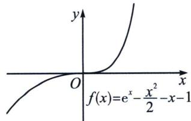
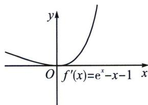
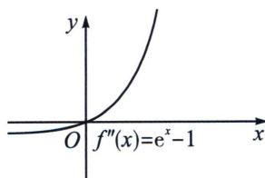

> [!faq]- 《导数专题(上册)》例题解析
>
> > [!success]- **【答案】** 详见解析
>
> > [!note]- **【解析】**
> > 解析 不等式 $f(x) \leqslant x \left( e^{x} - 2x + \frac{1}{2}x^{2} \right)$ 恒成立，即 $a(\ln x + x) \leqslant x e^{x} - 1$ 。所以 $x e^{x} - a \ln (x e^{x}) - 1 \geqslant 0$ ，令 $x e^{x} = t, t > 0$ ，所以 $h(t) = t - a \ln t - 1 \geqslant 0$ 。由于 $h(1) = 0$ ，所以 $h(t) \geqslant h(1) = 0, h'(t) = 1 - \frac{a}{t}$ ，所以 $a = 1$ ，又因为 $t' = (x + 1)e^{x} > 0$ 所以 $a$ 仅有唯一解，下面证明 $F(x) = x e^{x} - \ln (x e^{x}) - 1 = e^{x + \ln x} - x - \ln x - 1 = h(x + \ln x) \geqslant 0$ ，当且仅当 $x_{0} + \ln x_{0} = 0$ 时取等，所以 $a = 1$ 。
> >
> > ## 3. 导函数极点效应
> >
> > 根据泰勒展开， $\mathrm{e}^{x}=1+x+\frac{x^{2}}{2!}+\cdots+\frac{x^{n}}{n!}+o(x^{n})$ ，泰勒展开到奇数阶的时候，是恒成立，比如 $e^{x}\geqslant x+1$ ， $e^{x}\geqslant\frac{x^{3}}{6}+\frac{x^{2}}{2}+x+1$ ，当泰勒展开到偶次阶的时候，就是半成立，即切点两边一边大，一边小，我们仅以泰勒展开二阶为例，构造函数 $f(x)=\mathrm{e}^{x}-\frac{x^{2}}{2}-x-1$ ，如图所示，
> >
> > 
> >
> > 
> >
> > 
> >
> > 构造 $f'(x)=\mathrm{e}^{x}-x-1$ ，易知 $f'(x)_{\min}=f'(0)=0$ ，所以x=0是 $f'(x)$ 极小值，原因来自 $f''(0)=0$ ，也是最小值，这就是极点效应，通过作图和分析得知，x=0不是 $f(x)$ 极值点，整个函数是单调递增的， $\left\{\begin{aligned}\mathrm{e}^{x}&\leqslant\frac{x^{2}}{2}+x+1(x\leqslant0)\\ \mathrm{e}^{x}&\geqslant\frac{x^{2}}{2}+x+1(x\geqslant0)\end{aligned}\right.$ ，可以理解为一个函数导函数在 $x=x_{0}$ 处满足极点效应时，一定有 $\left\{\begin{aligned}f''(x_{0})&=0\\ f(x) &\text{单调}\end{aligned}\right.$
> >
> > 所以一个超越函数，比如指数对数这类，我们可以利用导函数极点效应来构造其二次切线，具体操作如下，当 $y_0 = f(x_0)$ ，构造此处的二次切线可以构造 $h(x) = f(x) - m(x - x_0)^2 - y_0$ ，当且仅当 $\begin{cases} h'(x_0) = 0 \\ h''(x_0) = 0 \end{cases}$ ，且 $x_0$ 是 $h''(x)$ 穿越零点（不符合 $h''(x)$ 的极点效应），即构造此处的二次切线，原函数也是一个纯单调函数，利用这个原理就有了几个重要的导数不等式，比如本书介绍的飘带和帕德.
