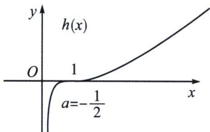
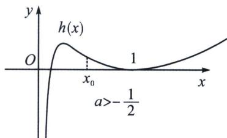
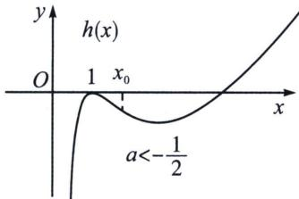
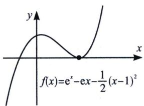
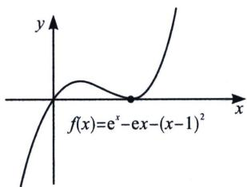
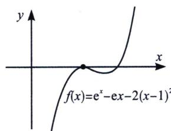
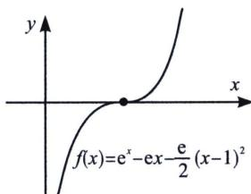
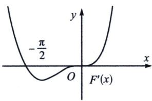
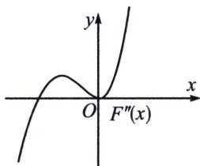
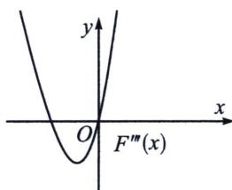

> [!faq]- 《导数专题(上册)》例题解析
>
> > [!success]- **【答案】** 详见解析
>
> > [!note]- **【解析】**
> > 解析 (1) $f(x)$ 的定义域为 $(0, 1) \cup (1, +\infty)$ ， $f'(x) = \frac{1 - \frac{1}{x} - \ln x}{(x - 1)^2}$ ，设 $g(x) = 1 - \frac{1}{x} - \ln x$ ，则 $g'(x) = \frac{1}{x^2} - \frac{1}{x} = \frac{1 - x}{x^2}$ ，当 $x \in (0, 1)$ 时， $g'(x) > 0$ ， $g(x)$ 单调递增；当 $x \in (1, +\infty)$ 时， $g'(x) < 0$ ， $g(x)$ 单调递减，所以 $g(x)_{\max} < g(1) = 0$ ，即 $f'(x) < 0$ 在定义域内恒成立，所以 $f(x)$ 在 $(0, 1)$ 和 $(1, +\infty)$ 上单调递减，无单调增区间.
> >
> > (2) 当 $x > 1$ 时, $f(x) < x^{a}$ 等价于 $x^{a + 1} - x^{a} - \ln x > 0$ ; 当 $0 < x < 1$ 时, $f(x) < x^{a}$ 等价于, $x^{a + 1} - x^{a} - \ln x < 0$
> >
> > $$
> > (x) = x ^ {a + 1} - x ^ {a} - \ln x, h (1) = 0
> > $$
> >
> > $$
> > h ^ {\prime} (x) = (a + 1) x ^ {a} - a x ^ {a - 1} - \frac {1}{x} = \frac {(a + 1) x ^ {a + 1} - a x ^ {a} - 1}{x}, h ^ {\prime} (1)
> > $$
> >
> > =0，这类型涉及到一边大于零，一边小于零，且原函数和一阶导都在这里等于零，一定是导函数的极点效应，本题需要求出 a 的值，还需要作矛盾取点分析，因为原函数的定义域不含有 x=1，前面例题都是包含有极点这个位置的定义域.
> >
> > 设 $\varphi(x)=(a+1)x^{a+1}-ax^{a}-1$ ，则 $\varphi'(x)=(a+1)^{2}x^{a}-a^{2}x^{a-1}=x^{a-1}\left[(a+1)^{2}x-a^{2}\right]$ ， $\varphi'(1)=(a+1)^{2}-a^{2}=2a+1$ ， $\varphi'(x)=0$ 时， $x_{0}=\frac{a^{2}}{(a+1)^{2}}$ ;
> > - **①**：当 $x_{0}=\frac{a^{2}}{(a+1)^{2}}=1$ 时， $a=-\frac{1}{2}$ ， $\varphi(x)=\frac{1}{2}x^{\frac{1}{2}}+\frac{1}{2}x^{-\frac{1}{2}}-1\geqslant0$ ，所以 $h(x)$ 在 $(0,+\infty)$ 单调递增，
> > 由于 $h(0)=0$ ，故当 0<x<1 时， $f(x)<x^{a}$ ，当 x>1 时， $f(x)<x^{a}$ ，如左图，符合题意；
> >
> > 排除 $a \geqslant 1$ ，取 $x = \frac{1}{\mathrm{e}}$ ， $h\left(\frac{1}{\mathrm{e}}\right) = \left(\frac{1}{\mathrm{e}}\right)^{a + 1} - \left(\frac{1}{\mathrm{e}}\right)^a + 1 > 0$ ，矛盾；当 $a \leqslant -1$ ， $h(\mathrm{e}) = \mathrm{e}^{a + 1} - \mathrm{e}^a + 1 < 0$ ，矛盾；
> >
> > 
> >
> > 
> >
> > 
> > - **②**：当 $x_{0}=\frac{a^{2}}{(a+1)^{2}}<1$ ，即 $1>a>-\frac{1}{2}$ 时，当 $x\in(x_{0},1)$ 时， $\varphi'(x)=x^{a-1}\left[(a+1)^{2}x-a^{2}\right]<0,\varphi(x)$ 单调递减，所以 $\varphi(x)<\varphi(1)=0$ ，所以 $h'(x)<0$ ，h(x) 单调递减，所以 $h(x)>h(0)=0$ ，如中图， $x_{0}$ 为 $h(x)$ 的拐点，矛盾；
> > - **③**：当 $x_{0}=\frac{a^{2}}{(a+1)^{2}}>1$ ，即 $-1<a<-\frac{1}{2}$ 时，当 $x\in(1,x_{0})$ 时， $\varphi'(x)=x^{a-1}\left[(a+1)^{2}x-a^{2}\right]<0$ ， $\varphi(x)$ 单调递减，所以 $\varphi(x)<\varphi(1)=0$ ，所以 $h'(x)<0$ ， $h(x)$ 单调递减，所以 $h(x)<h(0)=0$ ，如右图， $x_{0}$ 为 $h(x)$ 的拐点，矛盾；
> >
> > 所以 $a = -\frac{1}{2}$ ，故实数 $a$ 的取值集合为 $\{-\frac{1}{2}\}$ .
> >
> > ## 例8 (2024·武汉四调节选)已知函数 $f(x)=\frac{\mathrm{e}^{x}-1}{x}$ .
> >
> > 若 $f(x)>a^{x}$ ，其中a>0且 $a\neq1$ ，求实数a的值.
> >
> > 解析 令 $g(x)=\mathrm{e}^{x}-1-xa^{x}$ ，即 $\left\{\begin{aligned}x<0,&g(x)<0\\ x>0,&g(x)>0\end{aligned}\right.$ ， $g^{\prime}(x)=\mathrm{e}^{x}-xa^{x}\ln a-a^{x},\quad g^{\prime}(0)=0$ ，（此处符合导函数极点效应，导函数在0的邻域内需要恒正，在0处导数值为0），即 $g^{\prime\prime}(x)=\mathrm{e}^{x}-2a^{x}\ln a-xa^{x}\ln^{2}a,\quad g^{\prime\prime}(0)=0\Rightarrow a=\sqrt{\mathrm{e}}$ ，当 $a=\sqrt{\mathrm{e}},\quad g(x)=\mathrm{e}^{x}-1-x\mathrm{e}^{\frac{x}{2}}=\mathrm{e}^{\frac{x}{2}}(\mathrm{e}^{\frac{x}{2}}-\mathrm{e}^{-\frac{x}{2}}-x),\quad\left\{\begin{aligned}x<0,&g(x)<0\\ x>0,&g(x)>0\end{aligned}\right.$ ，成立，当 $a>\sqrt{\mathrm{e}},\quad g^{\prime\prime}(0)=1-2\ln a<0$ ，存在 $x_{0}>0,\quad g^{\prime\prime}(x_{0})<0$ ，即 $x\in(0,x_{0}),\quad g^{\prime\prime}(x_{0})<0,\quad g^{\prime}(x)\downarrow$ ， $g^{\prime}(x)<g^{\prime}(0)=0,\quad g(x)\downarrow$ ，则有 $g(x_{0})<0$ ，矛盾，同样的 $a<\sqrt{\mathrm{e}}$ ，此时会有 $x_{1}<0,\quad g(x_{1})>0$ ，矛盾，故 $a=\sqrt{\mathrm{e}}$ .
> >
> > ## 4. 极点效应失效分析
> >
> > 我们参考函数 $f(x) = \mathrm{e}^{x} - \mathrm{e}x - a(x - 1)^{2} \geqslant 0$ ，这里 $f(1) = 0$ ， $f'(1) = 0$ ，按道理说，产生极点效应与参数 $a$ 无关，所以 $x = 1$ 是函数的零点，也是函数的极值点，但是当 $f''(1) = 0$ 时，即 $a = \frac{\mathrm{e}}{2}$ 时， $f'(x) \geqslant f'(1) = 0$ ，所以 $f(x)$ 单调递增，此时极点效应失效。
> >
> > 如图，如果要探路 $f(x) = \mathrm{e}^{x} - \mathrm{e}x - a(x - 1)^{2} \geqslant 0$ 对 $x \geqslant 0$ 恒成立，无论如何函数均满足$\left\{ \begin{array}{l} f(1) = 0 \\ f'(1) = 0 \end{array} \right.$ ，但是我们看这三个图，虽然 $x = 1$ 是 $f(x)$ 的极值，但未必是极小值，也就未必成为最小值，当 $a = 1$ 是临界条件。此时满足 $\left\{ \begin{array}{l} f(0) \geqslant 0 \\ f_x = f(1) \geqslant 0 \end{array} \right.$ ，对此，我们在介绍端点效应失效时也提到了这个。
> >
> > 
> >
> > 
> >
> > 
> >
> > 当 $f''(1)=\mathrm{e}-2a=0$ 时， $a=\frac{\mathrm{e}}{2}$ ，此时 $f'(x)\geqslant0$ 恒成立， $f(x)$ 单调递增，这也是我们在后续一些极值点偏移中经常要去构造的单调函数类型，也是极点效应的失效类型，也属于本讲考点 2 关于导函数极点效应的原型.
> >
> > 
> >
> > 注意：关于导函数极点效应失效，就是当 $F''(0)=0$ 时， $F''(0)=0$ ， $F'(0)=0$ ，此时会产生二阶导的极点效应，如图，所以 $F''(0)=0$ 并不能保证 $F'(x)$ 产生极点效应，一定要符合 $F'''(0)\neq0$ ，这样 $F''(0)=0$ 才是一个穿越零点。所以，探路一定要多求一次导，而这些就是泰勒展开多项式给到的启发。
> >
> > 
> >
> > 
> >
> > 
