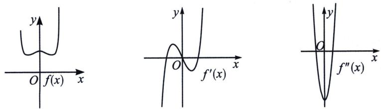

> [!faq]- 《导数专题(上册)》例题解析
>
> > [!success]- **【答案】** 详见解析
>
> > [!note]- **【分析】**
> > 如图， $f'(x)=-a\sin ax+\frac{2x}{1-x^{2}}$ ， $f'(0)=0$ ， $f''(x)=-a^{2}\cos ax+\frac{2+2x^{2}}{(1-x^{2})^{2}}$ ， $f''(0)=-a^{2}+2<0$ ，故 $a\in(-\infty,-\sqrt{2})\cup(\sqrt{2},+\infty)$ ;
>
> > [!note]- **【解析】**
> > 
> > 解：因为 $f'(x) = -a\sin ax + \frac{2x}{1 - x^2}$ ，所以 $f''(x) = -a^2\cos ax + \frac{2 + 2x^2}{(1 - x^2)^2}$ ，且 $f'(0) = 0$ ， $f''(0) = -a^2 + 2$ ，①若 $f''(0) = 2 - a^2 > 0$ ，即 $-\sqrt{2} < a < \sqrt{2}$ 时，易知存在 $t_1 > 0$ ，使得 $x \in (0, t_1)$ 时， $f''(x) > 0$ ，所以 $f'(x)$ 在 $(0, t_1)$ 上单调递增，所以 $f'(x) > f'(0) = 0$ ，所以 $f(x)$ 在 $(0, t_1)$ 上单调递增，这显然与 $x = 0$ 为函数的极大值点相矛盾，故舍去；
> > - **②**：若 $f''(0)=2-a^{2}<0$ ，即 $a<-\sqrt{2}$ 或 $a>\sqrt{2}$ 时，存在 $t_{2}>0$ ，使得 $x\in(-t_{2},t_{2})$ 时， $f''(x)<0$ ，所以 $f'(x)$ 在 $(-t_{2},t_{2})$ 上单调递减，又 $f'(0)=0$ ，所以当 $-t_{2}<x<0$ 时， $f'(x)>0$ ， $f(x)$ 单调递增；当 $0<x<t_{2}$ 时， $f'(x)<0$ ， $f(x)$ 单调递减，满足 x=0 为 $f(x)$ 的极大值点，符合题意；
> > - **③**：若 $f''(0)=2-a^{2}=0$ ，即 $a=\pm\sqrt{2}$ 时，因为 $f(x)$ 为偶函数，所以只考虑 $a=\sqrt{2}$ 的情况，此时 $f'(x)=-\sqrt{2}\sin(\sqrt{2}x)+\frac{2x}{1-x^{2}}$ ， $x\in(0,1)$ 时， $f'(x)=-2x+\frac{2x}{1-x^{2}}=2x\left(\frac{1}{1-x^{2}}-1\right)>0$ ，所以 $f(x)$ 在 $(0,1)$ 上单调递增，与显然与 x=0 为函数的极大值点相矛盾，故舍去.
> > $$
> > (- \infty , - \sqrt {2}) \cup (\sqrt {2}, + \infty)
> > $$
> > ## 2. 利用泰勒展开式的界定极值
> > 对于任意一个能用泰勒公式在 x=0 处展开的函数： $f(x)=f(0)+f'(0)x+\frac{f''(0)}{2!}x^{2}+\cdots\frac{f^{(n)}(0)}{n!}$ $x^{n}+o(x^{n})$
> > 我们可以将其写成 $f(x)\approx a_{0}+a_{1}x+a_{2}x^{2}+a_{3}x^{3}+a_{4}x^{4}+\cdots+a_{n}x^{n}$ 这种近似的形式：
> > 当 $x = 0$ 取得极大值时，一定会出现最低偶次项系数为负，即 $\left\{ \begin{array}{l}a_{1} = 0\\ a_{2} <   0 \end{array} \right.$ ，或者 $\left\{ \begin{array}{l}a_1 = 0\\ a_2 = 0\\ a_3 = 0\\ a_4 <   0 \end{array} \right.$ ，以此类推；  
> > 当 $x = 0$ 取得极小值时，一定会出现最低偶次项系数为正，即 $\left\{ \begin{array}{l}a_1 = 0\\ a_2 > 0 \end{array} \right.$ ，或者 $\left\{ \begin{array}{l}a_1 = 0\\ a_2 = 0\\ a_3 = 0\\ a_4 > 0 \end{array} \right.$ ，以此类推；
> > 综上，一个无限函数在最低阶无穷小必须是在偶次项时出现，且系数的正负决定是极大值或者是极小值，此方法叫做泰勒极值界定法.
> > 我们用泰勒展开来解读例 11 的极值原理：
> > $$
> > f (x) = \cos a x - \ln (1 - x ^ {2}) = 1 + \left(1 - \frac {a ^ {2}}{2}\right) x ^ {2} + \left(\frac {1}{2} - \frac {a ^ {4}}{4 !}\right) x ^ {4} + \dots
> > $$
> > $f(x)$ 的极大值为 $f(0) = 1$ ，则只需 $1 - \frac{a^2}{2} < 0 \Rightarrow a < -\sqrt{2}, a > \sqrt{2}$ ，故 $a \in (-\infty, -\sqrt{2}) \cup (\sqrt{2}, +\infty)$
