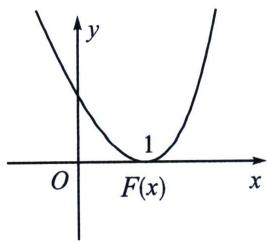
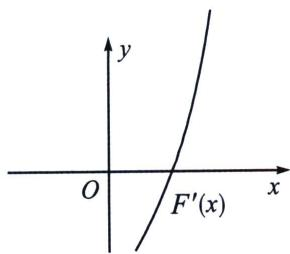
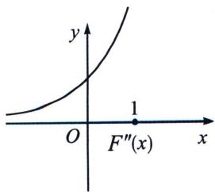
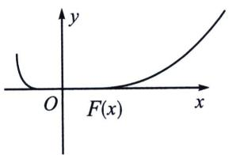
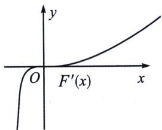
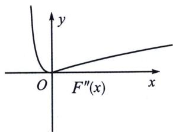
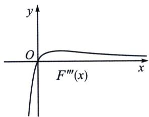
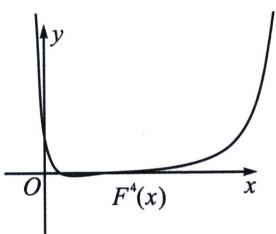

<!-- question-source:start -->
例9 (2025·河南安阳·一模)已知函数 $f(x)=\frac{x+1}{\mathrm{e}^{x}}$ .

若当 x > -1 时， $f(x) \geqslant 1 - ax^{2}$ ，求实数 a 的取值范围；

(3) 若 $x \in \left[-\frac{\pi}{2}, +\infty\right)$ 时， $xf(x) \geqslant 2x - x\cos x$ ，求 $a$ 的取值范围.

(1) 若 $f'(x_{0})=0$ ， $f(x)$ 在 $x=x_{0}$ 处取得极小值，则一定要满足 $f''(x_{0})>0$ ，如下图：

——导数专题

或者 $\left\{\begin{aligned}f^{\prime\prime}(x_{0})&=0\\ f^{\prime\prime\prime}(x_{0})&=0\end{aligned}\right.$ ，如下图，参考例10的极点效应失效理解，以此类推；

(2) 若 $f'(x_0) = 0$ ， $f(x)$ 在 $x = x_0$ 处取得极大值，则一定要满足 $f''(x_0) < 0$ ，或者 $\begin{cases} f''(x_0) = 0 \\ f'''(x_0) = 0 \\ f^4(x) < 0 \end{cases}$ ，

以此类推；
<!-- question-source:end -->

![[高中/总复习/专题/2026版高中《mst老唐说题》导数专题（数学）/上册/第07章_综合篇_显点探路/第二节_极点效应探路/例题/answers/Q00046717A1.md]]
