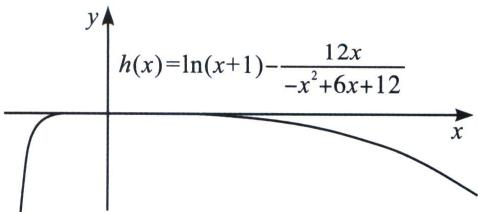

> [!faq]- 《导数专题(上)》例题解析
>
> > [!success]- **【答案】** 详见解析
>
> > [!note]- **【分析】**
> > 本题未单列分析。
>
> > [!note]- **【解析】**
> > 解析 故 $g(x)=\ln(1+x)$ 在 x=0 处的 [1, 2] 阶帕德逼近 $R_{1,2}(x)=\frac{12x}{-x^{2}+6x+12}$ ，故当 $f(x)=(2+x+ax^{2})\ln(1+x)-2x=0$ 时， $\ln(1+x)=\frac{2x}{2+x+ax^{2}}$ ，当且仅当 $a=-\frac{1}{6}$ 时符合帕德逼近。本题本质就是 $g(x)=\ln(1+x)$ 在 x=0 处的 [1, 2] 阶帕德逼近， $f(x)$ 的极大值点，本质就是要构造 $\ln(x+1)$ 的恒大于函数如图。
> > 
> > 注意: 通过帕德逼近原理来解释, $f(x) = \left(2 + x - \frac{1}{6} x^{2}\right)\ln (1 + x) - 2x$ 的极大值与 $h(x) = \ln (x + 1) - \frac{12x}{-x^{2} + 6x + 12}$ 是等价的. 帕德逼近的介绍和原理, 大家可以参考本书帕德逼近.
