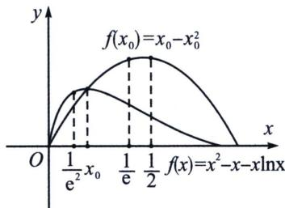
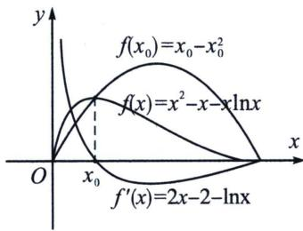

## 第三节 隐点效应与极值点不等式证明

涉及极值点的不等式证明一直是隐点效应的重难点，本节我们系统解读一系列隐点不等式构造.

考点1: 常数型

如果 $f(x_{0})$ 是函数 $y=f(x)$ 的极小值，则在证明不等式 $m<f(x_{0})<n$ 中， $f(x_{0})<n$ 可以直接从函数中找点获得，而 $m<f(x_{0})$ ，一个比极小值还要小的值，必须要将 $f'(x_{0})=0$ 的关系式做隐零点代换，构造新的函数 $g(x_{0})$ 来最值，这就属于利用隐零点来调整极值点函数单调性；同理， $f(x_{0})$ 是函数 $y=f(x)$ 的极大值，则在证明不等式 $m<f(x_{0})<n$ 中， $m<f(x_{0})$ 属于“原函数找点”， $f(x_{0})<n$ 则属于“隐零点调整单调性”.

(2017·新课标Ⅱ)已知函数 $f(x)=ax^{2}-ax-x\ln x$ ，且 $f(x)\geqslant0$ .

(1)求 $a$ ;

(2)证明： $f(x)$ 存在唯一的极大值点 $x_{0}$ ，且 $e^{-2}<f(x_{0})<2^{-2}$ .

解析
(1) 因为 $f(x) = ax^2 - ax - x\ln x = x(ax - a - \ln x) (x > 0)$ ，则 $f(x) \geqslant 0$ 等价于 $h(x) = ax - a - \ln x \geqslant 0$ ，由于 $h (1) = 0$ ，故 $h(x) \geqslant h (1)$ 恒成立，则 $h' (1) = a - 1 = 0$ ，解得 $a = 1$ ；（探路+极点效应）
(2)由
(1)可知 $f(x) = x^2 - x - x\ln x$ ， $f'(x) = 2x - \ln x - 2$ ，令 $f'(x) = 0$ ，可得 $2x - \ln x - 2 = 0$ ，记 $t(x) = 2x - 2 - \ln x$ ，则 $t'(x) = 2 - \frac{1}{x}$ ，令 $t'(x) = 0$ ，解得 $x = \frac{1}{2}$ ，所以 $t(x)$ 在区间 $\left(0, \frac{1}{2}\right)$ 上单调递减，在 $\left(\frac{1}{2}, +\infty\right)$ 上单调递增，所以 $t(x)_{\min} = t\left(\frac{1}{2}\right) = \ln 2 - 1 < 0$ ，方案一：考虑 $2x - \ln x - 2 > 0$ $-\ln x - 2 = 0$ ，取 $x = \frac{1}{e^2}$ ，故 $t\left(\frac{1}{e^2}\right) = \frac{2}{e^2} > 0$ ，所以 $t(x)$ 在 $\left(\frac{1}{e^2}, \frac{1}{2}\right)$ 上存在唯一零点 $x_0$ ，故 $f(x)$ 必存在唯一极大值点 $x_0$ ，且 $2x_0 - 2 - \ln x_0 = 0$ ，所以 $f(x_0) = x_0^2 - x_0 - x_0 \ln x_0 = x_0^2 - x_0 + 2x_0 - 2x_0^2 = x_0 - x_0^2$ ，由 $\frac{1}{e^2} < x_0 < \frac{1}{2}$ 得 $f(x_0) < (x_0 - x_0^2)_{\max} = -\frac{1}{2^2} + \frac{1}{2} = \frac{1}{4}$ ；由于 $f(x_0) > f\left(\frac{1}{e^2}\right) = \frac{1}{e^4} + \frac{1}{e^2} > \frac{1}{e^2}$ ，综上所述， $f(x)$ 存在唯一的极大值点 $x_0$ ，且 $e^{-2} < f(x_0) < 2^{-2}$ .

方案二：由于 $t\left(\frac{1}{e^2}\right) = \frac{2}{e^2} > 0$ ， $t\left(\frac{1}{e}\right) = \frac{2}{e} - 1 < 0$ ，所以 $t(x)$ 在 $\left(\frac{1}{e^2}, \frac{1}{e}\right)$ 上存在唯一零点 $x_0$ ，故 $f(x)$ 必存在唯一极大值点 $x_0$ ，故 $f(x_0) > f\left(\frac{1}{e}\right) = \frac{1}{e^2} - \frac{1}{e} - \frac{1}{e} \ln \frac{1}{e} = \frac{1}{e^2}$ ，如图所示，又因为 $2x_0 - 2 - \ln x_0 = 0$ ，所以 $f(x_0) = x_0^2 - x_0 - x_0 \ln x_0 = x_0^2 - x_0 + 2x_0 - 2x_0^2 = x_0 - x_0^2$ ，易知 $x_0 \in \left(\frac{1}{e^2}, \frac{1}{e}\right)$ 时， $f(x_0)$ 单调递增，故 $f(x_0) < \frac{1}{e} - \frac{1}{e^2} < \frac{1}{4}$ ，综上所述， $f(x)$ 存在唯一的极大值点 $x_0$ ，且 $e^{-2} < f(x_0) < 2^{-2}$ .

注意：极值点不等式 $e^{-2}<f(x_{0})<2^{-2}$ 证明，我们发现 $f(x_{0})$ 是极大值，证明 $e^{-2}<f(x_{0})$ 属于找点，在原函数上操作的范畴，因为只需要原函数找一个比极值小的点即可证明，所以最佳方案就是在原函数上进行操作 $e^{-2}<f\left(\frac{1}{e}\right)<f(x_{0})$ ，而 $f(x_{0})<2^{-2}$ 属于隐零点调整单调性，一个比极大值还要大的值显然是不会存在于此函数上的，所以我们通过 $2x_{0}-2-\ln x_{0}=0$ 构造了极值点新的函数 $f(x_{0})=x_{0}-x_{0}^{2}$ ，如图，我们这里也清晰表达极值点不等式构造原理，根据“原极导零”， $f'(x)=2x-\ln x-2$ 的零点对应 $f(x)=x^{2}-x-x\ln x$ 的极值点，同时 $f(x_{0})=x_{0}-x_{0}^{2}$ 与 $f(x)=x^{2}-x-x\ln x$ 的交点就是函数极值点，我们需要根据不等式方向来判断“隐零点调整单调性”和“原函数找点”。

显点效应关键在于找到题目当中给到的固定点，可以是原函数上，探其导函数，也可以是导函数上，探其原函数，与其对应的就是，放缩取点需要找到其隐零点，实现隐点效应.

![[高中/总复习/专题/2026版高中《mst老唐说题》导数专题（数学）/上册/第08章_综合篇_隐点探路/第三节_隐点效应与极值点不等式证明/例题/Q00046214.md]]
![[高中/总复习/专题/2026版高中《mst老唐说题》导数专题（数学）/上册/第08章_综合篇_隐点探路/第三节_隐点效应与极值点不等式证明/例题/Q00046215.md]]
![[高中/总复习/专题/2026版高中《mst老唐说题》导数专题（数学）/上册/第08章_综合篇_隐点探路/第三节_隐点效应与极值点不等式证明/例题/Q00046216.md]]
![[高中/总复习/专题/2026版高中《mst老唐说题》导数专题（数学）/上册/第08章_综合篇_隐点探路/第三节_隐点效应与极值点不等式证明/例题/Q00046217.md]]
![[高中/总复习/专题/2026版高中《mst老唐说题》导数专题（数学）/上册/第08章_综合篇_隐点探路/第三节_隐点效应与极值点不等式证明/例题/Q00046218.md]]
![[高中/总复习/专题/2026版高中《mst老唐说题》导数专题（数学）/上册/第08章_综合篇_隐点探路/第三节_隐点效应与极值点不等式证明/例题/Q00046219.md]]
![[高中/总复习/专题/2026版高中《mst老唐说题》导数专题（数学）/上册/第08章_综合篇_隐点探路/第三节_隐点效应与极值点不等式证明/例题/Q00046220.md]]
![[高中/总复习/专题/2026版高中《mst老唐说题》导数专题（数学）/上册/第08章_综合篇_隐点探路/第三节_隐点效应与极值点不等式证明/例题/Q00046221.md]]
![[高中/总复习/专题/2026版高中《mst老唐说题》导数专题（数学）/上册/第08章_综合篇_隐点探路/第三节_隐点效应与极值点不等式证明/例题/Q00046222.md]]
![[高中/总复习/专题/2026版高中《mst老唐说题》导数专题（数学）/上册/第08章_综合篇_隐点探路/第三节_隐点效应与极值点不等式证明/例题/Q00046223.md]]
![[高中/总复习/专题/2026版高中《mst老唐说题》导数专题（数学）/上册/第08章_综合篇_隐点探路/第三节_隐点效应与极值点不等式证明/例题/Q00046224.md]]
