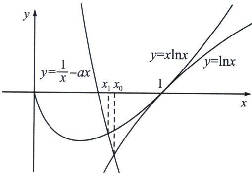

<!-- question-source:start -->
例8 (2024·哈尔滨期末)已知函数 $f(x) = \ln x + ax - \frac{1}{x}$ ， $g(x) = x\ln x + (a - 1)x + \frac{1}{x}$ .

(1) 讨论 $f(x)$ 的单调性；

(2)当 $a > 1$ 时，记 $f(x)$ 的零点为 $x_0$ ， $g(x)$ 的极小值点为 $x_{1}$ ，判断 $x_0$ 与 $x_{1}$ 的大小关系，并说明理由.

(1) 因为 $f(x) = \ln x + ax - \frac{1}{x}$ ，所以 $f'(x) = \frac{1}{x} + a + \frac{1}{x^2} = \frac{ax^2 + x + 1}{x^2} (x > 0)$ ，①若 $a \geqslant 0$ 时，则 $f'(x) > 0$ ，所以 $f(x)$ 在 $(0, +\infty)$ 上单调递增；

②若 $a < 0$ 时，令 $f'(x) = 0$ ，解得 $x_{1} = \frac{-1 - \sqrt{1 - 4a}}{2a}$ 或 $x_{2} = \frac{-1 + \sqrt{1 - 4a}}{2a} < 0$ （舍去），所以当 $0 < x < x_{1}$ 时， $f'(x) > 0$ ；当 $x > x_{2}$ 时， $f'(x) < 0$ ；所以 $f(x)$ 在 $(0, x_{1})$ 上单调递增，在 $(x_{2}, +\infty)$ 上单调递减，综合可得：当 $a \geqslant 0$ 时， $f(x)$ 在 $(0, +\infty)$ 上单调递增；当 $a < 0$ 时， $f(x)$ 在 $\left(0, \frac{-1 - \sqrt{1 - 4a}}{2a}\right)$ 上单调递增，在 $\left(\frac{-1 - \sqrt{1 - 4a}}{2a}, +\infty\right)$ 上单调递减；

(2)分析：先探路， $f(x_{0})=0\Leftrightarrow\ln x_{0}=\frac{1}{x_{0}}-ax_{0}$ ， $g^{\prime}(x_{1})=\ln x_{1}-\frac{1}{x_{1}^{2}}+a=0$ ，通过等效零点得 $x_{1}\ln x_{1}=\frac{1}{x_{1}}-ax_{1}$ ，通过作图可知 $x_{0}>x_{1}$ ，本题时解答题，故还是需要找点和构造函数，

法一(参数转变量调整单调性): $x_0 > x_1$ ，理由如下: 由
(1)知 $a > 1$ 时, $f(x)$ 在 $(0, +\infty)$ 上单调递增, 又 $f (1) = a - 1 > 0$ , $f\left(\frac{1}{\sqrt{a}}\right) = -\frac{1}{2} \ln a < 0$ , 所以存在唯一的 $x_0 \in \left(\frac{1}{\sqrt{a}}, 1\right)$ , 使 $f(x_0) = 0$ , 因为 $g(x) = x \ln x + (a - 1)x + \frac{1}{x}(x > 0)$ , 所以 $g'(x) = \ln x - \frac{1}{x^2} + a$ , 令 $h(x) = \ln x - \frac{1}{x^2} + a(x > 0)$ , 所以 $h'(x) = \frac{1}{x} + \frac{2}{x^3} > 0$ , 所以 $h(x)$ 在 $(0, +\infty)$ 上单调递增, 即 $g'(x)$ 在 $(0, +\infty)$ 上单调递增, 又 $g' (1) = a - 1 > 0$ , $g'\left(\frac{1}{\sqrt{a}}\right) = -\frac{1}{2} \ln a < 0$ , 存在 $m \in \left(\frac{1}{\sqrt{a}}, 1\right)$ , 使 $g'(m) = 0$ , 所以当 $0 < x < m$ 时, $g'(m) < 0$ ; 当 $x > m$ 时, $g'(m) > 0$ ; 所以 $g(x)$ 在 $(0, m)$ 单调递减, 在 $(m, +\infty)$ 上单调递增, 所以 $m$ 为 $g(x)$ 的极小值点, 所以 $x_1 = m$ , 由 $g'(m) = 0$ , 可得 $\ln x_1 - \frac{1}{x_1^2} + a = 0$ , 所以 $a = \frac{1}{x_1^2} - \ln x_1$ , 所以 $f(x_1) = \ln x_1 + ax_1 - \frac{1}{x_1} = \ln x_1 + x_1\left(\frac{1}{x_1^2} - \ln x_1\right) - \frac{1}{x_1} = (1 - x_1)\ln x_1$ , 又 $x_1 \in \left(\frac{1}{\sqrt{a}}, 1\right)$ , 所以 $f(x_1) = (1 - x_1)\ln x_1 < 0$ , 又 $f(x_0) = 0$ , 且 $f(x)$ 在 $(0, +\infty)$ 上单调递增, 所以 $x_0 > x_1$ .

法二(插值放缩取点): $g^{\prime}(x) = \ln x - \frac{1}{x^{2}} + a = \frac{1}{x}\left(x\ln x + ax - \frac{1}{x}\right)$ , 令 $h(x) = x\ln x + ax - \frac{1}{x}$ , $f(x) = \ln x + ax - \frac{1}{x}$ , 利用 $x\ln x \geqslant x - 1 \geqslant \ln x$ (插值), 故 $h(x) = x\ln x + ax - \frac{1}{x} \geqslant x - 1 + ax - \frac{1}{x} \geqslant \ln x + ax - \frac{1}{x} = f(x)$ , 当且仅当 $x = 1$ 时取等, 由于 $h
(1) = f (1) > 0$ , 且 $x - 1 + ax - \frac{1}{x} = 0$ 时, 取 $x_{2} = \frac{1 - \sqrt{5 + 4a}}{2 + 2a}$ , 故存在 $x_{1} \in \left(\frac{1}{\sqrt{a}}, x_{2}\right)$ , 使得 $h(x_{1}) = 0$ , 存在 $x_{0} \in (x_{2}, 1)$ , 使得 $f(x_{0}) = 0$ , 所以 $x_{0} > x_{2} > x_{1}$ .
<!-- question-source:end -->

![[高中/总复习/专题/2026版高中《mst老唐说题》导数专题（数学）/上册/第08章_综合篇_隐点探路/第三节_隐点效应与极值点不等式证明/考点_3_插值放缩解决不同函数的隐零点比大小/例题/answers/Q00047393A1.md]]
