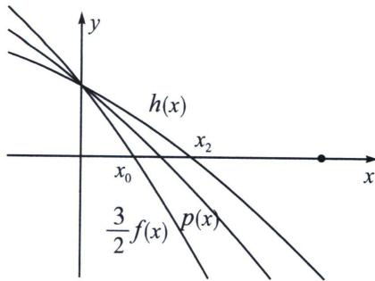

<!-- question-source:start -->
例9 (2014·辽宁)已知函数 $f(x)=(\cos x-x)(\pi+2x)-\frac{8}{3}(\sin x+1)$ ， $g(x)=3(x-\pi)\cos x-4(1+\sin x)\ln\left(3-\frac{2x}{\pi}\right)$ .

证明：
(1)存在唯一 $x_0 \in \left(0, \frac{\pi}{2}\right)$ ，使 $f(x_0) = 0$ ；

(2)存在唯一 $x_{1}\in \left(\frac{\pi}{2},\pi\right)$ ，使 $g(x_{1}) = 0$ ，且对
(1)中的 $x_0$ ，有 $x_0 + x_1 <   \pi .$

(1) 因为当 $x_0 \in \left(0, \frac{\pi}{2}\right)$ 时， $f'(x) = -(1 + \sin x)(\pi + 2x) - 2x - \frac{2}{3} \cos x < 0$ ，所以函数 $f(x)$ 在$\left(0, \frac{\pi}{2}\right)$ 上为减函数，又 $f(0)=\pi-\frac{8}{3}>0$ ， $f\left(\frac{\pi}{2}\right)=-\pi^{2}-\frac{16}{3}<0$ ；故存在唯一的 $x_{0} \in \left(0, \frac{\pi}{2}\right)$ ，使 $f(x_{0})=0$ ；

(2) 法一（转换变量+对数单身狗）考虑函数 $h(x)=\frac{3(x-\pi)\cos x}{1+\sin x}-4\ln\left(3-\frac{2}{\pi}x\right)$ ， $x \in \left[\frac{\pi}{2}, \pi\right]$ ，令 $t=\pi-x$ ，则 $x \in \left[\frac{\pi}{2}, \pi\right]$ 时， $t \in \left[0, \frac{\pi}{2}\right]$ ，记函数 $u(t)=h(\pi-t)=\frac{3t\cos t}{1+\sin t}-4\ln\left(1+\frac{2}{\pi}t\right)$ ；则 $u'(t)=\frac{(3\cos t-3tsint)(1+\sin t)-3t\cos t \cdot \cos t}{(1+\sin t)^{2}}-\frac{4}{1+\frac{2}{\pi}t} \cdot \frac{2}{\pi}=\frac{3\cos t-3tsint+3sint\cos t-3t}{(1+\sin t)^{2}}-\frac{8}{\pi+2t}=\frac{3(\cos t-t)(1+\sin t)}{(1+\sin t)^{2}}-\frac{8}{\pi+2t}=\frac{3f(t)}{(\pi+2t)(1+\sin t)}$ ，由
(1) 得，当 $t \in (0, x_{0})$ 时， $u'(t)>0$ ；在 $(0, x_{0})$ 上 $u(x)$ 是增函数，又 $u(0)=0$ ，所以当 $t \in (0, x_{0}]$ 时， $u(t)>0$ ，所以 $u(t)$ 在 $(0, x_{0}]$ 上无零点；在 $\left(x_{0}, \frac{\pi}{2}\right)$ 上 $u(t)$ 是减函数，且 $u(x_{0})>0$ ， $u\left(\frac{\pi}{2}\right)=-4\ln 2<0$ ，所以存在唯一的 $t_{1} \in \left(x_{0}, \frac{\pi}{2}\right)$ ，使 $u(t_{1})=0$ ；则存在唯一的 $t_{1} \in \left(0, \frac{\pi}{2}\right)$ ，使 $u(t_{1})=0$ ；即存在唯一的 $x_{1}=\pi-t_{1} \in \left(\frac{\pi}{2}, \pi\right)$ ，使 $h(x_{1})=h(\pi-t_{1})=u(t_{1})=0$ ；所以当 $x \in \left(\frac{\pi}{2}, \pi\right)$ 时， $1+\sin x>0$ ，即 $g(x)=(1+\sin x)h(x)$ 与 $h(x)$ 有相同的零点，所以存在唯一的 $x_{1} \in \left(\frac{\pi}{2}, \pi\right)$ ，使 $g(x_{1})=0$ ，因为 $x_{1}=\pi-t_{1}$ ， $t_{1}>x_{0}$ ，所以 $x_{0}+x_{1}<\pi$ 。

法二（插值放缩取点） $g(\pi-x)=3x\cos x-4(1+\sin x)\ln\left(1+\frac{2}{\pi}x\right)$ ，令 $h(x)=-4(1+\sin x)+\frac{3x\cos x}{\ln\left(1+\frac{2}{\pi}x\right)}$ ，抓住函数共有部分， $\frac{3}{2}f(x)=\frac{3}{2}(\cos x-x)(\pi+2x)-4(\sin x+1)$ ，本题只需证 $h(x)=-4(1+\sin x)+\frac{3x\cos x}{\ln\left(1+\frac{2}{\pi}x\right)}$ 在 $x_{2} \in \left(0, \frac{\pi}{2}\right)$ 时有 $h(x_{2})=0$ ，且 $x_{2}>x_{0}$ ，由于 $\ln\left(1+\frac{2x}{\pi}\right) \leqslant \frac{2x}{\pi}$ ，当且仅当 $x=0$ 取等，故 $h(0)=\frac{3}{2}\pi-4=\frac{3}{2}f(0)$ ，故构造插值函数 $p(x)=-4(1+\sin x)+\frac{3x\cos x}{\frac{2x}{\pi}}=-4(1+\sin x)+\frac{3\pi}{2}\cos x$ ，只需证 $h(x)>p(x)>\frac{3}{2}f(x)$ ，只需证： $\frac{3\pi}{2}\cos x>\frac{3}{2}(\cos x-x)(\pi+2x)$ ，只需证 $2x^{2}+\pi x-3x\cos x>0$ ，即证 $2x+\pi>\pi>3\cos x$ ，显然成立， $p(x)=\frac{3\pi}{2}\cos x-4\sin x-4$ ， $p(x)$ 在 $\left(0, \frac{\pi}{2}\right)$ 递减， $p(0)=\frac{3}{2}\pi-4>0$ ， $p\left(\frac{\pi}{2}\right)=-8<0$ ，故存在 $x_{3} \in \left(0, \frac{\pi}{2}\right)$ ，使得 $p(x_{3})=0$ ， $h\left(\frac{\pi}{2}\right)=-8=p\left(\frac{\pi}{2}\right)$ ， $h'(x)<0$ 对 $x \in \left(0, \frac{\pi}{2}\right)$ 恒成立（这里有一点计算量，省略了），所以 $\exists x_{2} \in (x_{3}, 1)$ ， $\exists x_{0} \in (0, x_{3})$ ，使得 $h(x_{2})=0$ ，即 $x_{2}=\pi-x_{1}>x_{3}>x_{0}$ ，所以 $x_{0}+x_{1}<\pi$ 。

<!-- question-source:end -->

![[高中/总复习/专题/2026版高中《mst老唐说题》导数专题（数学）/上册/第08章_综合篇_隐点探路/第三节_隐点效应与极值点不等式证明/考点_3_插值放缩解决不同函数的隐零点比大小/例题/answers/Q00047394A1.md]]
