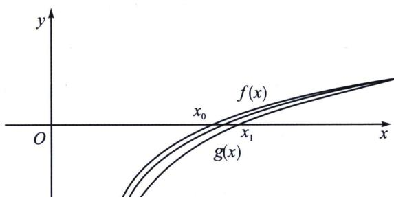

## 考点 3：插值放缩解决不同函数的隐零点比大小

$f(x)=h(x)-m(x)=0$ 与 $g(x)=h(x)-n(x)=0$ 在区间 $(a,b)$ 的零点分别为 $x_{0}$ 和 $x_{1}$ ，比较 $x_{1}$ 与 $x_{0}$ 的问题，可以转化为插值取点，即插入函数，即构造 $m(x)<p(x)<n(x)$ ，如图，这样就能构造 $f(x)>h(x)-p(x)>g(x)$ ，

若 $h(x_{2})-p(x_{2})=0$ ，则可以通过找点证明 $x_{0}<x_{2}<x_{1}$ .

![[高中/总复习/专题/2026版高中《mst老唐说题》导数专题（数学）/上册/第08章_综合篇_隐点探路/第三节_隐点效应与极值点不等式证明/考点_3_插值放缩解决不同函数的隐零点比大小/例题/Q00047393.md]]
![[高中/总复习/专题/2026版高中《mst老唐说题》导数专题（数学）/上册/第08章_综合篇_隐点探路/第三节_隐点效应与极值点不等式证明/考点_3_插值放缩解决不同函数的隐零点比大小/例题/Q00047394.md]]
