<!-- source-part:1 pages:1-200 -->

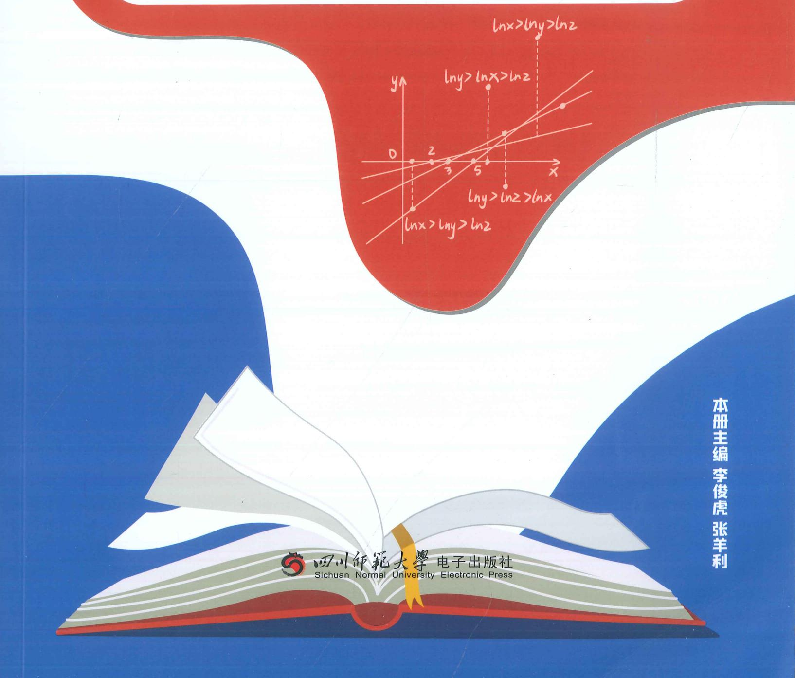

## 高中数学新思路 导数专题（下）

本册主编 李俊虎 张羊利

老唐说题团队教研产品
《高考数学满分突破 - 秒系列123》
《高中数学新思路 - 复习专题第一轮》
《高中数学新思路 - 复习专题第二轮》
《高中数学新思路 - 同步系列123》
《高中数学新思路 - 导数专题》
《高中数学新思路 - 圆锥曲线专题》
《MST新思路高中数学新定义 组合与概
《高中物理新思路 力学篇》
《高中物理新思路 电学篇》
《高中物理新思路 综合实验篇》

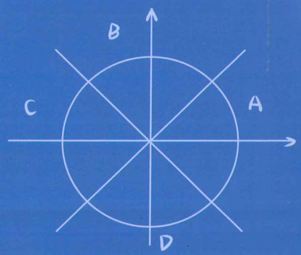

## 高中数学新思路 导数专题（下）

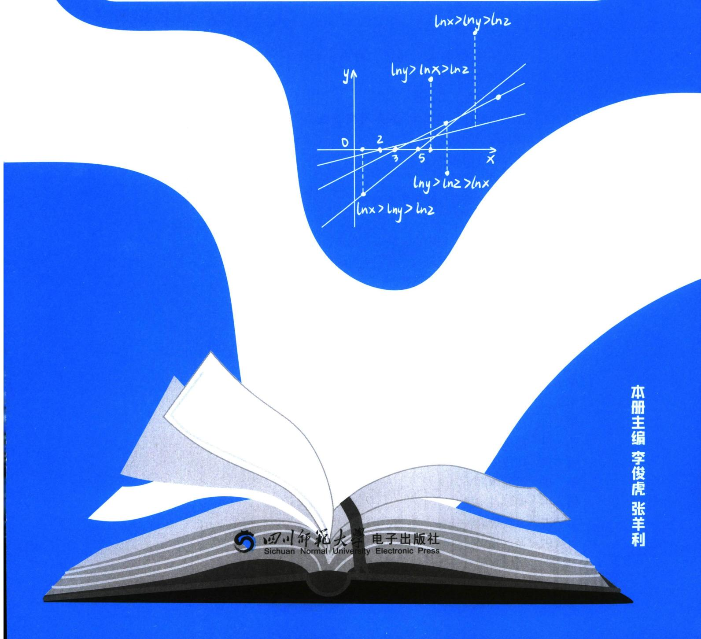

团队教研和灵感的设计源自 MST 创始人陪跑课答疑群，26 高考开启倒计时，MST 团队最新的教研成果都会第一时间在陪跑课体现，欢迎你与 MST 并肩陪跑。专属平板，专属答疑群，定制直播，把握最新考向，三位主讲老师及学霸助教陪你打造体系，直击本质，查漏补缺，突破瓶颈，系统提升，登上山顶。

MST 团队受邀参与讲座学校：（陪跑课由老唐、利哥、老魏，三位创始人主讲）

湖南长沙市一中，雅礼中学，郴州一中，衡阳八中，祁阳一中，湘潭县一中，攸县一中；浙江鲁迅中学，天台中学；河北衡水二中，正定中学，邢台一中；山东青岛二中，日照一中，烟台一中，莱芜一中，平度一中，昌乐二中，德州一中，菏泽一中，莘县一中；贵州遵义四中；河南省实验，郑州一中，郑州四中，洛阳一高，安阳一中，濮阳一中，郸城一高，沁阳一中；山西山大附中，太谷中学，康杰中学；云南昆明一中，云南师大附中，昭通一中；四川德阳五中；广西柳铁一高，北部湾高中，钦州二中；广东惠东高级中学，清远一中；安徽肥西实验学校，阜阳一中；福建南安一中，石狮中学；等全国重点高中开展高考压轴专题讲座，深受广大师生好评。

## MST 创始人 26 版陪跑课目录

(配专属平板，防盗版，保护学员权益)

## 一、函数专题

## (1) 内容篇

第1讲 必备不等式(糖水、均值、柯西、权方和)

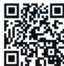

第2讲 函数三要素

第3讲 函数单调性、奇偶性

第 4 讲 函数对称性、周期性(含类周期函数)

第5讲 图像综合问题

第6讲 零点综合问题

第7讲 不动点与桥函数

第8讲 抽象函数综合(含与导数结合)

## (2)新定义篇

第1讲 函数不动点、稳定点、驻点、拐点、间断点

第2讲 高斯函数、黎曼函数、狄利克雷函数

第 3 讲 悬链线引发的双曲函数

第 4 讲 心形线、星形线、旋轮线

第5讲 平口单峰函数与切比雪夫最佳逼近

第6讲 曼哈顿距离

## 二、导数专题

## (1) 内容篇

第 1 讲 导数必备函数模型

第2讲 小题必备技巧补充

第3讲 同构体系

第4讲 切线体系

第5讲 放缩体系

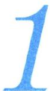

第6讲 隐零点与找点

第 7 讲 显点效应(一)——端点效应

第 8 讲 显点效应(一)——极点效应

第9讲 隐点效应——特殊点效应本质

第10讲 导数与三角体系(恒成立)
第11讲 导数与三角体系(泰勒与放缩)
第12讲 导数与三角体系(零点与偏移)
第13讲 导数与三角体系(结合数列)
第14讲 偏移基础篇——对称化构造、比值换元、对均
第15讲 偏移加强篇——曲线拟合、单调性调整
第16讲 切割线夹与曲线夹
第17讲 导数与数列放缩

(2)新定义篇
第1讲 泰勒展开与帕德逼近
第2讲 微分中值定理
第3讲 刘伟尔定理
第4讲 斯特林公式
第5讲 曲率与曲率半径的推导
第6讲 二元函数与偏导数

三、三角函数专题
第1讲 三角函数基础知识
第2讲 三角函数恒等变换
第3讲 三角函数图像问题
第4讲 必备追加模型
第5讲 卡根法
第6讲 万能 t 与正切恒等式

四、解三角形专题
(1)内容篇
第1讲 正弦定理及正切相关定理
第2讲 范围问题(含张角定理、倍角定理)
第3讲 应用问题(含嵌套三角形)
第4讲 解三角形二级结论

(2)新定义篇
第1讲 海伦公式与外森比克不等式
第2讲 布洛卡点

五、向量专题
(1)内容篇
第1讲 三点共线与对面的女孩看过来
第2讲 向量等和线
第3讲 极化恒等式
第4讲 向量建系法
第5讲 向量四心

(2)新定义篇
第1讲 向量三角与隐曲线
第2讲 莱洛三角形与费马点

六、立体几何专题
(1)内容篇
第1讲 静态立体几何第2讲 常规动态立体几何  
第3讲 外接球、内切球、棱切球  
第4讲 空间中的平行垂直  
第5讲 截面问题  
第6讲 折叠与对角线向量定理  
第7讲 三正弦与三余弦定理  
第8讲 空间向量、距离、夹角、动态  
第9讲 较难的动态与旋转问题  

(2)新定义篇  
第1讲 特殊几何体(含勒洛四面体)  
第2讲 特殊坐标系(含空间坐标系)  
第3讲 空间解析几何  
第4讲 九章算术下的空间几何体  
第5讲 祖暅原理  

七、数列专题  

(1)基础篇  
第1讲 数列基本定义与基本概念(含等差数列与等比数列性质)  
第2讲 常规通项公式求法  
第3讲 常规求和方法  

(2)提升篇  
第1讲 特征根法与不动点法求数列通项公式  
第2讲 蛛网图体系基本原理  
第3讲 斐波那契数列  
第4讲 数学归纳法的基本应用  
第5讲 二元数列的应用  
第6讲 牛顿数列的递推  
第7讲 周期数列与复数的关系  

(3)拓展篇  
第1讲 不动点的基本应用  
第2讲 不动点的一级精度裂项  
第3讲 不动点的二级精度调整  

八、圆锥曲线专题  

(1)基础篇  
第1讲 直线方程与直线系方程  
第2讲 圆的方程与圆系方程  
第3讲 椭圆的第一二三定义  
第4讲 双曲线的第一二三定义  
第5讲 抛物线的基本定义  
第6讲 离心率问题  
第7讲 圆锥曲线中的圆的问题  

(2)基本方法篇  
第1讲 圆锥曲线的斜率体系  
第2讲 圆锥曲线的方程体系  
第3讲 圆锥曲线的坐标体系  
第4讲 圆锥曲线的同构体系(3) 提升方法篇
第1讲 圆锥曲线下的伸缩旋转体系
第2讲 圆锥曲线下的双射体系
第3讲 圆锥曲线下的五点六点体系
第3讲 圆锥曲线下的背景体系

(4) 新定义篇
第1讲 丹德林双球与截口曲线
第2讲 双纽线与卵形线
第3讲 曼哈顿距离下的解析几何
第4讲 豪斯多夫距离下的解析几何
第5讲 高次韦达定理与齐次化下的三次方程

统计概率篇
(1) 概念篇
第1讲 独立事件，对立事件与互斥事件
第2讲 独立性检验，相关系数与决定系数
第3讲 条件概率，全概率与贝叶斯公式

(2) 高考的概率分布列问题
第1讲 离散型随机变量
第2讲 两点分布
第3讲 二项分布的分布列，期望，方差，最值问题
第4讲 超几何分布
第5讲 几何分布的概念与无记忆性

(3) 赛制问题与摸球问题
第1讲 摸球问题
第2讲 乒乓球赛制
第3讲 五局三胜制
第4讲 连胜问题
第5讲 点球大战

(4) 基于函数最值的概率问题
第1讲 函数与概率最值
第2讲 病毒药检

(5) 概率新定义
第1讲 概率与数列
①简单递推
②马尔科夫链与一阶线性游走
③马尔科夫链赌徒原理
④基于全概率下的概率递推
第2讲 几何分布与期望递推
第3讲 切比雪夫不等式与概率估计
第4讲 卡特兰数与极大似然估计
第5讲 二维离散型随机变量
第6讲 随机游走
第7讲 疯子坐飞机问题
第8讲 麦穗理论和37度法则

# 部分讲座学校展示

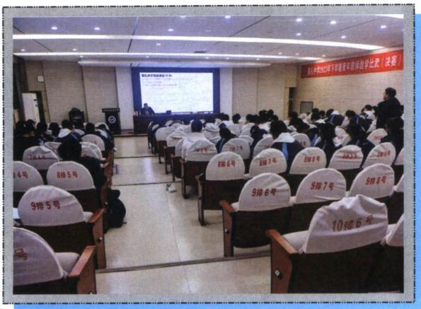  
雅礼中学

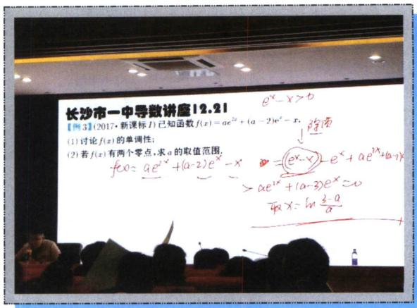  
长沙市一中

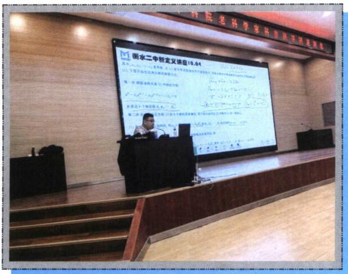  
衡水二中

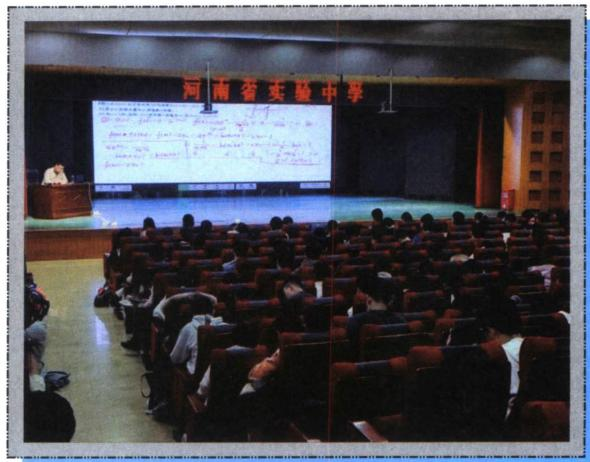  
河南省实验

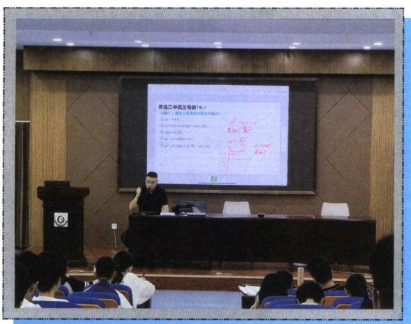  
青岛二中

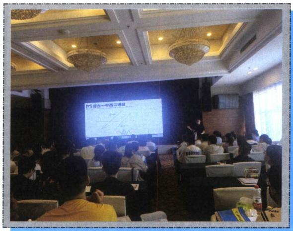  
烟台一中

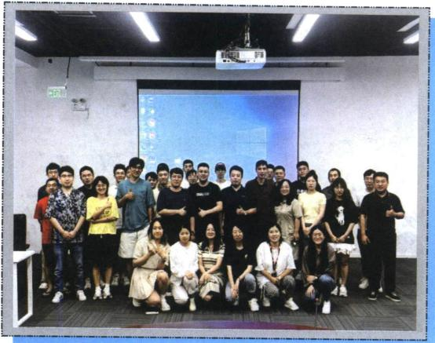  
北京高途总部

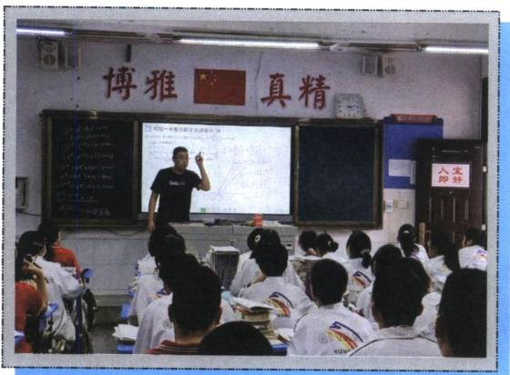  
祁阳一中

衡阳八中  
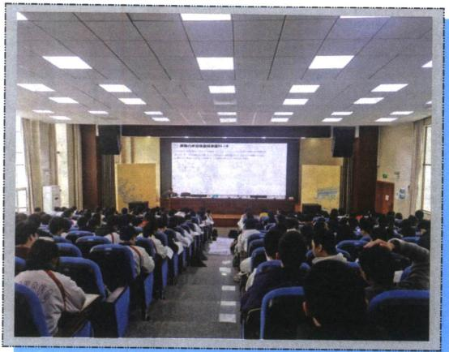

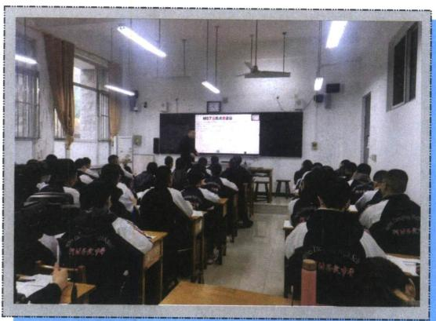  
正定中学

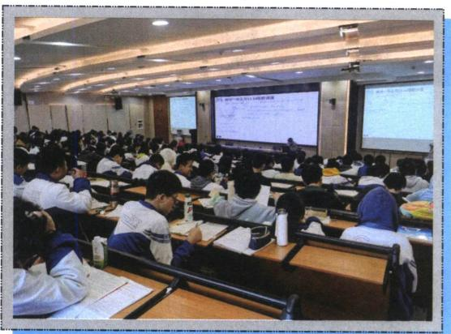  
郴州一中

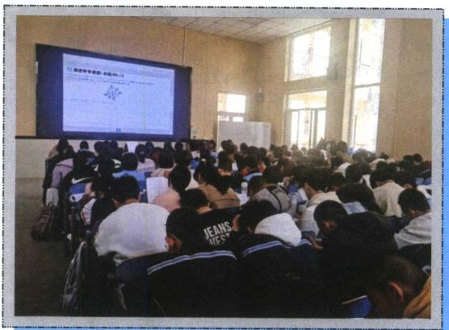  
康杰中学

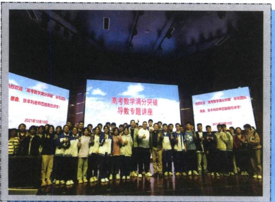  
钦州二中

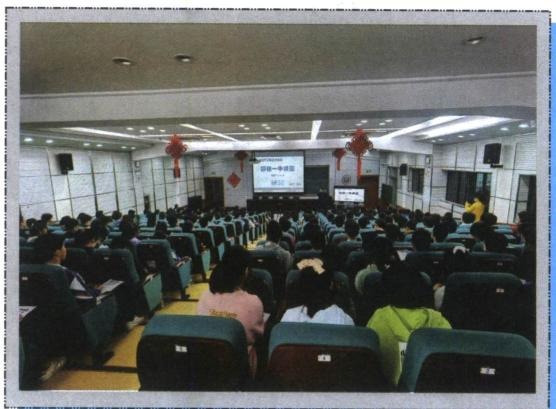  
柳铁一中

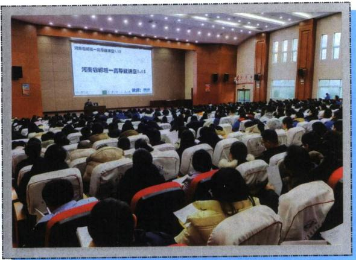  
河南郸城一高

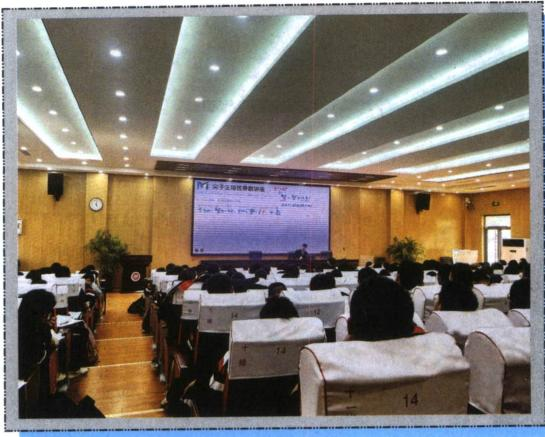  
菏泽一中

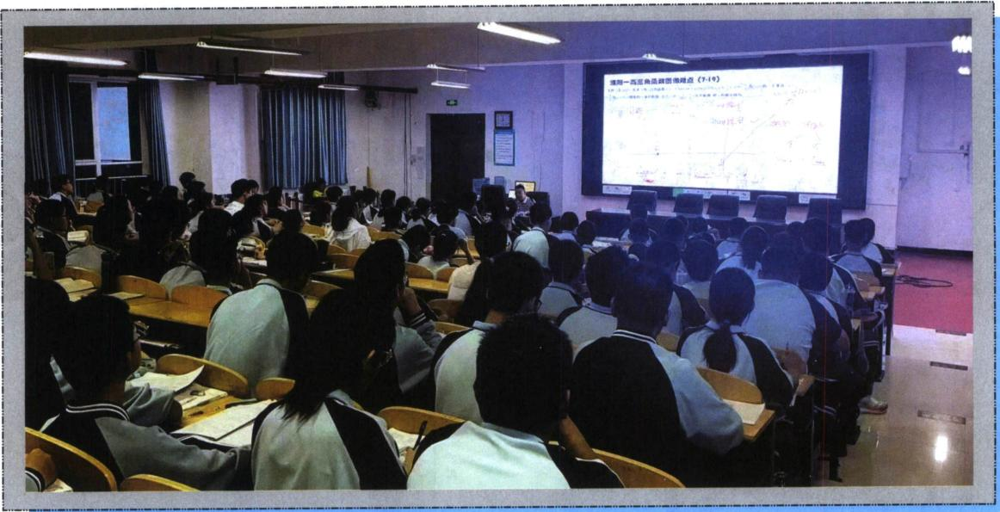  
濮阳一高

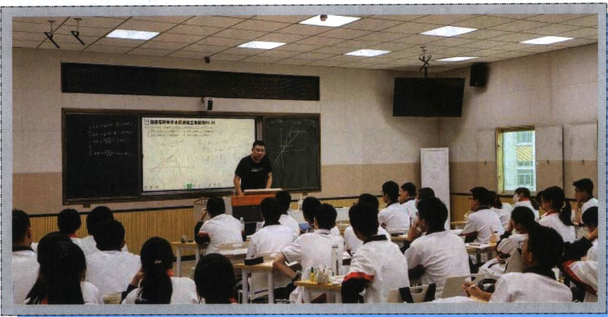  
石光中学

## 下册

## 第9章 导数与双变量

第一节 极值和差 …… 299
一、极值之和以参数为主元 …… 299
二、极值之差 …… 302
考点1：转化为 $x_{1}$ 为主元的构造 …… 302
1. $f(x_{1})-f(x_{2})$ 型 …… 303
2. $f(x_{1})-\lambda f(x_{2})$ 型 …… 307
3. $f(x_{1})-\lambda x_{2}$ 型 …… 307
4. $\frac{f(x_{1})}{x_{2}}$ 型 …… 308
考点2：比值换元构造与差值换元构造 …… 310
考点3：放缩法构造极值之差 …… 314
三、六大同构函数的比值换元 …… 316
四、比值换元与不对称零点和积最值问题 …… 321
第二节 极值点偏移 …… 326
一、对称化构造 …… 326
1. 极值点偏移显极值点和型构造 …… 328

2. 极值点偏移隐极值点和型构造 …… 330
3. 极值点偏移积型构造 …… 331
二、对数均值不等式与指数均值不等式 …… 333
1. 常规 ALG 不等式 …… 333
2. ALG 不等式符号反向用加法原理 …… 336
3. ALG 不等式常数项构造与调整 …… 336
4. 砍一半：根号 ALG 不等式与三角放缩交汇 …… 337
5. 两次使用 ALG 不等式 …… 339
三、零点偏移构造 …… 339
四、单调性调整与阿达玛积分不等式 …… 341
1. 和型 $x_{1} + x_{2} > 2x_{0}$ 构造 $F(x) = x^{2} - 2x_{0}x + \lambda f(x)$ …… 341
2. 阿达玛积分不等式 …… 341
①代征式不含参，直接调整 …… 342
②代证式含参，消参调整 …… 346
3. 积型函数单调性调整 …… 348

4. 积型乘除构造 $F(x) = \frac{f(x)}{x + \frac{m}{x}}$ 单调函数 …… 350

第三节 零点差直线拟合问题 …… 350

一、双零点处切线夹 $x_2 - x_1 < x_4 - x_3$ 构造 …… 351

二、单零点处和拐点外切线夹构造与单零点十切线探路 …… 353

三、双零点割线夹 $x_2 - x_1 > x_4 - x_3$ 构造 …… 355

四、单零点和极值点形成曲线夹 $x_2 - x_1 > x_4 - x_3$ 构造 …… 358

考点1： $f(x)$ 极小值模型 …… 359

考点2： $f(x)$ 极大值模型 …… 359

五、切线+割线夹构造 $x_1 + x_2 < x_3 + x_4$ 与 $x_1 + x_2 > x_3 + x_4$ 问题 …… 362

第四节 拟合体系 …… 363

一、极值点和型偏移与二次函数构造 …… 364

二、极值点积型偏移与对勾函数构造 …… 366

三、涉及双零点偏移的 $x \ln x$ 同构函数拟合 …… 368

四、指数对数函数的常见拟合函数 …… 370

考点1：常数的极值点 …… 372

考点2：含参的极值点 …… 373

五、合理有效利用帕德逼近拟合函数 …… 376

六、对勾与二次的强制转换 …… 378

七、组合型偏移与三元偏移 …… 380

八、变量转化为单调函数的调整函数 …… 389第五节 拐点偏移 …… 390
第六节 浙江风格的双变量 …… 395
一、高阶帕德逼近的应用 …… 395
二、泰勒展开与加强 …… 399
三、泰勒展开构造追加函数 …… 401
四、双变量恒成立探路 …… 403
第七节 双元问题调整与主元法 …… 404
函数 Hölder（赫尔德）连续性 …… 404

第 10 章 导数不等式与数列综合
第一节 导数与数列递推 …… 409
一、极值点与数列构造 …… 409
1. 由极值点隐零点代换构成的数列递推 …… 409
2. 由极值点方程构造的列项求和 …… 410
3. 由三角极值点方程构造的多零点问题 …… 410
二、切线方程与数列构造 …… 412
1. 由过定点切线方程构造的数列 … 412
2. 牛顿法作切线与近似值计算 …… 414
3. 分式平方递推与牛顿数列 …… 418
4. 牛顿数列与面积计算 …… 421
第二节 切线放缩型 …… 422
一、切线放缩求和型 VS 和式代换 …… 422
1. $\frac{1}{n+1}<\ln(1+\frac{1}{n})<\frac{1}{n}$ 型 …… 422
2. $\ln\sqrt{n+1}>1-2(\sqrt{n+1}-\sqrt{n})$ 型 …… 426

3. $\sin\frac{1}{n+1}<\ln\left(1+\frac{1}{n}\right)<\sin\frac{1}{n}<\frac{1}{n}$ 型
……429
4. $\ln\frac{n+1}{n}<\tan\frac{1}{n}<\ln\frac{n}{n-1}$ 型……433
5. $\frac{x}{e^{x}}$ 构造的切线放缩型……433
6. 以 $\sin x \geqslant \frac{2}{\pi} x$ 割线构造型……434
二、构造裂项相消型 ……435
1. 接龙型 $\frac{1}{n}-\frac{2}{n^{2}}<\ln\left(1+\frac{1}{n}\right)<\frac{1}{n}$ ……435
2. 接龙型 $\frac{2}{2n-1}-\frac{2}{(2n-1)^{2}}<\ln\frac{2n+1}{2n-1}$ $<\frac{2}{2n-1}$ ……437
3. $\cos\frac{1}{n}>1-\frac{1}{2n(n-1)}$ 或 $\cos\frac{1}{n}>1-\frac{2}{4n^{2}-1}$ 型……438
4. 隔项相消 $\frac{1}{2e^{n}-1}<\frac{1}{2}\left(\frac{1}{n}-\frac{1}{n+2}\right)$ 型， $e^{x}<\frac{1}{1-x}$ 型……440
三、构造等比数列放缩型 ……441
1. 等比 $\ln\left(1+\frac{1}{q}\right)\left(1+\frac{1}{q^{2}}\right)\cdots\left(1+\frac{1}{q^{n}}\right)<\frac{1}{q-1}(q>1)$ 型……441
5. $e^{1-n} \geqslant \left(\frac{1}{n}\right)^{n} > \sin\left(\frac{1}{n}\right)^{n} > \ln\left[1 + \left(\frac{1}{n}\right)^{n}\right]$ 型……442
四、积式代换型 ……446
1. $|\sin^{2}x\sin^{2}2x\sin^{2}4x\cdots\sin^{2}2^{n}x|$ 型
……446

2. $\left(\frac{1}{n}\right) \cdot \left(\frac{2}{n}\right)^2 \cdot \left(\frac{3}{n}\right)^3 \cdots \left(\frac{n-1}{n}\right)^{n-1}$ 型
…… 447
第三节 飘带函数型 …… 448
一、飘带函数 $\ln x < \frac{1}{2} \left(x - \frac{1}{x}\right) (x > 1)$ 常规型
…… 448
1. 令 $x = n$ 型 …… 448
2. 令 $x = 1 + \frac{1}{n}$ 型 …… 449
3. 令 $x = n(n+1)$ 型 …… 452
二、飘带函数根式 $\ln x < \sqrt{x} - \frac{1}{\sqrt{x}} (x > 1)$ 型
…… 452
1. 令 $x = 1 + \frac{1}{n}$ 接龙型 …… 452
2. 令 $x = 1 + \frac{2}{n}$ 隔项型 …… 455
3. 根式飘带放缩与帕德逼近数列放缩综合与估值问题…… 456
三、帕德逼近 $\ln x > \frac{2(x-1)}{x+1} (x > 1)$ 型 …… 457
1. 令 $x = \frac{2n+1}{2n-1}$ …… 457
2. 构造 $\ln \frac{2n+1}{2n-1} > \frac{1}{n} > \frac{1}{\sqrt{n^2+n}}$ 裂项相消型 …… 459
3. 令 $x = \frac{n}{n-1}$ 型 …… 460
四、斯特林公式与特殊的导数与数列类型
…… 461
第四节 导数与数列迭代放缩与求和 … 462
一、基于琴生不等式下的数列迭代求和

二、基于隐零点放缩下的数列迭代求和体系
…… 463
三、不动点蛛网图下的单调性证明与伪等比
探路体系 …… 467
第11章 三角与导数综合
第一节 三角函数与零点综合 …… 471
考点1：三角混合 $x\sin x$ 与 $x\cos x$ 型
…… 471
1. 三角零点证明分区间型…… 471
2. 参变分离型…… 472
3. 高精度第二周期见分晓型…… 473
考点2：三角VS对数 …… 476
1. 关于 $\sin x$ 与 $\ln (x + 1)$ …… 476
2. $x - \ln x - 1$ 与三角函数分而治之 … 480
3. $x\sin x$ 与 $\ln (x + 1)$ …… 481
考点3：三角VS指数 …… 483
1. 0处泰勒展开型 …… 483
2. 关于 $\frac{x}{e^x}, xe^x$ 与 $\sin x$ 零点 …… 485
3. 关于指数和正切组合零点 …… 489第二节 三角函数恒成立问题 …… 490
一、基于25新一卷的，三角恒成立解读
…… 490
二、三角恒成立与探路思想 …… 493
考点1：端点效应模型 …… 493
考点2：极点效应模型 …… 498
考点3：原函数极点效应失效 …… 501
考点4：隐点效应模型 …… 502
三、三角恒成立与放缩思想 …… 503
第三节 三角函数与数列综合 …… 504
考点1：基于sinx与ln(1+x) …… 504
考点2：基于cosx\~1- $\frac{1}{2}x^{2}$ 的放缩 … 506
考点3：基于弦切互化的数列综合放缩
…… 506
考点4：三角+数列与零点综合 …… 508
考点5：三角泰勒展开与数列综合 … 511
考点6：积式代换补充 …… 512
第四节 三角函数与双元杂谈 …… 513
![[高中/总复习/专题/2026版高中《mst老唐说题》导数专题（数学）/下册/第09章_导数与双变量/第09章_导数与双变量.md]]
![[高中/总复习/专题/2026版高中《mst老唐说题》导数专题（数学）/下册/第10章_导数不等式与数列综合/第10章_导数不等式与数列综合.md]]
![[高中/总复习/专题/2026版高中《mst老唐说题》导数专题（数学）/下册/第11章_三角与导数综合/第11章_三角与导数综合.md]]
