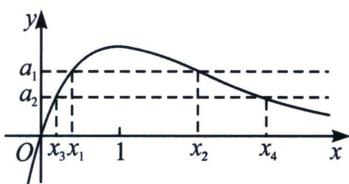
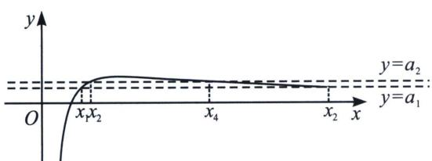
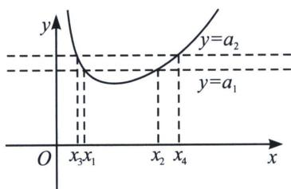

<!-- question-source:start -->
例17 (2014·天津)设 $f(x)=x-a\mathrm{e}^{x}(a\in\mathbb{R})$ ， $x\in\mathbb{R}$ ，已知函数 $y=f(x)$ 有两个零点 $x_{1}$ ， $x_{2}$ ，且 $x_{1}<x_{2}$ .

(1) 求 a 的取值范围；

(2)证明： $\frac{x_{2}}{x_{1}}$ 随着a的减小而增大；

(3)证明 $x_{1}+x_{2}$ 随着 a 的减小而增大.

(1) 法一因为 $f(x) = x - a\mathrm{e}^{x}$ ，所以 $f'(x) = 1 - a\mathrm{e}^{x}$ ；下面分两种情况讨论： $① a \leqslant 0$ 时， $f'(x) > 0$ 在 $\mathbb{R}$ 上恒成立，所以 $f(x)$ 在 $\mathbb{R}$ 上是增函数，不合题意； $② a > 0$ 时，由 $f'(x) = 0$ ，得 $x = -\ln a$ ，当 $x$ 变化时， $f'(x)$ 、 $f(x)$ 的变化情况如下表：

<table><tr><td>x</td><td> $(-\infty, -\ln a)$ </td><td> $-\ln a$ </td><td> $(-\ln a, +\infty)$ </td></tr><tr><td> $f'(x)$ </td><td>+</td><td>0</td><td>-</td></tr><tr><td> $f(x)$ </td><td>递增</td><td>极大值 $-\ln a - 1$ </td><td>递减</td></tr></table>

所以 $f(x)$ 的单调增区间是 $(-∞, -lna)$ ，减区间是 $(-lna, +∞)$ ；即函数 $y = f(x)$ 有两个零点等价于如下条件同时成立：①由 $f(-lna) > 0$ ，即 $-lna - 1 > 0$ ，解得 $0 < a < e^{-1}$ ；②存在 $s_1 \in (-∞, -lna)$ ，满足 $f(s_1) < 0$ ；取 $s_1 = 0$ ， $f(0) = -a < 0$ ，③存在 $s_2 \in (-lna, +∞)$ ，满足 $f(s_2) < 0$ ，取 $s_2 = 2\ln \frac{1}{a}$ ，满足 $s_2 \in (-lna, +∞)$ ，且 $f(s_2) = 2\ln \frac{1}{a} - \frac{1}{a} < \mathrm{e}\ln \frac{1}{a} - \frac{1}{a} \leqslant 0$ （倍数放大）；或者 $f(x) = \mathrm{e}^{\frac{x}{2}}\left(\frac{x}{\mathrm{e}^{\frac{x}{2}}} - a\mathrm{e}^{\frac{x}{2}}\right) \leqslant \mathrm{e}^{\frac{x}{2}}\left(\frac{2}{\mathrm{e}} - a\mathrm{e}^{\frac{x}{2}}\right) = 0$ ，取 $s_2 = 2\ln \frac{2}{ae}$ （同构找点），所以 $a$ 的取值范围是 $(0, e^{-1})$ .

(2)由 $f(x)=x-a\mathrm{e}^{x}=0$ ，得 $a=\frac{x}{\mathrm{e}^{x}}$ ，设 $g(x)=\frac{x}{\mathrm{e}^{x}}$ ，由 $g^{\prime}(x)=\frac{1-x}{\mathrm{e}^{x}}$ ，得 $g(x)$ 在 $(-∞,1)$ 上单调递增，在 $(1,+∞)$ 上单调递减，并且当 $x∈(-∞,0)$ 时， $g(x)\leqslant0$ ，当 $x∈(0,+∞)$ 时， $g(x)\geqslant0$ ，如图所示， $x_{1}$ 、 $x_{2}$ 满足 $a=g(x_{1})$ ， $a=g(x_{2})$ ， $a∈(0,\mathrm{e}^{-1})$ 及 $g(x)$ 的单调性，可得 $x_{1}\in(0,1)$ ， $x_{2}\in(1,+∞)$ ；对于任意的 $a_{1}$ 、 $a_{2}\in(0,\mathrm{e}^{-1})$ ，设 $a_{1}>a_{2}$ ， $g(x_{1})=g(x_{2})=a_{1}$ ，其中 $0<x_{1}<1<x_{2}$ ； $g(x_{3})=g(x_{4})=a_{2}$ ，其中 $0<x_{3}<1<x_{4}$ ；因为 $g(x)$ 在 $(0,1)$ 上是增函数，由 $a_{1}>a_{2}$ ，得 $g(x_{1})>$ $g(x_{3})$ ，可得 $x_{1}>x_{3}$ ；类似可得 $x_{2}<x_{4}$ ；又由 $x_{1}$ 、 $x_{2}$ 、 $x_{3}$ 、 $x_{4}>0$ ，得 $\frac{x_{2}}{x_{1}}<\frac{x_{4}}{x_{1}}<\frac{x_{4}}{x_{3}}$ ；所以 $\frac{x_{2}}{x_{1}}$ 随着 a 的减小而增大；

(3) 因为 $x_{1}=ae^{x_{1}}$ ， $x_{2}=ae^{x_{2}}$ ，所以 $\ln x_{1}=\ln a+x_{1}$ ， $\ln x_{2}=\ln a+x_{2}$ ；即 $x_{2}-x_{1}=\ln x_{2}-\ln x_{1}=\ln\frac{x_{2}}{x_{1}}$ ，设 $\frac{x_{2}}{x_{1}}=t$ ，则 t>1，所以 $\left\{\begin{aligned}x_{2}-x_{1}&=\ln t\\ x_{2}&=x_{1}t\end{aligned}\right.$ ，解得 $x_{1}=\frac{\ln t}{t-1}$ ， $x_{2}=\frac{t\ln t}{t-1}$ ，则 $x_{1}+x_{2}=\frac{(t+1)\ln t}{t-1}\cdots①$ ;

令 $h(x) = \frac{(x + 1)\ln x}{x - 1}, x \in (1, +\infty)$ ，则 $h'(x) = \frac{-2\ln x + x - \frac{1}{x}}{(x - 1)^2}$ ；令 $u(x) = -2\ln x + x - \frac{1}{x}$ ，得 $u'(x) = \left(\frac{x - 1}{x}\right)^2$ ，当 $x \in (1, +\infty)$ 时， $u'(x) > 0$ ，所以 $u(x)$ 在 $(1, +\infty)$ 上是增函数，即对任意的 $x \in (1, +\infty), u(x) > u
(1) = 0$ ，所以 $h'(x) > 0$ ，即 $h(x)$ 在 $(1, +\infty)$ 上是增函数；则由①得 $x_1 + x_2$ 随着 $t$ 的增大而增大。由
(2)知， $t$ 随着 $a$ 的减小而增大，所以 $x_1 + x_2$ 随着 $a$ 的减小而增大。

总结: 本题作为比值换元的模型题, 充分挖掘了六大函数当中 $y = \frac{x}{\mathrm{e}^{x}}$ 的性质, 并且在 $x_{1} + x_{2}$ 构造当中遇到了老朋友 $h'(x) = \frac{x - \frac{1}{x} - 2 \ln x}{(x - 1)^{2}}$ , 分子又是飘带函数遇上了对数函数, 这种经典搭配总在高考题反复出现.

关于 $x_{2}=tx_{1}$ ，我们得到 $x_{1}=\frac{\ln t}{t-1}$ ， $x_{2}=\frac{t\ln t}{t-1}$ 这类型换元操作成为解题的关键突破口.

下面我们来进行比值换元的数学建模：

(1)已知 $f(x)=\frac{x}{\mathrm{e}^{x}}$ ，若 $f(x_{1})=f(x_{2})=a(x_{2}>x_{1})$ ，令 $x_{2}=tx_{1}$ ，则一定有 $x_{1}=\frac{\ln t}{t-1}$ ， $x_{2}=\frac{t\ln t}{t-1}$ ，a随着t的增大而减小， $x_{1}+x_{2}$ 随着t的增大而减小，参考例1图；

(2)已知 $f(x)=\frac{\ln x}{x}$ ，若 $f(x_{1})=f(x_{2})=a(x_{2}>x_{1})$ ，令 $x_{2}=tx_{1}$ ，则一定有 $\ln x_{1}=\frac{\ln t}{t-1}$ ， $\ln x_{2}=\frac{t\ln t}{t-1}$ ，a随着t的增大而减小， $x_{1}+x_{2}$ 或者 $x_{1}x_{2}$ 随着t的增大而减小，参考左下图；

(3)已知 $f(x)=\frac{\mathrm{e}^{x}}{x}$ ，若 $f(x_{1})=f(x_{2})=a(x_{2}>x_{1})$ ，令 $x_{2}=tx_{1}$ ，则一定有 $x_{1}=\frac{\ln t}{t-1}$ ， $x_{2}=\frac{t\ln t}{t-1}$ ，a随着t的增大而增大， $x_{1}+x_{2}$ 随着t的增大而增大，参考右上图；

(4)已知 $f(x)=\frac{x}{\ln x}$ ，若 $f(x_{1})=f(x_{2})=a(x_{2}>x_{1})$ ，令 $x_{2}=tx_{1}$ ，则一定有 $\ln x_{1}=\frac{\ln t}{t-1}$ ， $\ln x_{2}=\frac{t\ln t}{t-1}$ ，a随着t的增大而增大， $x_{1}+x_{2}$ 或者 $x_{1}x_{2}$ 随着t的增大而增大；

(5)已知 $f(x)=xe^{x}$ ，若 $f(x_{1})=f(x_{2})=a(x_{2}<-1<x_{1}<0)$ ，令 $x_{2}=tx_{1}$ ，则一定有 $x_{1}=\frac{\ln t}{1-t}$ ， $x_{2}=\frac{t\ln t}{1-t}$ ，a随着t的增大而增大， $x_{1}+x_{2}$ 随着t的增大而增大；

(6)已知 $f(x)=x\ln x$ ，若 $f(x_{1})=f(x_{2})=a(0<x_{1}<\frac{1}{e}<x_{2}<1)$ ，令 $x_{2}=tx_{1}$ ，则一定有 $\ln x_{1}=\frac{\ln t}{1-t}$ ， $\ln x_{2}=\frac{t\ln t}{1-t}$ ，a随着t的增大而增大， $x_{1}+x_{2}$ 或者 $x_{1}x_{2}$ 随着t的增大而增大；
<!-- question-source:end -->

![[高中/总复习/专题/2026版高中《mst老唐说题》导数专题（数学）/下册/第09章_导数与双变量/第一节_极值和差/三_六大同构函数的比值换元/例题/answers/Q00047416A1.md]]
