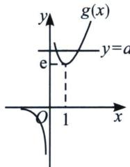

> [!faq]- 《导数专题(下册)》例题解析
>
> > [!success]- **【答案】** 详见解析
>
> > [!note]- **【分析】**
> > 本题未单列分析。
>
> > [!note]- **【解析】**
> > 解析 因为 $f'(x)=ax-\mathrm{e}^{x}$ ， $x_{1}$ ， $x_{2}$ 是 $f(x)$ 的两个极值点，所以 $x_{1}$ ， $x_{2}$ 是 $ax-\mathrm{e}^{x}=0$ 的两根，又当 x=0 时，方程不成立，所以 y=a 与 $y=\frac{\mathrm{e}^{x}}{x}$ 有两个不同的交点；令 $g(x)=\frac{\mathrm{e}^{x}}{x}$ ，易知 $g(x)$ 在 (0,1) 上单调递减，在 $(1,+\infty)$ 上单调递增，则 $g(x)$ 图象如图所示，
> > 
> > 由图象可知： $0 < x_{1} < 1 < x_{2}$ 且 $a > \mathrm{e}$ ；因为 $\frac{x_2}{x_1} \geqslant 2$ ，所以 $x_{2} \geqslant 2x_{1}$ ；令 $x_{2} = tx_{1}, t \geqslant 2$
> > 则 $\frac{\mathrm{e}^{x_1}}{x_1} = \frac{\mathrm{e}^{tx_1}}{tx_1}\Rightarrow t = \mathrm{e}^{tx_1 - x_1}\Rightarrow \ln t = (t - 1)x_1$ ，故 $x_{1} = \frac{\ln t}{t - 1},x_{2} = \frac{t\ln t}{t - 1},a = \frac{\mathrm{e}^{x_1}}{x_1}$ ，由于 $x_{1} < 1$ ，故 $a$ 随着 $x_{1}$ 的增大而减小，令 $g(t) = \frac{\ln t}{t - 1},g'(t) = \frac{1 - \frac{1}{t} - \ln t}{(t - 1)^2}$ ，由于 $\ln t > 1 - \frac{1}{t}$ ，所以 $g^{\prime}(t) <   0$ ，所以 $g(t)_{\max}$ $= g
