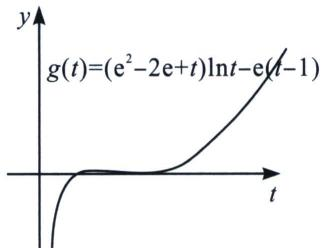
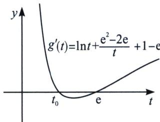

<!-- question-source:start -->
例23 (2023·武汉模拟)已知关于 $x$ 的方程 $ax - \ln x = 0$ 有两个不相等的正实根 $x_{1}$ 和 $x_{2}$ , 且 $x_{1} < x_{2}$ .

(1)求实数 a 的取值范围;

(2)设 k 为常数，当 a 变化时，若 $x_{1}^{k}x_{2}$ 有最小值 $e^{e}$ ，求常数 k 的值.

(1) 由 $f(x) = ax - \ln x$ ，且 $x > 0$ ， $f'(x) = a - \frac{1}{x}$ ，

①若 $a \leqslant 0$ ， $f'(x) < 0$ ， $f(x)$ 单调递减，不可能出现两个零点；

②若 $a > 0$ 时， $f'(x) = 0$ 时， $x = \frac{1}{a}$ ， $f(x)$ 在区间 $\left(0, \frac{1}{a}\right)$ 单调递减，在区间 $\left(\frac{1}{a}, +\infty\right)$ 单调递增， $f(x)_{\min} = f\left(\frac{1}{a}\right) = 1 - \ln \frac{1}{a} < 0$ 时，即 $0 < a < \frac{1}{\mathrm{e}}$ 时，会有两个零点， $f
(1) = a > 0$ ， $f\left(\frac{1}{a^2}\right) = \frac{1}{a} - 2\ln \frac{1}{a} > 0$ ，故存在 $x_1 \in \left(1, \frac{1}{a}\right)$ ， $x_2 \in \left(\frac{1}{a}, \frac{1}{a^2}\right)$ ，使得 $f(x) = 0$ ，故 $a$ 的取值范围是 $\left(0, \frac{1}{\mathrm{e}}\right)$ ；

(2) 易得 $1 < x_{1} < \mathrm{e} < x_{2}$ , 则 $a = \frac{\ln x_{1}}{x_{1}} = \frac{\ln x_{2}}{x_{2}}, \frac{x_{2}}{x_{1}} = \frac{\ln x_{2}}{\ln x_{1}}$ , 设 $\frac{x_{2}}{x_{1}} = t (t > 1)$ , 则 $t = \frac{\ln t + \ln x_{1}}{\ln x_{1}}$ , 即 $\ln x_{1} = \frac{\ln t}{t - 1}, \ln x_{2} = \frac{t \ln t}{t - 1}$ , 由 $x_{1}^{k} x_{2}$ 有最小值 $\mathrm{e}^{\mathrm{e}}$ , 即 $k \ln x_{1} + \ln x_{2} = \frac{(k + t) \ln t}{t - 1}$ 有最小值 $\mathrm{e}$ , 即 $g(t) = (k + t) \ln t - \mathrm{e}(t - 1) \geqslant 0$ 恒成立, 类似于切线找点探路, 我们先探 $\left\{ \begin{array}{l} g(t_0) = 0 \\ g'(t_0) = 0 \end{array} \right.$ , 即 $\left\{ \begin{array}{l} (k + t_0) \ln t_0 - \mathrm{e}(t_0 - 1) = 0 \\ \frac{k}{t_0} + \ln t_0 + 1 - \mathrm{e} = 0 \end{array} \right.$ , 所以 $k = (\mathrm{e} - 1)t_0 - t_0 \ln t_0$ , 代入 $(k + t_0) \ln t_0 - \mathrm{e}(t_0 - 1) = 0$ 得: $(\mathrm{e} - \ln t_0)t_0 \ln t_0 - \mathrm{e}(t_0 - 1) = 0$ , 显然 $t_0$ $= \mathrm{e}$ ，此时 $k = \mathrm{e}^2 -2\mathrm{e}$ ，下面我们证明 $g(t) = (\mathrm{e}^2 -2\mathrm{e} + t)\ln t - \mathrm{e}(t - 1)\geqslant 0$ ， $g^{\prime}(t) = \ln t + \frac{\mathrm{e}^{2} - 2\mathrm{e}}{t} +1-$ e， $g''(t) = \frac{1}{t} -\frac{\mathrm{e}^2 - 2\mathrm{e}}{t^2}$ ，故 $g^{\prime}(t)$ 在 $(1,\mathrm{e}^{2} - 2\mathrm{e})$ 单调递减，在区间 $(\mathrm{e}^2 -2\mathrm{e}, + \infty)$ 单调递增， $g^{\prime}
(1) =$ $\mathrm{e}^2 -3\mathrm{e} + 1 > 0$ ， $g^{\prime}(\mathrm{e}^{2} - 2\mathrm{e}) = \ln (\mathrm{e} - 2) - (\mathrm{e} - 2) + 1 <   0$ ，故存在 $t_0\in (1,\mathrm{e}^2 -2\mathrm{e})$ ，使得 $g^{\prime}(t_{0}) = 0$ ，此时 $g(t_0)$ 为 $g(t)$ 的极大值，又 $g (1) = 0$ ，故 $g(t_0) > 0$ ，又因为 $g^{\prime}(\mathrm{e}) = 0$ ，所以 $g(t)_{\text{极小}} = g(\mathrm{e}) = 0$ ，故当 $t\in (1,\mathrm{e})\cup (\mathrm{e}, + \infty)$ 时， $g(t) > 0$ ，得证．综上所述， $k = \mathrm{e}^2 -2\mathrm{e}$

(2023 秋·雨城区校级月考)已知函数 $f(x)=x\ln x-ax^{2}$ .

(1)若函数 $f(x)$ 有两个不同的零点，求实数a的取值范围；

(2)若函数 $g(x)=f(x)-x+a$ 有两个不同的极值点 $x_{1}$ ， $x_{2}(x_{1}<x_{2})$ ，当 $\lambda\geqslant1$ 时，求证： $\frac{x_{1}}{e}>\left(\frac{e}{x_{2}}\right)^{\lambda}$ .

(1)解: 因为 $\ln x - ax = 0$ 在 $(0, +\infty)$ 上有两个不同根 $\Leftrightarrow a = \frac{\ln x}{x}$ 在 $(0, +\infty)$ 上有两个解, 令 $g(x) = \frac{\ln x}{x}$ , 则 $g'(x) = \frac{1 - \ln x}{x^2} > 0 \Rightarrow 0 < x < e$ , $g(x) = \frac{\ln x}{x}$ 在 $(0, e)$ 上单调递增, 在 $(e, +\infty)$ 上单调递减, $g(e) = \frac{1}{e}$ , $g (1) = 0$ ; 当 $x > 1$ 时, $g(x) > 0$ ; 当 $0 < x < 1$ 时, $g(x) < 0$ , 故 $a \in \left(0, \frac{1}{e}\right)$ .
(2)证明: 因为 $g(x) = f(x) - x + a$ 有两个不同的极值点 $x_1$ , $x_2(x_1 < x_2)$ ,

$\Rightarrow g^{\prime}(x) = f^{\prime}(x) - 1 = \ln x - 2ax = 0$ 有两个根 $x_{1}$ ， $x_{2} \Rightarrow \ln x_{1} = 2ax_{1}$ 且 $\ln x_{2} = 2ax_{2}$ ， $x_{1} < e < x_{2}$ ，$\Rightarrow g(x) = f(x) - 1 = \ln x - 2ax = 0$ 有两个根 $x_{1}$ ， $x_{2} \Rightarrow \ln x_{1} = 2ax_{1}$ 且 $\ln x_{2} = 2ax_{2}$ ， $x_{1} < e < x_{2}$ ，所以 $\frac{x_{1}}{e} > \left(\frac{e}{x_{2}}\right)^{\lambda} \Leftrightarrow e^{1 + \lambda} < x_{1} \cdot x_{2}^{\lambda} \Leftrightarrow 1 + \lambda < \ln x_{1} + \lambda \ln x_{2} \Leftrightarrow \lambda (\ln x_{2} - 1) \geqslant \ln x_{2} - 1 > 1 - \ln x_{1}$ ，即 $x_{1}x_{2} > e^{2}$ ， $2a = \frac{\ln x_{1}}{x_{1}} = \frac{\ln x_{2}}{x_{2}} = \frac{\ln x_{2} + \ln x_{1}}{x_{2} + x_{1}} = \frac{\ln x_{2} - \ln x_{1}}{x_{2} - x_{1}}$ ，令 $x_{2} = tx_{1}$ ， $t > 1$ ， $\ln x_{1} = \frac{\ln t}{t - 1}$ ， $\ln x_{2} = \frac{t\ln t}{t - 1}$ ，即证： $\ln x_{1} + \ln x_{2} = \frac{(t + 1)\ln t}{t - 1} > 2$ ， $\ln t > \frac{2(t - 1)}{t + 1}$ （自证），所以原不等式成立。即 $\frac{x_1}{e} > \left(\frac{e}{x_2}\right)^{\lambda}$ 。

非对称多参数通常采用比值(差值)代换+主元思想
<!-- question-source:end -->

![[高中/总复习/专题/2026版高中《mst老唐说题》导数专题（数学）/下册/第09章_导数与双变量/第一节_极值和差/例题/answers/Q00046753A1.md]]
