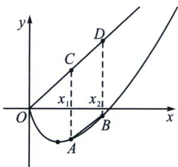
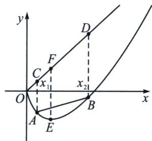
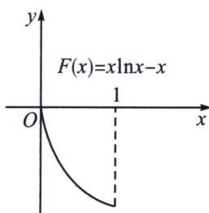
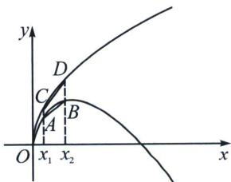
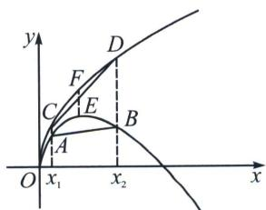
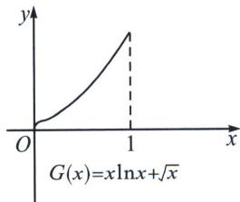
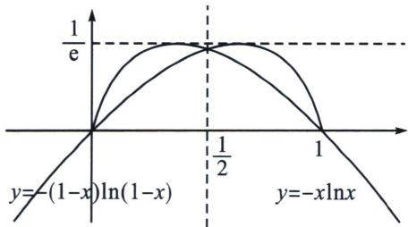

<!-- question-source:start -->
例1 (2025·桃城区月考)若存在常数 $k(k > 0)$ , 使得对定义域 $D$ 内的任意 $x_{1}, x_{2} (x_{1} \neq x_{2})$ , 都有 $|f(x_{1}) - f(x_{2})| \leqslant k |x_{1} - x_{2}|$ 成立, 则称函数 $f(x)$ 在其定义域 $D$ 上是“ $k-$ 利普希兹条件函数”.

(1) 判断函数 $f(x) = \frac{1}{x}$ 是否是区间 $[1, +\infty)$ 上的“1-利普希兹条件函数”？并说明理由；

(2)已知函数 $f(x)=x^{3}$ 是区间 $[0,a](a>0)$ 上的“3—利普希兹条件函数”，求实数a的取值范围；

(3)若函数 $f(x)$ 为连续函数，其导函数为 $f'(x)$ ，若 $f'(x) \in (-K, K)$ ，其中 $0 < K < 1$ ，且 $f(0) = 1$ 。定义数列 $\{x_n\}$ : $x_1 = 0$ ， $x_n = f(x_{n-1})$ ，证明： $|f(x_n)| < \frac{1}{1 - K}$ 。

(1)依题意， $\forall x_{1}, x_{2} \in [1, +\infty)$ ， $|f(x_{1}) - f(x_{2})| = \left|\frac{1}{x_{1}} - \frac{1}{x_{2}}\right| = \frac{1}{x_{1}x_{2}} |x_{1} - x_{2}|$ ，注意到 $x_{1}, x_{2} \in [1, +\infty)$ ，因此 $x_{1}x_{2} \geqslant 1$ ，从而 $\frac{1}{x_{1}x_{2}} \leqslant 1$ ，故 $|f(x_{1}) - f(x_{2})| = \frac{1}{x_{1}x_{2}} |x_{1} - x_{2}| \leqslant |x_{1} - x_{2}|$ ，即 $f(x)$ 是区间 $[1, +\infty)$ 上的“1一利普希兹条件函数”。

(2)依题意， $\forall x_{1}, x_{2} \in [0, a]$ ，均有 $|f(x_{1}) - f(x_{2})| \leqslant 3|x_{1} - x_{2}|$ ，不妨设 $x_{2} > x_{1}$ ，则 $f(x_{2}) - f(x_{1}) \leqslant 3x_{2} - 3x_{1}$ ，即 $f(x_{2}) - 3x_{2} \leqslant f(x_{1}) - 3x_{1}$ ，设 $p(x) = f(x) - 3x = x^{3} - 3x$ ，则 $p(x)$ 单调递减，故 $p'(x) = 3x^{2} - 3 \leqslant 0$ ， $\forall x \in [0, a]$ 恒成立，即 $0 < 3a^{2} \leqslant 3$ ，因此 $a \in (0, 1]$ .

(3)证明：因为 $f^{\prime}(x)\in (-K,K)$ ，设 $g(x) = f(x) + Kx$ ，则 $g^{\prime}(x) = f^{\prime}(x) + K > 0$ ，故 $g(x)$ 为单调递增函数，则 $\forall x_{1} <   x_{2}$ ，恒有 $g(x_{1}) <   g(x_{2})$ ，即 $f(x_{1}) + Kx_{1} <   f(x_{2}) + Kx_{2}\Leftrightarrow f(x_{1}) - f(x_{2})< K(x_{2} - x_{1})$ ，设 $h(x) = f(x) - Kx$ ，则 $h^\prime (x) = f^\prime (x) - K <   0$ ，故 $h(x)$ 为递减函数，则 $\forall x_1 <   x_2$ ，恒有 $h(x_{1}) > h(x_{2})$ ，即 $f(x_{1}) - Kx_{1} > f(x_{2}) - Kx_{2}\Leftrightarrow K(x_{2} - x_{1}) > f(x_{2}) - f(x_{1})$ ，综上可知， $|f(x_1) - f(x_2)| <   K|x_1 - x_2|$ ，则 $|f(x_2) - f(x_1)| <   K|x_2 - x_1| = K|x_2| = K|f(x_1)| = K$ ，当 $n$ $\geqslant 2$ 时， $|f(x_n) - f(x_{n - 1})| <   K|x_n - x_{n - 1}| = K|f(x_{n - 1}) - f(x_{n - 2})| <   K^2 |x_{n - 1} - x_{n - 2}| = \dots = K^{n - 2}$ $|f(x_2) - f(x_1)| <   K^{n - 1}|x_2 - x_1| = K^{n - 1}$ ，则 $|f(x_n)| = |f(x_n) - f(x_{n - 1}) + f(x_{n - 1}) - f(x_{n - 2}) + \dots +f(x_2) - f(x_1) + f(x_1)|\leqslant |f(x_n) - f(x_{n - 1})| + |f(x_{n - 1}) - f(x_{n - 2})| + \dots +|f(x_2) - f(x_1)|+$ $|f(x_1)| <   K^{n - 1} + K^{n - 2} + \dots +K + 1 = \frac{1 - K^n}{1 - K} <\frac{1}{1 - K}$ ，综上可知， $|f(x_n)| <   \frac{1}{1 - K}$

## 例 2 (2024 · 天津卷) 设函数 $f(x)=x\ln x$ .

(1)求 $f(x)$ 图象上点 $(1, f (1))$ 处的切线方程；

(2) 若 $f(x) \geqslant a (x - \sqrt{x})$ 在 $x \in (0, +\infty)$ 时恒成立，求 $a$ 的取值范围；

(3) 若 $x_{1}, x_{2} \in (0, 1)$ ，证明 $\left|f(x_{1}) - f(x_{2})\right| \leqslant \left|x_{1} - x_{2}\right|^{\frac{1}{2}}$

(1) 由于 $f(x) = x \ln x$ ，故 $f'(x) = \ln x + 1$ 。所以 $f (1) = 0$ ， $f' (1) = 1$ ，所以所求的切线经过 (1, 0)，且斜率为 1，故其方程为 $y = x - 1$ 。

(2) 分析：构造 $g(x)=x\ln x-a(x-\sqrt{x})$ ， $g
(1)=0$ ， $g(x)\geqslant g (1)=0$ .

法一(极点效应): 令 $g(x) = x \ln x - a (x - \sqrt{x})$ , 由于 $g
(1) = 0$ , 故 $g(x) \geqslant g (1) = 0$ , 则 $g'(x) = \ln x + 1 - a + \frac{a}{2 \sqrt{x}}$ , $g (1)$ 为函数的最小值, 一定是 $g(x)$ 在开区间 $x \in (0, +\infty)$ 极小值, 则 $g' (1) = 0$ , 即 $a = 2$ . 下面证明当 $a = 2$ 时, $g(x) = x \ln x - 2 (x - \sqrt{x}) = x \left( \ln x - 2 + \frac{2}{\sqrt{x}} \right) \geqslant 0$ 恒成立, 故只需证 $h(x) = \ln x - 2 + \frac{2}{\sqrt{x}} = 2 \left( \ln \sqrt{x} - 1 + \frac{1}{\sqrt{x}} \right) \geqslant 0$ 恒成立 (显然根据 $\ln x \geqslant 1 - \frac{1}{x}$ 可知 $\ln \sqrt{x} - 1 + \frac{1}{\sqrt{x}} \geqslant 0$ ), $h'(x) = \frac{1}{x} - \frac{1}{\sqrt{x^3}} = \frac{1}{x} \left( 1 - \frac{1}{\sqrt{x}} \right)$ , $h' (1) = 0$ , $x \in (0, 1)$ 时, $h'(x) < 0$ , $h(x)$ 单调递减,$x\in(1,+\infty)$ 时， $h'(x)>0$ ， $h(x)$ 递增，故 $h(x)\geqslant h (1)=0$ 恒成立，即a=2时 $g(x)\geqslant0$ 恒成立；

法二：（分类讨论）令 $\sqrt{x} = t(t > 0)$ ，即有 $t^2\ln t^2 \geqslant a(t^2 - t) \Leftrightarrow 2t^2\ln t - a(t^2 - t) \geqslant 0 \Leftrightarrow 2t\ln t - at + a \geqslant 0$ 令 $g(t) = 2t\ln t - at + a$ ， $g'(t) = 2\ln t + 2 - a$ ，即有 $g(t)$ 在 $(0, e^{\frac{a - 2}{2}}) \downarrow$ ，在 $(e^{\frac{a - 2}{2}}, +\infty) \uparrow$ 当 $a > 2$ 时，令 $g'(t) < 0$ ，得 $1 < t < e^{\frac{a - 2}{2}}$ ， $g(t)$ 在 $(1, e^{\frac{a - 2}{2}}) \downarrow$ ， $g(t) < g
(1) = 0$ ，不合题意！当 $a = 2$ 时，令 $g'(t) < 0$ ，解得 $0 < x < 1$ ，令 $g'(t) > 0$ 解得 $1 < t$ ，故 $g(t)$ 在 $(0, 1) \downarrow (1, +\infty) \uparrow$ ，

故 $\varphi(t)\geqslant\varphi
(1)=0$ ，满足题意！当 a<2 时，令 $g'(t)>0$ 解得 $e^{\frac{a-2}{2}}<t<1$ ， $g(t)$ 在 $(e^{\frac{a-2}{2}},1)\uparrow$ ， $\varphi(t)<\varphi (1)=0$ ，不合题意！综上：a=2；

(3)法一: 由 $|f(x_1) - f(x_2)| \leqslant |x_1 - x_2|^{\frac{1}{2}}$ 可得: $-\sqrt{x_2 - x_1} \leqslant |f(x_1) - f(x_2)| \leqslant \sqrt{x_2 - x_1}$ (1 > $x_2 > x_1 > 0$ ), 展开可得: $-\sqrt{x_2 - x_1} \leqslant x_1 \ln x_1 - x_2 \ln x_2 \leqslant \sqrt{x_2 - x_1}$ , 显然不能直接构造同构函数进行单调性调整, 需要先放缩, 拆分为单独含有 $x_1$ 和 $x_2$ 的项, 再进行单调性构造调整.

由于 $1 > x_{2} > x_{1} > 0$ ，需要构造 $\sqrt{x_2 - x_1}\geqslant |\sqrt{x_2} -\sqrt{x_1} |$ ，或者 $\sqrt{x_2 - x_1}\geqslant |x_2 - x_1|$ 显然符合题意条件的有：①- $\sqrt{x_2 - x_1} < -(x_2 - x_1) < x_1\ln x_1 - x_2\ln x_2 < (x_2 - x_1) < \sqrt{x_2 - x_1}$

$$
② - \sqrt {x _ {2} - x _ {1}} <   - (\sqrt {x _ {2}} - \sqrt {x _ {1}}) <   x _ {1} \ln x _ {1} - x _ {2} \ln x _ {2} <   \sqrt {x _ {2}} - \sqrt {x _ {1}} <   \sqrt {x _ {2} - x _ {1}};
$$

对于①， $x_{2}\ln x_{2}+x_{2}>x_{1}\ln x_{1}+x_{1}$ ， $F_{1}(x)=x\ln x+x$ 或者 $x_{2}\ln x_{2}-x_{2}<x_{1}\ln x_{1}-x_{1}$ ， $F_{2}(x)=x\ln x-x$ ，由于 $F_{1}'(x)=\ln x+2$ 不单调，不符合题意； $F_{2}'(x)=\ln x<0$ ， $F_{2}(x_{2})<F_{2}(x_{1})$ ；

对于②， $x_{2}\ln x_{2}+\sqrt{x_{2}}>x_{1}\ln x_{1}+\sqrt{x_{1}}$ ， $G_{1}(x)=x\ln x+\sqrt{x}$ 或者 $x_{2}\ln x_{2}-\sqrt{x_{2}}<x_{1}\ln x_{1}-\sqrt{x_{1}}$ $G_{2}(x)=x\ln x-\sqrt{x}$ ，由于 $G_{1}'(x)=\ln x+1+\frac{1}{2\sqrt{x}}=\frac{1}{\sqrt{x}}\left[\sqrt{x}(\ln x+1)+\frac{1}{2}\right]=$ $\frac{1}{\sqrt{x}}\left(\frac{1}{2\sqrt{e}}\sqrt{ex}\ln\sqrt{ex}+\frac{1}{2}\right)\geqslant\frac{1}{\sqrt{x}}\left(-\frac{1}{2e\sqrt{e}}+\frac{1}{2}\right)>0$ ，故 $G_{1}(x_{1})<G_{1}(x_{2})$ 符合题意；

$G_{2}^{\prime}(x) = \ln x + 1 - \frac{1}{2\sqrt{x}}$ ，不单调，不符合题意；

法一解答过程：①先看不等式左边，显然 $f(x_{1})<f(x_{2})$ ，当 $\frac{1}{e}<x_{1}<x_{2}<1$ 时， $f(x)$ 单调递增，由于 $x_{2}-x_{1}<1$ ，故 $\sqrt{x_{2}-x_{1}}>x_{2}-x_{1}$ ，即 $-\sqrt{x_{2}-x_{1}}<-(x_{2}-x_{1})$ ， $x_{1}\ln x_{1}-x_{2}\ln x_{2}>-(x_{2}-x_{1})\Rightarrow x_{1}\ln x_{1}-x_{1}>x_{2}\ln x_{2}-x_{2}$ ，可以理解为 $y=f(x)=x\ln x$ 与 $y=g(x)=x$ 的差值关系，如左图构造割线，当 $y_{A}<y_{B}$ 时，只需证 $y_{C}-y_{A}<y_{D}-y_{B}$ ，即 $x_{1}-x_{1}\ln x_{1}<x_{2}-x_{2}\ln x_{2}$ ，令 $F(x)=x\ln x-x$ ， $F'(x)=\ln x<0$ ，易得 $F(x)$ 在区间 $(0,1)$ 单调递减，则 $F(x_{1})>F(x_{2})$ 。

当 $0 < x_{1} < \frac{1}{e} < x_{2}$ 时，且 $y_{A} < y_{B}$ ，令 $E\left(\frac{1}{e}, -\frac{1}{e}\right)$ ， $F\left(\frac{1}{e}, \frac{1}{e}\right)$ 如中图，
由于 $y_{D}-y_{B}>y_{F}-y_{E}>y_{C}-y_{A}$ ， $x_{1}\ln x_{1}-x_{2}\ln x_{2}>-(x_{2}-x_{1})$ 依然成立；

②再看右边不等式，显然 $f(x_{1}) > f(x_{2})$ ，即 $-f(x_{1}) < -f(x_{2})$ ，结合完全平方式可得， $\sqrt{x_{2}} - \sqrt{x_{1}} < \sqrt{x_{2} - x_{1}}$ ，只需证 $x_{1} \ln x_{1} - x_{2} \ln x_{2} < \sqrt{x_{2}} - \sqrt{x_{1}}$ ，即证 $x_{2} \ln x_{2} + \sqrt{x_{2}} > x_{1} \ln x_{1} + \sqrt{x_{1}}$ ，如图所示，构造 $y = h(x) = \sqrt{x}$ 与 $y = -f(x) = -x \ln x$ 的差值，当 $y_{A} < y_{B}$ 时，需要证明 $y_{D} - y_{B} > y_{C} - y_{A}$ ，当 $0 < x_{1} < x_{2} < \frac{1}{e}$ 时，令 $G(x) = x \ln x + \sqrt{x}$ ， $G'(x) = \ln x + 1 + \frac{1}{2\sqrt{x}} = \frac{1}{2\sqrt{x}} \left( \frac{4}{e} e^{\sqrt{x}} \ln e^{\sqrt{x}} + 1 \right) \geqslant \frac{1}{2\sqrt{x}} \left( -\frac{4}{e^{2}} + 1 \right) > 0$ ，所以 $G(x_{2}) > G(x_{1})$ ，

当 $0 < x_{1} < \frac{1}{e} < x_{2}$ 时，且 $y_{A} < y_{B}$ ，令 $E\left(\frac{1}{e}, \frac{1}{e}\right)$ ， $F\left(\frac{1}{e}, \frac{1}{\sqrt{e}}\right)$ 如中图，

由于 $y_{D} - y_{B} > y_{F} - y_{E} > y_{C} - y_{A}$ ， $x_{2}\ln x_{2} + \sqrt{x_{2}} >x_{1}\ln x_{1} + \sqrt{x_{1}}$ 依然成立；

③当 $x_{1}=x_{2}$ 时， $\left|f(x_{1})-f(x_{2})\right|=\left|x_{1}-x_{2}\right|^{\frac{1}{2}}=0$ ，或者 $0<x_{1}<\frac{1}{e}<x_{2}$ ，且 $f(x_{1})=f(x_{2})$ 时， $\left|f(x_{1})-f(x_{2})\right|=0<\left|x_{1}-x_{2}\right|^{\frac{1}{2}}$ ；综上，当 $x_{1}, x_{2}\in(0,1)$ ， $\left|f(x_{1})-f(x_{2})\right|\leqslant\left|x_{1}-x_{2}\right|^{\frac{1}{2}}$ 恒成立.

注：在证明 $0 < x_{1} < \frac{1}{e} < x_{2}$ 时可以这么来理解： $|f(x_{1}) - f(x_{2})| \leqslant |x_{1} - x_{2}|^{\frac{1}{2}} \Leftrightarrow \frac{|f(x_{1}) - f(x_{2})|}{|x_{1} - x_{2}|}$ $\leqslant \frac{1}{e} < 1 < \frac{|x_{1} - x_{2}|^{\frac{1}{2}}}{|x_{1} - x_{2}|}$ ，左边成立的原因是此时割线斜率绝对值恒小于原点与极值点连线斜率绝对值，右边由于在 $x_{1}, x_{2} \in (0, 1), |x_{1} - x_{2}| \leqslant |x_{1} - x_{2}|^{\frac{1}{2}}$ ，故满足；

法二：主元法：当 $x_{1}=x_{2}$ 时， $\left|f(x_{1})-f(x_{2})\right|=\left|x_{1}-x_{2}\right|^{\frac{1}{2}}=0$ 成立，当 $x_{1}\neq x_{2}$ 时，由于 $x_{1}, x_{2}$ 轮换对称，不妨设 $0<x_{1}<x_{2}<1$ ，设 $t=x_{2}-x_{1}\in(0,1)$ ，则 $x_{1}=x_{2}-t$ ，

因此 $|f(x_1) - f(x_2)| \leqslant |x_1 - x_2|^{\frac{1}{2}} \Leftrightarrow |f(x_2 - t) - f(x_2)| \leqslant t^{\frac{1}{2}} \Leftrightarrow -t^{\frac{1}{2}} \leqslant f(x_2) - f(x_2 - t) \leqslant t^{\frac{1}{2}}$

只需证 $-t^{\frac{1}{2}}\leqslant x_{2}\ln x_{2}-(x_{2}-t)\ln(x_{2}-t)\leqslant t^{\frac{1}{2}}$ ，以 $x_{2}$ 为主元，当 $x\in(t,1)$ 设 $F(x)=x\ln x-(x-t)\ln(x-t)$ ，所以 $F'(x)=\ln x-\ln(x-t)>0$ ，所以 $F(x)$ 在 $(t,1)$ 上单调递增，所以 $F(t)<F(x)<F
(1)$ ，所以 $t\ln t<F(x)<-(1-t)\ln(1-t)$ ，

只需证 $-t^{\frac{1}{2}}\leqslant t\ln t<F(x)<-(1-t)\ln(1-t)\leqslant t^{\frac{1}{2}}$ ，即证 $\left\{\begin{aligned}-t^{\frac{1}{2}}&\leqslant t\ln t\\-(1-t)\ln(1-t)&\leqslant t^{\frac{1}{2}}\end{aligned}\right.$

要证 $-t^{\frac{1}{2}} \leqslant t \ln t$ ，只需证 $\sqrt{t} \ln t \geqslant -1$ ，由于 $\sqrt{t} \ln t = \frac{1}{2} \sqrt{t} \ln \sqrt{t} \geqslant -\frac{1}{2e} > -1$ ，所以 $-t^{\frac{1}{2}} \leqslant t \ln t$ 成立；

对于 $-(1-t)\ln(1-t)\leqslant t^{\frac{1}{2}}$ ，可以发现函数 $y=-(1-t)\ln(1-t)$ 与函数 $y=-t\ln t$ 关于 $x=\frac{1}{2}$ 对称，由函数图像可知当 $x \in \left(0, \frac{1}{2}\right]$ 时， $-(1 - t)\ln (1 - t) < -t\ln t \leqslant t^{\frac{1}{2}}$ ，当 $x \in \left(\frac{1}{2}, 1\right)$ 时， $-(1 - t)\ln (1 - t) \leqslant \frac{1}{e} < \frac{1}{2} < t^{\frac{1}{2}}$ ，即 $-(1 - t)\ln (1 - t) \leqslant t^{\frac{1}{2}}$ ，综上， $|f(x_1) - f(x_2)| \leqslant |x_1 - x_2|^{\frac{1}{2}}$ 。

注意：单调函数构造的法一需要先放缩，再进行同构，属于双变量的一种构造通法，前提是指数幂简单，主元法属于 Hölder- $\alpha$ 连续函数的一种通法.
<!-- question-source:end -->

![[高中/总复习/专题/2026版高中《mst老唐说题》导数专题（数学）/下册/第09章_导数与双变量/第七节_双元问题调整与主元法/例题/answers/Q00046833A1.md]]
