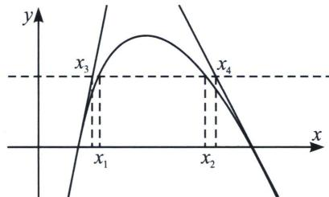

## 一、双零点处切线夹 $x_{2}-x_{1}<x_{4}-x_{3}$ 构造

若 $f(x) = m$ 有两根，满足 $x_{2} - x_{1} < g(m) = x_{4} - x_{3}$ ，通常在双零点处进行切线夹构造，如图，分别找出两个零点处切线与 $y = m$ 的交点， $(x_{3}, m)$ 和 $(x_{4}, m)$ ，即可证明。最早出现切线夹放缩在2015年天津高考卷。

![[高中/总复习/专题/2026版高中《mst老唐说题》导数专题（数学）/下册/第09章_导数与双变量/第三节_零点差直线拟合问题/一_双零点处切线夹_x__2__x__1_x__4__x__3__构造/例题/Q00047456.md]]
![[高中/总复习/专题/2026版高中《mst老唐说题》导数专题（数学）/下册/第09章_导数与双变量/第三节_零点差直线拟合问题/一_双零点处切线夹_x__2__x__1_x__4__x__3__构造/例题/Q00047457.md]]
![[高中/总复习/专题/2026版高中《mst老唐说题》导数专题（数学）/下册/第09章_导数与双变量/第三节_零点差直线拟合问题/一_双零点处切线夹_x__2__x__1_x__4__x__3__构造/例题/Q00047458.md]]
